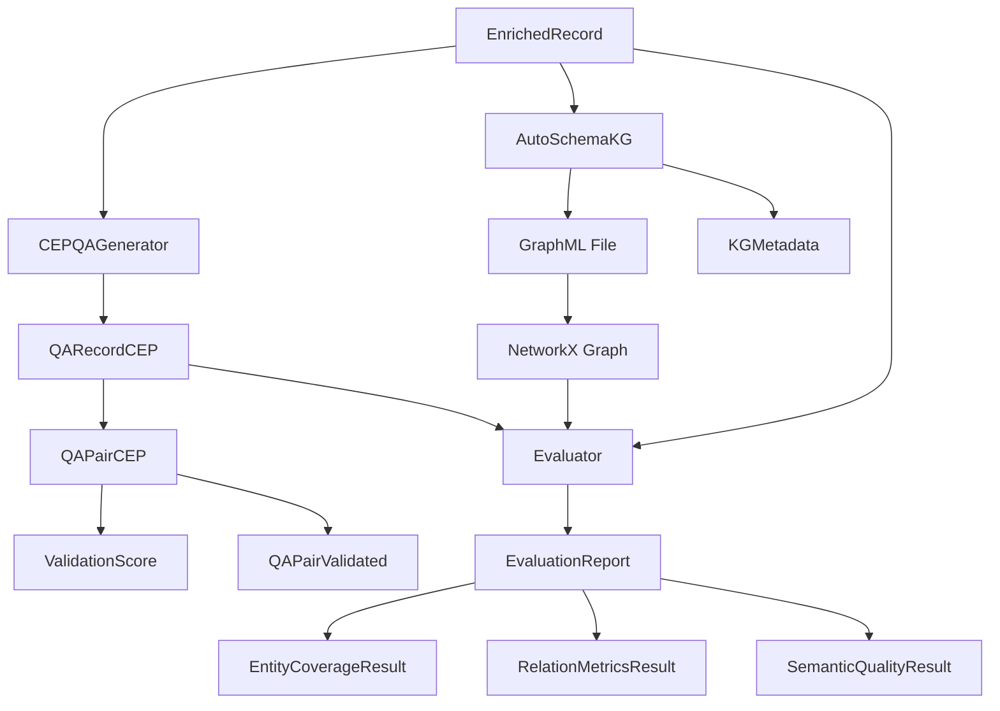

This document provides complete specifications for all data schemas used in the Knowledge Graph Construction Pipeline.

## Table of Contents

1. [Input Schemas](#input-schemas)
2. [QA Generation Schemas](#qa-generation-schemas)
3. [CEP QA Generation Schemas](#cep-qa-generation-schemas)
4. [Knowledge Graph Schemas](#knowledge-graph-schemas)
5. [Evaluation Schemas](#evaluation-schemas)
6. [Schema Relationships](#schema-relationships)

---

## Input Schemas

### EnrichedRecord

Represents a transcription record with enrichment metadata. Extends `InputRecord` with transcription results and quality checks.

**Fields** (inherits all fields from InputRecord):

| Field | Type | Required | Description |
|-------|------|----------|-------------|
| `file_id` | `str` | Yes | Unique file identifier (for Drive-backed records, this is the Google Drive file ID) |
| `name` | `str` | Yes | File name |
| `mimeType` | `str` | Yes | MIME type of the file |
| `parents` | `list[str]` | Yes | List of parent folder IDs |
| `web_content_link` | `str` | Yes | Direct download link |
| `size_bytes` | `int \| None` | No | File size in bytes |
| `transcription_text` | `str` | Yes | Full transcription text |
| `detected_language` | `str` | Yes | Detected language code (ISO 639-1, e.g., "pt") |
| `language_probability` | `float` | Yes | Confidence score for detected language |
| `model_id` | `str` | Yes | Hugging Face model ID used for transcription |
| `compute_device` | `str` | Yes | Device used for computation (cpu/cuda/mps) |
| `processing_duration_sec` | `float` | Yes | Processing time in seconds |
| `transcription_status` | `str` | Yes | Status of transcription process |
| `created_at_enrichment` | `datetime` | Yes | Timestamp of enrichment |
| `segments` | `list[TranscriptionSegment] \| None` | No | Detailed timestamp segments |
| `transcription_quality` | `TranscriptionQualityScore \| None` | No | Transcription quality check results |
| `is_valid` | `bool \| None` | No | Whether transcription passes quality check (None = not yet checked) |

**Language Routing Note**:

The `detected_language` field provides the language code directly. There is **no** `metadata.lang` field in the actual implementation. The `ensure_language_metadata()` method exists as a placeholder for future metadata handling if needed.

**Example**:
```json
{
  "file_id": "1abc123xyz",
  "name": "entrevista_enchente_2023.mp3",
  "mimeType": "audio/mpeg",
  "parents": ["1parent_folder_id"],
  "web_content_link": "https://drive.google.com/uc?id=1abc123xyz&export=download",
  "size_bytes": 15728640,
  "transcription_text": "A enchente foi causada por chuvas intensas...",
  "detected_language": "pt",
  "language_probability": 0.98,
  "model_id": "openai/whisper-large-v3",
  "compute_device": "cuda",
  "processing_duration_sec": 45.2,
  "transcription_status": "success",
  "created_at_enrichment": "2026-01-14T10:00:00Z",
  "segments": [
    {
      "text": "A enchente foi causada por chuvas intensas",
      "start": 0.0,
      "end": 5.2
    }
  ],
  "transcription_quality": {
    "script_match_score": 0.95,
    "repetition_score": 0.92,
    "segment_quality_score": 0.88,
    "content_density_score": 0.90,
    "overall_score": 0.91,
    "issues_detected": [],
    "quality_rationale": "High-quality transcription with natural pacing"
  },
  "is_valid": true
}
```

**Python Implementation**:
```python
from datetime import datetime
from pydantic import BaseModel, Field

class TranscriptionSegment(BaseModel):
    """Schema for a transcription segment with timestamp information."""
    text: str = Field(..., description="Transcribed text for this segment")
    start: float = Field(..., description="Start time in seconds")
    end: float = Field(..., description="End time in seconds")

class EnrichedRecord(InputRecord):
    """Schema for output records containing transcription results and metadata."""
    transcription_text: str = Field(..., description="Full transcription text")
    detected_language: str = Field(..., description="Detected language code")
    language_probability: float = Field(..., description="Confidence score for detected language")
    model_id: str = Field(..., description="Hugging Face model ID used for transcription")
    compute_device: str = Field(..., description="Device used for computation (cpu/cuda/mps)")
    processing_duration_sec: float = Field(..., description="Processing time in seconds")
    transcription_status: str = Field(..., description="Status of transcription process")
    created_at_enrichment: datetime = Field(
        default_factory=datetime.now, description="Timestamp of enrichment"
    )
    segments: list[TranscriptionSegment] | None = Field(
        None, description="Detailed timestamp segments"
    )
    transcription_quality: TranscriptionQualityScore | None = Field(
        None, description="Transcription quality check results"
    )
    is_valid: bool | None = Field(
        default=None,
        description="Whether transcription passes quality check (None = not yet checked)",
    )

    def ensure_language_metadata(self) -> None:
        """Ensure metadata compatibility for AutoSchemaKG language routing.
        
        Note: The detected_language field already provides the language code.
        """
        pass
```

---

## Transcription Quality Schemas

### TranscriptionQualityScore

Quality scores for transcription validation using heuristics. Distinct from `ValidationScore` (LLM-as-a-Judge for QA pairs). This evaluates Whisper transcription output quality.

**Fields**:

| Field | Type | Required | Description |
|-------|------|----------|-------------|
| `script_match_score` | `float` | Yes | Text uses expected character set (0.0-1.0, Latin for pt/en) |
| `repetition_score` | `float` | Yes | Text is free from excessive repetition (0.0-1.0) |
| `segment_quality_score` | `float` | Yes | Segment timestamps are natural, not suspicious (0.0-1.0) |
| `content_density_score` | `float` | Yes | Words per minute within reasonable range (0.0-1.0) |
| `overall_score` | `float` | Yes | Weighted average of all scores (0.0-1.0) |
| `issues_detected` | `list[str]` | Yes | List of quality issues (default: empty list) |
| `quality_rationale` | `str \| None` | No | Explanation of quality assessment |

**Example**:
```json
{
  "script_match_score": 0.95,
  "repetition_score": 0.88,
  "segment_quality_score": 0.92,
  "content_density_score": 0.85,
  "overall_score": 0.90,
  "issues_detected": ["Minor repetition in segment 3-5"],
  "quality_rationale": "Good quality transcription with minor repetition issues"
}
```

**Python Implementation**:
```python
from pydantic import BaseModel, Field

class TranscriptionQualityScore(BaseModel):
    """Quality scores for transcription validation."""
    script_match_score: float = Field(
        ..., ge=0.0, le=1.0, description="Text uses expected character set (Latin for pt/en)"
    )
    repetition_score: float = Field(
        ..., ge=0.0, le=1.0, description="Text is free from excessive repetition"
    )
    segment_quality_score: float = Field(
        ..., ge=0.0, le=1.0, description="Segment timestamps are natural, not suspicious"
    )
    content_density_score: float = Field(
        ..., ge=0.0, le=1.0, description="Words per minute within reasonable range"
    )
    overall_score: float = Field(..., ge=0.0, le=1.0, description="Weighted average of all scores")
    issues_detected: list[str] = Field(default_factory=list, description="List of quality issues")
    quality_rationale: str | None = Field(None, description="Explanation of quality assessment")
```

---

## QA Generation Schemas (CEP)

The QA generation pipeline uses the CEP (Cognitive Elicitation Pipeline) for cognitive scaffolding based on Bloom's Taxonomy.

### QAPairCEP

Extends `QAPair` with CEP cognitive elicitation fields. **Inherits from QAPair**, adding Bloom's taxonomy level, reasoning traces, and tacit knowledge inference for cognitive scaffolding-based QA generation.

**Fields** (in addition to QAPair base fields):

| Field | Type | Required | Description |
|-------|------|----------|-------------|
| `question` | `str` | Yes | The generated question (inherited from QAPair) |
| `answer` | `str` | Yes | Ground truth answer (extractive from context, inherited) |
| `context` | `str` | Yes | Source text segment (inherited from QAPair) |
| `question_type` | `Literal["factual", "conceptual", "temporal", "entity"]` | Yes | Question generation strategy type (inherited) |
| `confidence` | `float` | Yes | Generation confidence score 0.0-1.0 (inherited) |
| `start_time` | `float \| None` | No | Segment start time in seconds (inherited) |
| `end_time` | `float \| None` | No | Segment end time in seconds (inherited) |
| `bloom_level` | `BloomLevel` | Yes | Bloom's taxonomy cognitive level |
| `reasoning_trace` | `str \| None` | No | Logical connections between facts leading to the answer |
| `is_multi_hop` | `bool` | No | Whether answer requires connecting distant text parts (default: False) |
| `hop_count` | `int \| None` | No | Number of reasoning hops (1-5 when is_multi_hop=True) |
| `tacit_inference` | `str \| None` | No | Explanation of implicit domain knowledge surfaced |
| `generation_prompt` | `str \| None` | No | LLM prompt used to generate this QA pair |

**BloomLevel**: `Literal["remember", "understand", "apply", "analyze", "evaluate", "create"]`

**Validators**:
- `coerce_reasoning_trace`: Automatically converts `list[str]` to joined string with " -> " separator

**Example**:
```json
{
  "question": "Por que o pescador guarda o barco quando o rio sobe?",
  "answer": "Para evitar perda do equipamento devido ao risco de enchente",
  "context": "Se o rio sobe rápido, guardo o barco para evitar perda",
  "question_type": "conceptual",
  "confidence": 0.88,
  "start_time": 120.5,
  "end_time": 125.3,
  "bloom_level": "analyze",
  "reasoning_trace": "Fato: rio sobe -> Ação: guardar barco -> Razão: evitar perda",
  "is_multi_hop": false,
  "hop_count": null,
  "tacit_inference": "Subida rápida do rio indica risco iminente de enchente",
  "generation_prompt": "Generate an analyze-level question about risk management..."
}
```

**Bloom Level Semantics**:
- `remember`: Recall explicit facts from text
- `understand`: Explain and interpret concepts
- `apply`: Use knowledge in new situations
- `analyze`: Identify relationships and patterns
- `evaluate`: Make judgments and justify decisions
- `create`: Propose solutions or create something new

**Python Implementation**:
```python
from typing import Literal
from pydantic import BaseModel, Field, field_validator, model_validator

BloomLevel = Literal["remember", "understand", "apply", "analyze", "evaluate", "create"]

class QAPairCEP(QAPair):
    """Extended QA pair with CEP cognitive elicitation fields."""
    bloom_level: BloomLevel = Field(
        ..., description="Bloom's taxonomy cognitive level for this question"
    )
    reasoning_trace: str | None = Field(
        None, description="Logical connections between facts leading to the answer"
    )

    @field_validator("reasoning_trace", mode="before")
    @classmethod
    def coerce_reasoning_trace(cls, v: str | list[str] | None) -> str | None:
        """Coerce reasoning_trace from list to joined string."""
        if isinstance(v, list):
            return " -> ".join(str(item) for item in v)
        return v

    is_multi_hop: bool = Field(
        default=False, description="Whether answer requires connecting distant text parts"
    )
    hop_count: int | None = Field(
        None, ge=1, le=5, description="Number of reasoning hops if multi-hop"
    )
    tacit_inference: str | None = Field(
        None, description="Explanation of implicit/tacit knowledge used in the answer"
    )
    generation_prompt: str | None = Field(
        None, description="LLM prompt used to generate this QA pair"
    )

    @model_validator(mode="after")
    def validate_multi_hop(self) -> Self:
        """Validate hop_count is set when is_multi_hop is True."""
        if self.is_multi_hop and self.hop_count is None:
            object.__setattr__(self, "hop_count", 2)
        if not self.is_multi_hop and self.hop_count is not None:
            object.__setattr__(self, "hop_count", None)
        return self
```

### ValidationScore

Represents LLM-as-a-Judge validation scores for a QA pair.

**Fields**:

| Field | Type | Required | Description |
|-------|------|----------|-------------|
| `faithfulness` | `float` | Yes | Answer grounded in context (0.0-1.0) |
| `bloom_calibration` | `float` | Yes | Question matches declared cognitive level (0.0-1.0) |
| `informativeness` | `float` | Yes | Answer reveals non-obvious knowledge (0.0-1.0) |
| `overall_score` | `float` | Yes | Weighted average of criteria |
| `judge_rationale` | `str \| None` | No | LLM's explanation of the scores |

**Scoring Weights** (default):
- Faithfulness: 40%
- Bloom Calibration: 30%
- Informativeness: 30%

**Example**:
```json
{
  "faithfulness": 0.85,
  "bloom_calibration": 0.78,
  "informativeness": 0.72,
  "overall_score": 0.79,
  "judge_rationale": "Answer well grounded, question requires appropriate analysis level."
}
```

**Python Implementation**:
```python
from pydantic import BaseModel, Field

class ValidationScore(BaseModel):
    """LLM-as-a-Judge validation scores."""
    faithfulness: float = Field(ge=0.0, le=1.0)
    bloom_calibration: float = Field(ge=0.0, le=1.0)
    informativeness: float = Field(ge=0.0, le=1.0)
    overall_score: float = Field(ge=0.0, le=1.0)
    judge_rationale: str | None = None
```

### QAPairValidated

Extends QAPairCEP with validation results.

**Fields** (in addition to QAPairCEP fields):

| Field | Type | Required | Description |
|-------|------|----------|-------------|
| `validation` | `ValidationScore \| None` | No | Validation scores from LLM-as-a-Judge |
| `is_valid` | `bool` | Yes | Whether pair passes validation threshold |

**Example**:
```json
{
  "question": "Por que o pescador guarda o barco?",
  "answer": "Para evitar perda durante enchentes.",
  "context": "Se o rio sobe rápido, guardo o barco para evitar perda.",
  "question_type": "conceptual",
  "confidence": 0.9,
  "bloom_level": "analyze",
  "validation": {
    "faithfulness": 0.9,
    "bloom_calibration": 0.8,
    "informativeness": 0.7,
    "overall_score": 0.81
  },
  "is_valid": true
}
```

### QARecordCEP

Complete CEP QA dataset for a single transcription with cognitive scaffolding metadata and validation summary.

**Fields**:

| Field | Type | Required | Description |
|-------|------|----------|-------------|
| `source_file_id` | `str` | Yes | Unique identifier of the original media file (e.g. Google Drive file ID) |
| `source_filename` | `str` | Yes | Original filename |
| `transcription_text` | `str` | Yes | Full transcription text |
| `qa_pairs` | `list[QAPairValidated \| QAPairCEP]` | Yes | CEP-enhanced QA pairs (validated or unvalidated) |
| `model_id` | `str` | Yes | LLM model used for generation |
| `validator_model_id` | `str \| None` | No | LLM model used for validation (if enabled) |
| `provider` | `Literal["openai", "ollama", "custom"]` | Yes | LLM provider used |
| `language` | `str` | Yes | Language for prompts (ISO 639-1, default: "pt") |
| `generation_timestamp` | `datetime` | Yes | When QA pairs were generated |
| `total_pairs` | `int` | Yes | Total number of QA pairs generated |
| `validated_pairs` | `int` | Yes | Number of pairs passing validation (default: 0) |
| `bloom_distribution` | `dict[str, int]` | Yes | Count of pairs per Bloom level |
| `validation_summary` | `dict[str, float] \| None` | No | Aggregated validation metrics (NOT a ValidationSummary class) |
| `validation_rate` | `float` | Computed | Percentage of pairs that passed validation (computed field) |
| `cep_version` | `str` | Yes | CEP pipeline version (default: "1.0") |

**Important Notes**:
- `qa_pairs` accepts both `QAPairValidated` and `QAPairCEP` in a union type
- `QAPairValidated` must be listed first in the union for Pydantic to correctly preserve validation fields
- `validation_summary` is a plain `dict[str, float]`, **NOT** a ValidationSummary class (this class does not exist)
- `validation_rate` is a computed property: `validated_pairs / total_pairs`

**Example**:
```json
{
  "source_file_id": "1abc123xyz",
  "source_filename": "interview_2023.mp3",
  "transcription_text": "O pescador contou que quando o rio sobe...",
  "qa_pairs": [...],
  "model_id": "llama3.1:8b",
  "validator_model_id": "gpt-4",
  "provider": "ollama",
  "language": "pt",
  "generation_timestamp": "2026-02-03T10:30:00Z",
  "total_pairs": 12,
  "validated_pairs": 10,
  "bloom_distribution": {
    "remember": 3,
    "understand": 4,
    "analyze": 3,
    "evaluate": 2
  },
  "validation_summary": {
    "avg_faithfulness": 0.85,
    "avg_bloom_calibration": 0.78,
    "avg_informativeness": 0.72,
    "avg_overall_score": 0.79
  },
  "validation_rate": 0.833,
  "cep_version": "1.0"
}
```

**JSONL Export**:

QARecordCEP supports JSONL export for KGQA training compatibility:

```python
record = QARecordCEP.load("cep_dataset/1abc123xyz_cep_qa.json")

# Export to file
record.to_jsonl("output.jsonl")

# Get as string
jsonl_content = record.to_jsonl()
```

Each line in the JSONL contains one QA pair with all CEP fields:
```json
{"question": "O que aconteceu?", "answer": "...", "context": "...", "bloom_level": "remember", "confidence": 0.92}
{"question": "Por que isso aconteceu?", "answer": "...", "context": "...", "bloom_level": "analyze", "reasoning_trace": "..."}
```

**Python Implementation**:
```python
from datetime import datetime
from pathlib import Path
from pydantic import BaseModel, Field, computed_field, model_validator

class QARecordCEP(BaseModel):
    """Extended QA dataset record with CEP metadata and validation summary."""
    source_file_id: str = Field(..., alias="source_gdrive_id", description="Unique identifier of the original media file")
    source_filename: str = Field(..., description="Original filename")
    transcription_text: str = Field(..., description="Full transcription text")
    qa_pairs: list[QAPairValidated | QAPairCEP] = Field(
        ..., description="List of CEP-enhanced QA pairs"
    )
    model_id: str = Field(..., description="LLM model used for generation")
    validator_model_id: str | None = Field(
        None, description="LLM model used for validation (if enabled)"
    )
    provider: Literal["openai", "ollama", "custom"] = Field(..., description="LLM provider used")
    language: str = Field(default="pt", description="Language for prompts (ISO 639-1)")
    generation_timestamp: datetime = Field(
        default_factory=datetime.now, description="When QA pairs were generated"
    )
    total_pairs: int = Field(..., description="Total number of QA pairs generated")
    validated_pairs: int = Field(default=0, description="Number of pairs passing validation")
    bloom_distribution: dict[str, int] = Field(
        default_factory=dict, description="Count of QA pairs per Bloom level"
    )
    validation_summary: dict[str, float] | None = Field(
        None, description="Aggregated validation metrics"
    )
    cep_version: str = Field(default="1.0", description="CEP pipeline version")

    @model_validator(mode="after")
    def validate_counts(self) -> Self:
        """Validate that total_pairs matches actual count."""
        if self.total_pairs != len(self.qa_pairs):
            raise ValueError(
                f"total_pairs ({self.total_pairs}) must equal len(qa_pairs) ({len(self.qa_pairs)})"
            )
        return self

    @computed_field
    @property
    def validation_rate(self) -> float:
        """Compute the percentage of pairs that passed validation."""
        if self.total_pairs == 0:
            return 0.0
        return self.validated_pairs / self.total_pairs

    def save(self, path: str | Path) -> None:
        """Save CEP QA record to JSON file."""
        Path(path).write_text(self.model_dump_json(indent=2))

    def to_jsonl(self, path: str | Path | None = None) -> str | None:
        """Export QA pairs to JSONL format for KGQA training compatibility."""
        lines = [pair.model_dump_json() for pair in self.qa_pairs]
        jsonl_content = "\n".join(lines)

        if path is not None:
            with open(path, "w", encoding="utf-8") as f:
                f.write(jsonl_content + "\n" if jsonl_content else "")
            return None

        return jsonl_content

    @classmethod
    def load(cls, path: str | Path) -> "QARecordCEP":
        """Load CEP QA record from JSON file."""
        return cls.model_validate_json(Path(path).read_text())
```

---

## Knowledge Graph Schemas

### Design Decision: GraphML-First Approach

Instead of defining custom schema classes (KGNode, KGEdge, etc.), we use **AutoSchemaKG's native GraphML output** directly with NetworkX. This provides:

- **Simplicity**: No custom conversion code to maintain
- **Standard format**: GraphML is widely supported
- **Direct NetworkX compatibility**: Load with `nx.read_graphml()`
- **AutoSchemaKG validation**: Triples are validated during extraction

### AutoSchemaKG Pipeline

The KG construction uses AutoSchemaKG's extraction pipeline:

```python
from atlas_rag.kg_construction import KGExtractor

# Initialize extractor
kg_extractor = KGExtractor(config)

# 1. Extract triples from text
kg_extractor.run_extraction()

# 2. Convert to CSV format
kg_extractor.convert_json_to_csv()

# 3. Run schema induction (conceptualization)
kg_extractor.generate_concept_csv_temp()

# 4. Create concept CSV
kg_extractor.create_concept_csv()

# 5. Export to GraphML (NetworkX-compatible)
kg_extractor.convert_to_graphml()
```

### Loading into NetworkX

```python
import networkx as nx

# Load GraphML directly into NetworkX
graph = nx.read_graphml("knowledge_graphs/corpus_graph.graphml")

# Access nodes and edges with all attributes preserved
for node, attrs in graph.nodes(data=True):
    print(f"Node: {node}, Type: {attrs.get('type')}, Label: {attrs.get('label')}")

for u, v, attrs in graph.edges(data=True):
    print(f"Edge: {u} -> {v}, Relation: {attrs.get('relation')}")

# Compute statistics using NetworkX
print(f"Nodes: {graph.number_of_nodes()}")
print(f"Edges: {graph.number_of_edges()}")
print(f"Density: {nx.density(graph)}")
print(f"Connected components: {nx.number_connected_components(graph)}")
```

### KGMetadata (Optional)

For provenance tracking, a lightweight metadata sidecar file can be stored alongside the GraphML:

**Fields**:

| Field | Type | Required | Description |
|-------|------|----------|-------------|
| `graph_id` | `str` | Yes | Unique graph identifier |
| `source_documents` | `list[str]` | Yes | List of source document gdrive IDs |
| `created_at` | `datetime` | Yes | When graph was created |
| `model_id` | `str` | Yes | LLM model used for extraction |
| `provider` | `str` | Yes | LLM provider |
| `language` | `str` | Yes | Language code used for extraction (ISO 639-1) |
| `total_documents` | `int` | Yes | Number of source documents |
| `total_nodes` | `int \| None` | No | Number of nodes in graph |
| `total_edges` | `int \| None` | No | Number of edges in graph |
| `backend_version` | `str \| None` | No | Backend identifier (e.g., `"atlas-rag==0.0.5"`) |

**Example** (`corpus_graph_metadata.json`):
```json
{
  "graph_id": "test-cep-01",
  "source_documents": ["1abc123xyz", "2def456uvw"],
  "created_at": "2026-02-26T15:45:00Z",
  "model_id": "qwen3:14b",
  "provider": "ollama",
  "language": "pt",
  "total_documents": 2,
  "total_nodes": 342,
  "total_edges": 187,
  "backend_version": "atlas-rag==0.0.5"
}
```

**Python Implementation**:
```python
from datetime import datetime
from pathlib import Path
from pydantic import BaseModel, Field

class KGMetadata(BaseModel):
    """Provenance metadata for knowledge graph construction."""
    graph_id: str
    source_documents: list[str]
    model_id: str
    provider: str
    language: str = Field(default="pt", description="ISO 639-1 language code")
    total_documents: int = 0
    total_nodes: int | None = None
    total_edges: int | None = None
    backend_version: str | None = None
    created_at: datetime = Field(default_factory=datetime.now)

    def save(self, path: str | Path) -> None:
        Path(path).write_text(self.model_dump_json(indent=2))

    @classmethod
    def load(cls, path: str | Path) -> "KGMetadata":
        return cls.model_validate_json(Path(path).read_text())
```

### Node Types (from AutoSchemaKG)

AutoSchemaKG extracts nodes with these semantic types (stored as node attributes in GraphML):

- `PERSON` - People, groups of people
- `LOCATION` - Geographic locations
- `ORGANIZATION` - Companies, institutions
- `EVENT` - Occurrences, incidents
- `DATE` - Temporal references
- `CONCEPT` - Abstract ideas
- `OBJECT` - Physical objects
- Custom types from dynamic schema induction

### Common Relations

Relations are stored as edge attributes in GraphML:

- `LOCATED_IN` - Spatial containment
- `CAUSED_BY` - Causal relationship
- `AFFECTED_BY` - Impact relationship
- `OCCURRED_IN` - Temporal/spatial occurrence
- `BELONGS_TO` - Membership
- Custom relations from dynamic schema induction

---

## Evaluation Schemas

### GraphConnectivity

Graph connectivity metrics from NetworkX analysis.

**Fields**:

| Field | Type | Required | Description |
|-------|------|----------|-------------|
| `average_degree` | `float` | Yes | Average node degree (must be >= 0.0) |
| `connected_components` | `int` | Yes | Number of connected components (must be >= 1) |
| `largest_component_size` | `int` | Yes | Size of largest component (must be >= 0) |
| `density` | `float` | Yes | Graph density (0.0-1.0) |

**Example**:
```json
{
  "average_degree": 5.05,
  "connected_components": 3,
  "largest_component_size": 1421,
  "density": 0.0033
}
```

**Python Implementation**:
```python
from pydantic import BaseModel, Field

class GraphConnectivity(BaseModel):
    """Graph connectivity metrics from NetworkX analysis."""
    average_degree: float = Field(..., ge=0.0, description="Average node degree")
    connected_components: int = Field(..., ge=1, description="Number of connected components")
    largest_component_size: int = Field(..., ge=0, description="Size of largest component")
    density: float = Field(..., ge=0.0, le=1.0, description="Graph density")
```

### EntityCoverageResult

Represents entity coverage metrics.

**Fields**:

| Field | Type | Required | Description |
|-------|------|----------|-------------|
| `total_entities` | `int` | Yes | Total entities extracted |
| `unique_entities` | `int` | Yes | Number of unique entities |
| `entity_density` | `float` | Yes | Entities per 100 tokens |
| `entity_type_distribution` | `dict[str, int]` | Yes | Count by entity type |
| `entity_diversity` | `float` | Computed | unique_entities / total_entities (auto-calculated) |

**Example**:
```json
{
  "total_entities": 4823,
  "unique_entities": 1523,
  "entity_density": 12.4,
  "entity_diversity": 0.316,
  "entity_type_distribution": {
    "PERSON": 342,
    "LOCATION": 189,
    "EVENT": 423,
    "ORGANIZATION": 156
  }
}
```

**Interpretation**:
- **Entity Density**: Higher values indicate more entity mentions per text unit
- **Entity Diversity**: Values closer to 1.0 indicate less repetition
- Ideal diversity: 0.3-0.6 (some repetition for coherence, but not excessive)

**Python Implementation**:
```python
from pydantic import BaseModel, Field, computed_field

class EntityCoverageResult(BaseModel):
    """Entity coverage metrics."""
    total_entities: int = Field(ge=0)
    unique_entities: int = Field(ge=0)
    entity_density: float = Field(ge=0.0, description="Entities per 100 tokens")
    entity_type_distribution: dict[str, int]

    @computed_field
    @property
    def entity_diversity(self) -> float:
        """Compute entity diversity as unique/total ratio."""
        if self.total_entities == 0:
            return 0.0
        return self.unique_entities / self.total_entities
```

### RelationMetricsResult

Represents relation metrics.

**Fields**:

| Field | Type | Required | Description |
|-------|------|----------|-------------|
| `total_relations` | `int` | Yes | Total relations extracted |
| `unique_relations` | `int` | Yes | Number of unique relations |
| `relation_density` | `float` | Yes | Relations per entity |
| `graph_connectivity` | `GraphConnectivity` | Yes | Nested connectivity metrics model |
| `relation_diversity` | `float` | Computed | unique_relations / total_relations (auto-calculated) |

**Example**:
```json
{
  "total_relations": 3847,
  "unique_relations": 1204,
  "relation_density": 2.53,
  "relation_diversity": 0.313,
  "graph_connectivity": {
    "average_degree": 5.05,
    "connected_components": 3,
    "largest_component_size": 1421,
    "density": 0.0033
  }
}
```

**Interpretation**:
- **Relation Density**: Typical range 1.5-3.0 (depends on domain)
- **Connectivity**: Fewer components = more cohesive knowledge
- **Density**: Values close to 0 are normal for large graphs

**Python Implementation**:
```python
from pydantic import BaseModel, Field, computed_field

class GraphConnectivity(BaseModel):
    """Graph connectivity metrics."""
    average_degree: float = Field(ge=0.0)
    connected_components: int = Field(ge=1)
    largest_component_size: int = Field(ge=0)
    density: float = Field(ge=0.0, le=1.0)

class RelationMetricsResult(BaseModel):
    """Relation density and connectivity metrics."""
    total_relations: int = Field(ge=0)
    unique_relations: int = Field(ge=0)
    relation_density: float = Field(ge=0.0, description="Relations per entity")
    graph_connectivity: GraphConnectivity

    @computed_field
    @property
    def relation_diversity(self) -> float:
        """Compute relation diversity as unique/total ratio."""
        if self.total_relations == 0:
            return 0.0
        return self.unique_relations / self.total_relations
```

### SemanticQualityResult

Represents semantic quality metrics.

**Fields**:

| Field | Type | Required | Description |
|-------|------|----------|-------------|
| `coherence_score` | `float` | Yes | Semantic coherence (0.0-1.0) |
| `information_density` | `float` | Yes | (Entities + Relations) / text_length |
| `knowledge_coverage` | `float` | Yes | Entities covered by QA pairs (0.0-1.0) |

**Example**:
```json
{
  "coherence_score": 0.78,
  "information_density": 0.042,
  "knowledge_coverage": 0.64
}
```

**Interpretation**:
- **Coherence**: >0.7 is good, >0.8 is excellent
- **Information Density**: Higher values indicate more structured knowledge
- **Knowledge Coverage**: >0.5 means QA pairs cover majority of entities

**Python Implementation**:
```python
from pydantic import BaseModel, Field

class SemanticQualityResult(BaseModel):
    """Semantic quality metrics."""
    coherence_score: float = Field(ge=0.0, le=1.0)
    information_density: float = Field(ge=0.0)
    knowledge_coverage: float = Field(ge=0.0, le=1.0)
```

### EvaluationReport

Represents a comprehensive evaluation report.

**Fields**:

| Field | Type | Required | Description |
|-------|------|----------|-------------|
| `dataset_name` | `str` | Yes | Name/identifier of evaluated dataset |
| `evaluation_timestamp` | `datetime` | Yes | When evaluation was run |
| `total_documents` | `int` | Yes | Number of documents evaluated |
| `total_qa_pairs` | `int` | Yes | Total QA pairs in dataset |
| `qa_exact_match` | `float \| None` | No | Exact match score (0.0-1.0) |
| `qa_f1_score` | `float \| None` | No | F1 score (0.0-1.0) |
| `qa_bleu_score` | `float \| None` | No | BLEU score (0.0-100.0) |
| `entity_coverage` | `EntityCoverageResult \| None` | No | Entity coverage metrics |
| `relation_metrics` | `RelationMetricsResult \| None` | No | Relation metrics |
| `semantic_quality` | `SemanticQualityResult \| None` | No | Semantic quality metrics |
| `recommendations` | `list[str]` | Yes | Improvement suggestions |
| `overall_score` | `float` | Computed | Weighted average score (auto-calculated, 0.0-1.0) |

**Example**:
```json
{
  "dataset_name": "etno_kgc_evaluation_2026_01_14",
  "evaluation_timestamp": "2026-01-14T18:30:00Z",
  "total_documents": 187,
  "total_qa_pairs": 2244,
  "qa_exact_match": 0.68,
  "qa_f1_score": 0.79,
  "qa_bleu_score": 72.3,
  "entity_coverage": { ... },
  "relation_metrics": { ... },
  "semantic_quality": { ... },
  "overall_score": 0.73,
  "recommendations": [
    "Increase entity diversity by reducing repetitive mentions",
    "Improve relation extraction for temporal relations",
    "Consider using more specific question strategies for conceptual QA"
  ]
}
```

**Overall Score Calculation**:
```python
overall_score = (
    0.3 * qa_f1_score +
    0.2 * entity_coverage.entity_diversity +
    0.2 * relation_metrics.relation_density / 3.0 +  # normalized
    0.3 * semantic_quality.coherence_score
)
```

**Python Implementation**:
```python
from datetime import datetime
from pathlib import Path
from pydantic import BaseModel, Field, computed_field

class EvaluationReport(BaseModel):
    """Comprehensive evaluation report."""
    dataset_name: str
    evaluation_timestamp: datetime = Field(default_factory=datetime.now)
    total_documents: int = Field(ge=0)
    total_qa_pairs: int = Field(ge=0)

    # QA metrics
    qa_exact_match: float | None = Field(default=None, ge=0.0, le=1.0)
    qa_f1_score: float | None = Field(default=None, ge=0.0, le=1.0)
    qa_bleu_score: float | None = Field(default=None, ge=0.0, le=100.0)

    # Component metrics
    entity_coverage: EntityCoverageResult | None = None
    relation_metrics: RelationMetricsResult | None = None
    semantic_quality: SemanticQualityResult | None = None

    # Summary
    recommendations: list[str] = Field(default_factory=list)

    @computed_field
    @property
    def overall_score(self) -> float:
        """Compute weighted overall score."""
        components = []
        weights = []

        if self.qa_f1_score is not None:
            components.append(self.qa_f1_score)
            weights.append(0.3)

        if self.entity_coverage is not None:
            components.append(self.entity_coverage.entity_diversity)
            weights.append(0.2)

        if self.relation_metrics is not None:
            # Normalize relation_density (assuming max ~3.0)
            components.append(min(self.relation_metrics.relation_density / 3.0, 1.0))
            weights.append(0.2)

        if self.semantic_quality is not None:
            components.append(self.semantic_quality.coherence_score)
            weights.append(0.3)

        if not components:
            return 0.0

        # Normalize weights and compute weighted average
        total_weight = sum(weights)
        return sum(c * w for c, w in zip(components, weights)) / total_weight

    def save(self, path: str | Path) -> None:
        """Save evaluation report to JSON file."""
        Path(path).write_text(self.model_dump_json(indent=2))

    @classmethod
    def load(cls, path: str | Path) -> "EvaluationReport":
        """Load evaluation report from JSON file."""
        return cls.model_validate_json(Path(path).read_text())
```

---

## Results Versioning Schemas

The following schemas support versioned pipeline runs with comprehensive metadata tracking for reproducibility and provenance.

### PipelineType

Enum representing the different pipeline types.

**Values**:
- `TRANSCRIPTION` - "transcription"
- `QA` - "qa"
- `CEP` - "cep"
- `KG` - "kg"
- `EVALUATION` - "evaluation"

**Python Implementation**:
```python
from enum import Enum

class PipelineType(str, Enum):
    """Enum representing the different pipeline types."""
    TRANSCRIPTION = "transcription"
    QA = "qa"
    CEP = "cep"
    KG = "kg"
    EVALUATION = "evaluation"
```

### PipelineMetadata

Metadata for a pipeline run group sharing a single pipeline ID. Stored as `pipeline.json` at `results/{pipeline_id}/`.

**Fields**:

| Field | Type | Required | Description |
|-------|------|----------|-------------|
| `pipeline_id` | `str` | Yes | Unique pipeline identifier |
| `created_at` | `datetime` | Yes | When the pipeline was first created (UTC) |
| `steps_run` | `list[str]` | Yes | Pipeline steps executed (default: empty list) |
| `schema_version` | `str` | Yes | Schema version for compatibility (default: "2.0") |

**Example**:
```json
{
  "pipeline_id": "20260214_143022_transcription",
  "created_at": "2026-02-14T14:30:22Z",
  "steps_run": ["transcription", "qa"],
  "schema_version": "2.0"
}
```

### RunStatus

Enum representing the status of a pipeline run.

**Values**:
- `PENDING` - "pending"
- `IN_PROGRESS` - "in_progress"
- `COMPLETED` - "completed"
- `FAILED` - "failed"
- `CANCELLED` - "cancelled"

**Python Implementation**:
```python
from enum import Enum

class RunStatus(str, Enum):
    """Enum representing the status of a pipeline run."""
    PENDING = "pending"
    IN_PROGRESS = "in_progress"
    COMPLETED = "completed"
    FAILED = "failed"
    CANCELLED = "cancelled"
```

### ExecutionEnvironment

Captures execution environment information including SLURM detection.

**Fields**:

| Field | Type | Required | Description |
|-------|------|----------|-------------|
| `is_slurm` | `bool` | Yes | Whether running in SLURM environment (default: False) |
| `is_local` | `bool` | Yes | Whether running locally (default: True) |
| `slurm_job_id` | `str \| None` | No | SLURM job ID |
| `slurm_partition` | `str \| None` | No | SLURM partition name |
| `slurm_node` | `str \| None` | No | SLURM node hostname |
| `hostname` | `str` | Yes | System hostname |
| `username` | `str` | Yes | Current username |

**Class Method**: `detect()` - Auto-detects execution environment from environment variables

**Example**:
```json
{
  "is_slurm": true,
  "is_local": false,
  "slurm_job_id": "12345",
  "slurm_partition": "gpu",
  "slurm_node": "node042",
  "hostname": "cluster.university.edu",
  "username": "researcher"
}
```

### HardwareInfo

Captures hardware information for reproducibility.

**Fields**:

| Field | Type | Required | Description |
|-------|------|----------|-------------|
| `device_type` | `str` | Yes | Device type: cpu, cuda, mps |
| `gpu_name` | `str \| None` | No | GPU name if available |
| `gpu_memory_gb` | `float \| None` | No | GPU memory in GB |
| `cuda_version` | `str \| None` | No | CUDA version if available |
| `cpu_count` | `int` | Yes | Number of CPU cores |
| `torch_version` | `str` | Yes | PyTorch version |
| `python_version` | `str` | Yes | Python version |

**Class Method**: `capture()` - Auto-captures current hardware information

**Example**:
```json
{
  "device_type": "cuda",
  "gpu_name": "NVIDIA A100-SXM4-40GB",
  "gpu_memory_gb": 40.0,
  "cuda_version": "12.1",
  "cpu_count": 32,
  "torch_version": "2.2.0",
  "python_version": "3.13.1"
}
```

### ConfigSnapshot

Captures configuration at the time of run execution.

**Fields**:

| Field | Type | Required | Description |
|-------|------|----------|-------------|
| `config_type` | `str` | Yes | Configuration class name |
| `config_values` | `dict` | Yes | Configuration values as dictionary |
| `environment_variables` | `dict[str, str]` | Yes | Relevant environment variables (default: empty dict) |

**Class Method**: `from_config(config, env_prefix="ARANDU_")` - Creates snapshot from a Pydantic config object

**Example**:
```json
{
  "config_type": "TranscriptionConfig",
  "config_values": {
    "model_id": "openai/whisper-large-v3",
    "device": "cuda",
    "batch_size": 16
  },
  "environment_variables": {
    "ARANDU_MODEL_ID": "openai/whisper-large-v3",
    "ARANDU_DEVICE": "cuda"
  }
}
```

### RunMetadata

Complete metadata for a pipeline run. Tracks identity, timing, status, execution context, and progress for a versioned pipeline run.

**Fields**:

| Field | Type | Required | Description |
|-------|------|----------|-------------|
| `run_id` | `str` | Yes | Unique run identifier (YYYYMMDD_HHMMSS_context) |
| `pipeline_id` | `str \| None` | No | Pipeline ID grouping related steps |
| `pipeline_type` | `PipelineType` | Yes | Type of pipeline executed |
| `started_at` | `datetime` | Yes | Run start time (UTC) |
| `ended_at` | `datetime \| None` | No | Run end time (UTC) |
| `status` | `RunStatus` | Yes | Current run status (default: PENDING) |
| `error_message` | `str \| None` | No | Error message if failed |
| `execution` | `ExecutionEnvironment` | Yes | Execution environment details |
| `hardware` | `HardwareInfo` | Yes | Hardware information |
| `config` | `ConfigSnapshot` | Yes | Configuration snapshot |
| `total_items` | `int` | Yes | Total items to process (default: 0) |
| `completed_items` | `int` | Yes | Successfully completed items (default: 0) |
| `failed_items` | `int` | Yes | Failed items (default: 0) |
| `output_directory` | `str` | Yes | Path to run output directory |
| `checkpoint_file` | `str \| None` | No | Path to checkpoint file |
| `arandu_version` | `str` | Yes | Arandu version |
| `schema_version` | `str` | Yes | Schema version for compatibility (default: "1.0") |
| `input_source` | `str \| None` | No | Input source (catalog, directory) |
| `duration_seconds` | `float \| None` | Computed | Run duration in seconds (computed field) |
| `success_rate` | `float \| None` | Computed | Success rate as percentage (computed field) |

**Example**:
```json
{
  "run_id": "20260214_143022_transcription",
  "pipeline_id": "pipeline_20260214",
  "pipeline_type": "transcription",
  "started_at": "2026-02-14T14:30:22Z",
  "ended_at": "2026-02-14T15:45:10Z",
  "status": "completed",
  "error_message": null,
  "execution": {
    "is_slurm": true,
    "is_local": false,
    "slurm_job_id": "12345",
    "hostname": "cluster.edu"
  },
  "hardware": {
    "device_type": "cuda",
    "gpu_name": "NVIDIA A100",
    "cpu_count": 32
  },
  "config": {
    "config_type": "TranscriptionConfig",
    "config_values": {...}
  },
  "total_items": 100,
  "completed_items": 98,
  "failed_items": 2,
  "output_directory": "results/20260214_143022_transcription",
  "checkpoint_file": "results/20260214_143022_transcription/checkpoint.json",
  "arandu_version": "0.1.0",
  "schema_version": "1.0",
  "input_source": "catalog",
  "duration_seconds": 4488.0,
  "success_rate": 98.0
}
```

**Python Implementation**:
```python
from datetime import UTC, datetime
from pathlib import Path
from pydantic import BaseModel, Field, computed_field

def _utc_now() -> datetime:
    """Return the current UTC datetime for consistent timestamp capture."""
    return datetime.now(UTC)

class RunMetadata(BaseModel):
    """Complete metadata for a pipeline run."""
    # Identity
    run_id: str = Field(..., description="Unique run identifier (YYYYMMDD_HHMMSS_context)")
    pipeline_id: str | None = Field(default=None, description="Pipeline ID grouping related steps")
    pipeline_type: PipelineType = Field(..., description="Type of pipeline executed")

    # Timing
    started_at: datetime = Field(default_factory=_utc_now, description="Run start time (UTC)")
    ended_at: datetime | None = Field(default=None, description="Run end time (UTC)")

    # Status
    status: RunStatus = Field(default=RunStatus.PENDING, description="Current run status")
    error_message: str | None = Field(default=None, description="Error message if failed")

    # Context
    execution: ExecutionEnvironment = Field(..., description="Execution environment details")
    hardware: HardwareInfo = Field(..., description="Hardware information")
    config: ConfigSnapshot = Field(..., description="Configuration snapshot")

    # Progress
    total_items: int = Field(default=0, description="Total items to process")
    completed_items: int = Field(default=0, description="Successfully completed items")
    failed_items: int = Field(default=0, description="Failed items")

    # Paths
    output_directory: str = Field(..., description="Path to run output directory")
    checkpoint_file: str | None = Field(default=None, description="Path to checkpoint file")

    # Version info
    arandu_version: str = Field(..., description="Arandu version")
    schema_version: str = Field(default="1.0", description="Schema version for compatibility")

    # Optional input source
    input_source: str | None = Field(default=None, description="Input source (catalog, directory)")

    @computed_field
    @property
    def duration_seconds(self) -> float | None:
        """Compute run duration in seconds."""
        if self.ended_at is None:
            return None
        return (self.ended_at - self.started_at).total_seconds()

    @computed_field
    @property
    def success_rate(self) -> float | None:
        """Compute success rate as percentage."""
        total = self.completed_items + self.failed_items
        if total == 0:
            return None
        return round(self.completed_items / total * 100, 2)

    def save(self, path: str | Path) -> None:
        """Save run metadata to JSON file."""
        Path(path).write_text(self.model_dump_json(indent=2))

    @classmethod
    def load(cls, path: str | Path) -> "RunMetadata":
        """Load run metadata from JSON file."""
        return cls.model_validate_json(Path(path).read_text())
```

---

## Schema Relationships



## File Format Examples

### Knowledge Graph Files

Knowledge graphs are stored as **GraphML files** (AutoSchemaKG native output) with optional metadata sidecars.

**Graph file**: `<graph_id>.graphml`
**Metadata file**: `<graph_id>_metadata.json`

**Example Directory Structure**:
```
knowledge_graphs/
├── corpus_graph.graphml           # Main graph (NetworkX-compatible)
├── corpus_graph_metadata.json     # Provenance metadata
├── individual/                    # Per-document graphs (optional)
│   ├── 1abc123xyz.graphml
│   └── 2def456uvw.graphml
└── checkpoints/
    └── kg_checkpoint.json
```

**Metadata Example** (`corpus_graph_metadata.json`):
```json
{
  "graph_id": "corpus_merged",
  "source_documents": ["1abc123xyz", "2def456uvw"],
  "created_at": "2026-01-14T15:45:00Z",
  "model_id": "llama3.1:8b",
  "provider": "ollama",
  "language": "pt",
  "prompt_path": "prompts/pt_prompts.json"
}
```

**Loading and Computing Statistics**:
```python
import networkx as nx

# Load graph
graph = nx.read_graphml("knowledge_graphs/corpus_graph.graphml")

# Compute statistics on demand
stats = {
    "total_nodes": graph.number_of_nodes(),
    "total_edges": graph.number_of_edges(),
    "density": nx.density(graph),
    "connected_components": nx.number_connected_components(graph),
    "average_degree": sum(dict(graph.degree()).values()) / graph.number_of_nodes()
}
```

### EvaluationReport JSON File

**Filename**: `evaluation_report_<timestamp>.json`

```json
{
  "dataset_name": "etno_kgc_evaluation",
  "evaluation_timestamp": "2026-01-14T18:30:00Z",
  "total_documents": 187,
  "total_qa_pairs": 2244,
  "qa_exact_match": 0.68,
  "qa_f1_score": 0.79,
  "qa_bleu_score": 72.3,
  "entity_coverage": {
    "total_entities": 4823,
    "unique_entities": 1523,
    "entity_density": 12.4,
    "entity_diversity": 0.316,
    "entity_type_distribution": {"PERSON": 342}
  },
  "relation_metrics": {
    "total_relations": 3847,
    "unique_relations": 1204,
    "relation_density": 2.53,
    "relation_diversity": 0.313,
    "graph_connectivity": {
      "average_degree": 5.05,
      "connected_components": 3
    }
  },
  "semantic_quality": {
    "coherence_score": 0.78,
    "information_density": 0.042,
    "knowledge_coverage": 0.64
  },
  "overall_score": 0.73,
  "recommendations": [
    "Increase entity diversity",
    "Improve temporal relation extraction"
  ]
}
```

---

**Document Version**: 2.0
**Last Updated**: 2026-02-14
**Changes**: Fixed all schema inaccuracies based on actual implementation in schemas.py
