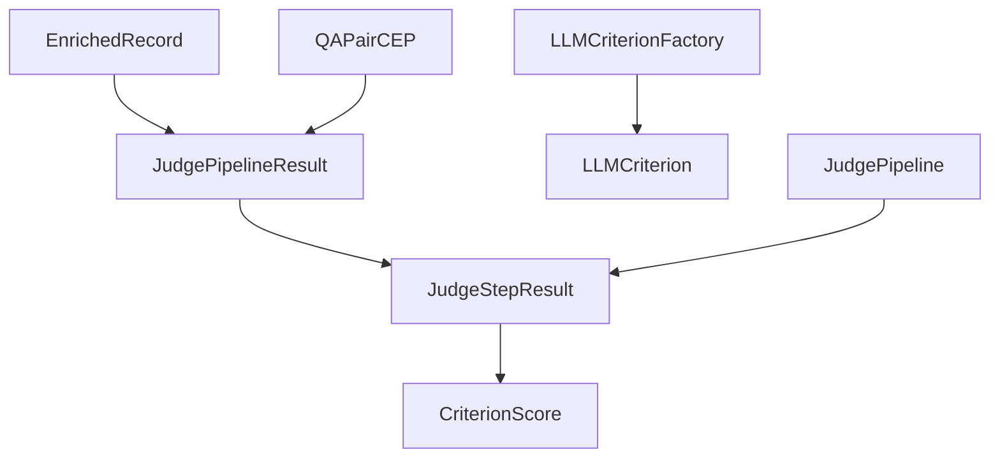

This page summarizes the active schema contracts in:

- `src/arandu/shared/schemas.py`
- `src/arandu/shared/judge/schemas.py`
- `src/arandu/shared/judge/*.py`
- `src/arandu/qa/schemas.py`

## Input and transcription records

### `EnrichedRecord`

`EnrichedRecord` extends `InputRecord` and mixes in `JudgeResultMixin`.

Important judge-related fields:

| Field | Type | Meaning |
|---|---|---|
| `validation` | `JudgePipelineResult \| None` | Full per-record judge output |
| `is_valid` | `bool \| None` (computed) | Derived from `validation.passed` |

`transcription_quality` is not part of the current canonical schema. During load,
legacy payloads are migrated by `_migrate_legacy_quality_field`.

## Judge result schema

### `CriterionScore`

| Field | Type |
|---|---|
| `score` | `float \| None` |
| `threshold` | `float` |
| `rationale` | `str` |
| `thinking` | `str \| None` |
| `error` | `str \| None` |

Computed behavior: `passed` is true only when `score >= threshold` and no error.

### `JudgeStepResult`

| Field | Type |
|---|---|
| `criterion_scores` | `dict[str, CriterionScore]` |

Computed behavior: `passed` is true only when all criterion scores pass.

### `JudgePipelineResult`

| Field | Type |
|---|---|
| `stage_results` | `dict[str, JudgeStepResult]` |
| `passed` | `bool` |
| `rejected_at` | `str \| None` |

This is the canonical persisted verdict type for both transcription records and CEP QA pairs.

### `JudgeResultMixin`

Reusable mixin that standardizes:

- `validation: JudgePipelineResult | None`
- `is_valid` computed from `validation.passed`

## LLMCriterion framework

The judging framework uses composable criterion and stage abstractions.

### Criterion classes

- `JudgeCriterion`: abstract base class with shared error handling.
- `HeuristicCriterion`: pure-Python scoring via `_check()`.
- `LLMCriterion`: LLM-scored criterion using prompt templates and structured output.

`LLMCriterion` is configured by:

- `prompts/judge/criteria/<criterion>/config.json` (`threshold`, optional `temperature`)
- `prompts/judge/criteria/<criterion>/<lang>/prompt.md`

### Factory and pipeline

- `LLMCriterionFactory` lazily builds and caches `LLMCriterion` instances.
- `JudgeStep` evaluates a set of criteria in one stage.
- `JudgePipeline` executes ordered `JudgeStage` objects with stage modes:
  - `filter`: failure rejects pipeline and skips later non-`always` stages
  - `score`: records stage result without rejecting
  - `always`: runs even after prior rejection

## CEP QA schemas

### `QAPairCEP`

`QAPairCEP` extends `QAPair` and mixes in `JudgeResultMixin`.

Judge persistence is per pair:

- `validation: JudgePipelineResult | None`
- `is_valid` computed from `validation.passed`

CEP-specific fields include:

- `bloom_level`, `reasoning_trace`, `is_multi_hop`, `hop_count`, `tacit_inference`,
  `generation_prompt`, `generation_thinking`

### `QARecordCEP`

Container for generated QA pairs and generation metadata.

Key fields:

- provenance (`source_file_id`, `source_filename`, `source_metadata`)
- generation metadata (`model_id`, `provider`, `language`, `generation_timestamp`)
- pair collection (`qa_pairs`, `total_pairs`, `validated_pairs`, `bloom_distribution`)
- optional aggregate metrics (`validation_summary`)
- computed `validation_rate`

## Relationship overview

