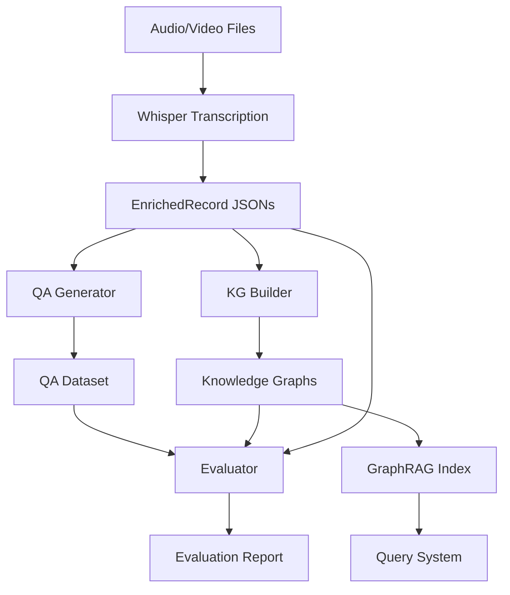

# Knowledge Graph Construction Pipeline - Implementation Plan

**Project**: etno-kgc-preprocessing (G-Transcriber)
**Version**: 2.0
**Date**: 2026-01-14
**Status**: Planning Complete, Ready for Implementation

## Table of Contents

1. [Executive Summary](#executive-summary)
2. [Project Context](#project-context)
3. [Architecture Overview](#architecture-overview)
4. [Task Breakdown](#task-breakdown)
5. [Implementation Phases](#implementation-phases)
6. [Technical Specifications](#technical-specifications)
7. [Deployment Strategy](#deployment-strategy)
8. [Testing & Validation](#testing--validation)
9. [Success Criteria](#success-criteria)
10. [References](#references)

---

## Executive Summary

This document outlines the implementation plan for extending the G-Transcriber project to add knowledge graph construction, synthetic QA dataset generation, and evaluation capabilities. The project builds on the completed transcription preprocessing pipeline (P1) and implements three new capabilities (P2 tasks) plus two research initiatives (P3 tasks).

### Key Objectives

1. **Generate Synthetic QA Datasets** - Create question-answer pairs from transcriptions for evaluation
2. **Measure Knowledge Elicitation** - Define and compute metrics for knowledge quality
3. **Build Knowledge Graphs** - Construct graphs using AutoSchemaKG framework
4. **Research Alternative Frameworks** - Compare KG construction approaches
5. **Develop GraphRAG System** - Enable querying and retrieval over knowledge graphs

### Timeline

- **Phase 1 (Foundation)**: Week 1 - Infrastructure setup
- **Phase 2 (QA Generation)**: Week 2 - Synthetic QA implementation
- **Phase 3 (KG Construction)**: Week 3-4 - AutoSchemaKG integration
- **Phase 4 (Evaluation)**: Week 5 - Metrics implementation
- **Phase 5 (Research)**: Week 6-8 - Framework comparison and GraphRAG

### Technology Stack

- **LLM Integration**: OpenAI API, Ollama (via OpenAI-compatible endpoint)
- **KG Framework**: AutoSchemaKG (atlas-rag package)
- **Graph Library**: NetworkX
- **Evaluation**: scikit-learn, sentence-transformers, sacrebleu
- **Infrastructure**: Docker, SLURM, Pydantic, Typer

---

## Project Context

### Current State (P1 - Completed)

The G-Transcriber project is a production-grade automated transcription system with:

- **Batch Processing**: Parallel workers with checkpointing and resume capability
- **Google Drive Integration**: Download, transcribe, upload workflow
- **Multi-Environment Support**: Docker compose with GPU/CPU/ROCm variants
- **SLURM Cluster Support**: Optimized for PCAD cluster with $SCRATCH I/O
- **Rich Configuration**: Pydantic Settings with .env support
- **CLI Interface**: Typer-based commands with progress tracking

**Output**: EnrichedRecord JSONs containing transcriptions with metadata, timestamps, and segments

### Target State (P2 + P3)

Extend the pipeline to support knowledge extraction and evaluation:

```
Transcriptions → [QA Generation] → Synthetic QA Dataset
                ↓
                [KG Construction] → Knowledge Graphs
                ↓
                [Evaluation] → Quality Metrics + Recommendations
                ↓
                [GraphRAG] → Query System (future)
```

### Key Decisions Made

1. **AutoSchemaKG Framework** - Selected for dynamic schema induction capabilities
2. **Hybrid LLM Approach** - Combine commercial APIs (OpenAI) with local Ollama models via OpenAI-compatible endpoint
3. **GraphML Format** - AutoSchemaKG native output, directly compatible with NetworkX
4. **Metric Categories** - Four evaluation dimensions (QA, entity, relation, semantic)
5. **Batch Processing Pattern** - Reuse existing architecture for consistency

---

## Architecture Overview

### System Components

```
┌─────────────────────────────────────────────────────────────┐
│                    G-Transcriber v2.0                       │
├─────────────────────────────────────────────────────────────┤
│                                                             │
│  ┌──────────────┐  ┌──────────────┐  ┌──────────────┐    │
│  │ Transcription│  │      QA      │  │      KG      │    │
│  │   Pipeline   │→ │  Generation  │→ │ Construction │    │
│  │   (P1 ✓)    │  │   (P2.1)     │  │   (P2.3)     │    │
│  └──────────────┘  └──────────────┘  └──────────────┘    │
│         │                 │                   │            │
│         └─────────────────┴───────────────────┘            │
│                           ↓                                │
│                  ┌──────────────┐                         │
│                  │  Evaluation  │                         │
│                  │   (P2.2)     │                         │
│                  └──────────────┘                         │
│                           ↓                                │
│                  ┌──────────────┐                         │
│                  │   GraphRAG   │                         │
│                  │   (P3.5)     │                         │
│                  └──────────────┘                         │
└─────────────────────────────────────────────────────────────┘
```

### Data Flow



### Module Structure

```
src/gtranscriber/
├── main.py                      # CLI entrypoint
├── config.py                    # Configuration (extended)
├── schemas.py                   # Data models (extended)
├── core/
│   ├── engine.py               # Whisper engine (existing)
│   ├── batch.py                # Batch processing (existing)
│   ├── drive.py                # Google Drive (existing)
│   ├── checkpoint.py           # Checkpointing (existing)
│   │
│   ├── llm_client.py          # NEW: Unified LLM client
│   ├── qa_generator.py        # NEW: QA generation
│   ├── qa_batch.py            # NEW: QA batch processing
│   ├── kg_builder.py          # NEW: AutoSchemaKG wrapper
│   ├── kg_batch.py            # NEW: KG batch processing
│   ├── metrics.py             # NEW: Evaluation metrics
│   └── evaluator.py           # NEW: Evaluation orchestration
└── utils/
    ├── logger.py               # Logging (existing)
    └── ui.py                   # Progress bars (existing)
```

### Infrastructure

**Docker Compose Services**:
- `gtranscriber` - Original transcription (GPU/CUDA)
- `gtranscriber-cpu` - CPU-only transcription
- `gtranscriber-rocm` - AMD GPU support
- `gtranscriber-qa` - NEW: QA generation
- `gtranscriber-kg` - NEW: KG construction
- `gtranscriber-eval` - NEW: Evaluation

**SLURM Scripts**:
- `scripts/slurm/*.slurm` - Partition-specific scripts (existing)
- `scripts/slurm/job_common.sh` - Common logic with $SCRATCH (existing)
- `scripts/slurm/run_qa_generation.slurm` - NEW: QA generation job
- `scripts/slurm/run_kg_construction.slurm` - NEW: KG construction job
- `scripts/slurm/run_evaluation.slurm` - NEW: Evaluation job

---

## Task Breakdown

### P2 Task 1: Synthetic QA Dataset Generation

**Objective**: Generate question-answer pairs from transcriptions using hybrid LLM approach

**Components**:
1. LLM Client (`llm_client.py`)
2. QA Generator (`qa_generator.py`)
3. QA Batch Processor (`qa_batch.py`)
4. CLI Command (`generate-qa`)

**Input**: EnrichedRecord JSONs from `results/` directory

**Output**: QARecord JSONs with question-answer pairs

**Key Features**:
- Multiple question strategies (factual, conceptual, temporal, entity-focused)
- Hybrid LLM support (OpenAI, Ollama via OpenAI-compatible API)
- Prompt engineering with few-shot examples
- Context window management for long transcriptions
- Answer validation (extractive from context)
- Parallel processing with checkpointing

**Configuration Settings**:
```python
qa_provider: str = "ollama"
qa_model_id: str = "llama3.1:8b"
qa_ollama_url: str = "http://localhost:11434"
openai_api_key: str | None = None
llm_base_url: str | None = None  # For custom OpenAI-compatible endpoints
questions_per_document: int = 10
qa_strategies: list[str] = ["factual", "conceptual"]
```

**CLI Usage**:
```bash
gtranscriber generate-qa results/ \
    --output-dir qa_dataset \
    --provider ollama \
    --model-id llama3.1:8b \
    --workers 4 \
    --questions 10 \
    --strategy factual \
    --strategy conceptual
```

**Docker Deployment**:
```bash
docker compose --profile qa up gtranscriber-qa
```

**SLURM Deployment**:
```bash
sbatch scripts/slurm/run_qa_generation.slurm
```

### P2 Task 2: Knowledge Elicitation Metrics

**Objective**: Measure knowledge extraction quality across four dimensions

**Components**:
1. Metrics Module (`metrics.py`)
2. Evaluator (`evaluator.py`)
3. CLI Command (`evaluate`)

**Metric Categories**:

**A. QA-Based Metrics**
- Exact Match (EM): Percentage of exact answer matches
- F1 Score: Token-level F1 between prediction and ground truth
- BLEU Score: N-gram overlap for answer quality

**B. Entity Coverage Metrics**
- Entity Density: Entities per 100 tokens
- Entity Diversity: Unique entities / total entities
- Entity Type Distribution: Breakdown by type (PERSON, LOCATION, etc.)

**C. Relation Density Metrics**
- Relation Density: Relations per entity
- Relation Diversity: Unique relation types / total relations
- Graph Connectivity: Connected components, average degree, density

**D. Semantic Quality Metrics**
- Coherence Score: Semantic similarity between segments
- Information Density: (Entities + Relations) / text length
- Knowledge Coverage: Entities covered by QA pairs

**Input**:
- QA Dataset (QARecord JSONs)
- Knowledge Graphs (GraphML files)
- Original Transcriptions (EnrichedRecord JSONs)

**Output**: EvaluationReport JSON with scores and recommendations

**CLI Usage**:
```bash
gtranscriber evaluate qa_dataset/ results/ \
    --kg-path knowledge_graphs/corpus_graph.graphml \
    --output evaluation_report.json \
    --metric qa \
    --metric entity \
    --metric relation \
    --metric semantic
```

### P2 Task 3: Knowledge Graph Construction

**Objective**: Build knowledge graphs using AutoSchemaKG framework

**Components**:
1. KG Builder (`kg_builder.py`) - AutoSchemaKG wrapper
2. KG Batch Processor (`kg_batch.py`)
3. CLI Command (`build-kg`)
4. Portuguese Prompts (`prompts/pt_prompts.json`) - Custom extraction prompts for Portuguese

**Language Support**:
AutoSchemaKG supports multilingual KG construction through custom prompt templates. Since all transcriptions in this project are in Portuguese, we need to create language-specific prompts for triple extraction. The framework routes extraction to the correct language via document metadata (`metadata.lang`).

**AutoSchemaKG Pipeline**:
1. **Triple Extraction**: `kg_extractor.run_extraction()` - LLM extracts triples
2. **CSV Conversion**: `kg_extractor.convert_json_to_csv()` - Convert to tabular format
3. **Schema Induction**: `kg_extractor.generate_concept_csv_temp()` - Conceptualize entities/events
4. **Concept CSV**: `kg_extractor.create_concept_csv()` - Create concept mapping
5. **GraphML Export**: `kg_extractor.convert_to_graphml()` - Export to NetworkX-compatible format

The output GraphML can be loaded directly with `nx.read_graphml()` - no custom schemas needed.

**Processing Strategy**:
- Process each transcription independently (enables parallelization)
- Save individual graphs as GraphML files
- Optionally merge all graphs into corpus-level graph
- Checkpoint progress for fault tolerance

**Configuration Settings**:
```python
kg_provider: str = "ollama"
kg_model_id: str = "llama3.1:8b"
kg_merge_graphs: bool = True
kg_output_format: str = "graphml"  # json or graphml
kg_language: str = "pt"  # Language code for extraction prompts
kg_prompt_path: str = "prompts/pt_prompts.json"  # Path to custom prompts
```

**Portuguese Prompt Template** (`prompts/pt_prompts.json`):
```json
{
  "pt": {
    "system": "Você é um assistente especializado em extração de conhecimento de textos em português...",
    "triple_extraction": "Extraia triplas de conhecimento (sujeito, predicado, objeto) do texto a seguir. Identifique entidades (pessoas, locais, organizações, eventos, datas) e suas relações..."
  }
}
```

**CLI Usage**:
```bash
gtranscriber build-kg results/ \
    --output-dir knowledge_graphs \
    --provider ollama \
    --model-id llama3.1:8b \
    --workers 4 \
    --merge \
    --format json
```

**Docker Deployment**:
```bash
docker compose --profile kg up gtranscriber-kg
```

**SLURM Deployment**:
```bash
sbatch scripts/slurm/run_kg_construction.slurm
```

### P3 Task 4: Research Other KG Frameworks

**Objective**: Comparative analysis of KG construction frameworks

**Frameworks to Evaluate**:
1. AutoSchemaKG - Dynamic schema induction
2. Microsoft GraphRAG - Community detection + RAG
3. KARMA - Multi-agent KG construction
4. Neo4j LLM KG Builder - LangChain integration
5. paper2lkg - Academic paper KG construction

**Evaluation Criteria**:
- Integration complexity with existing pipeline
- Scalability to large corpora (millions of documents)
- Schema flexibility (fixed vs. dynamic)
- LLM requirements and API costs
- Output quality and coherence
- License and maintenance status

**Deliverable**: `docs/KG_FRAMEWORKS_COMPARISON.md`

**Approach**:
1. Literature review (1 week)
2. Prototype top 2-3 frameworks on sample data (1 week)
3. Compare outputs and document findings (3-4 days)

### P3 Task 5: GraphRAG System Development

**Objective**: Enable natural language querying over knowledge graphs

**Research Areas**:
1. Microsoft GraphRAG architecture study
2. Indexing strategies (community detection, hierarchical clustering)
3. Query processing (local vs. global search)
4. Integration with existing KG pipeline

**Prototype Components** (Future):
- `graphrag_indexer.py` - Index KG for retrieval
- `graphrag_retriever.py` - Retrieve relevant subgraphs
- `graphrag_qa.py` - Question answering over graphs
- `graphrag_evaluator.py` - Evaluate performance

**CLI Commands** (Future):
```bash
# Index knowledge graph
gtranscriber index-graphrag knowledge_graphs/corpus_graph.graphml

# Query with natural language
gtranscriber query-graphrag graphrag_index/ \
    --query "What flood events occurred in 2023?"

# Evaluate performance
gtranscriber evaluate-graphrag graphrag_index/ qa_dataset/ \
    --output graphrag_evaluation.json
```

**Evaluation Strategy**:
- Use synthetic QA dataset (P2 Task 1) as ground truth
- Measure answer accuracy, retrieval precision/recall, latency
- Compare to baselines (BM25, dense retrieval)

**Deliverable**: `docs/GRAPHRAG_INTEGRATION_PLAN.md`

---

## Implementation Phases

### Phase 1: Foundation (Week 1)

**Goal**: Set up shared infrastructure for all new features

**Tasks**:

1. **LLM Client Implementation** (`llm_client.py`)
   - [ ] Create `LLMProvider` enum (OpenAI, Ollama, Custom)
   - [ ] Implement `LLMClient` class using OpenAI SDK with configurable base_url
   - [ ] Add retry logic with tenacity
   - [ ] Add health check functionality
   - [ ] Implement token usage tracking
   - [ ] Add unit tests for each provider

2. **Configuration Extension** (`config.py`)
   - [ ] Add QA generation settings
   - [ ] Add KG construction settings
   - [ ] Add evaluation settings
   - [ ] Add GraphRAG settings (future)
   - [ ] Update `.env.example` with new variables

3. **Schema Extension** (`schemas.py`)
   - [ ] Add `QAPair` model
   - [ ] Add `QARecord` model
   - [ ] Add `KGMetadata` dataclass (lightweight provenance tracking)
   - [ ] Add `EntityCoverageResult` model
   - [ ] Add `RelationMetricsResult` model
   - [ ] Add `SemanticQualityResult` model
   - [ ] Add `EvaluationReport` model

   **Note**: KG data uses AutoSchemaKG's native GraphML output directly with NetworkX.
   No custom KGNode/KGEdge/KGRecord classes needed.

4. **Docker Configuration**
   - [ ] Add `gtranscriber-qa` service to `docker-compose.yml`
   - [ ] Add `gtranscriber-kg` service to `docker-compose.yml`
   - [ ] Add `gtranscriber-eval` service to `docker-compose.yml`
   - [ ] Configure environment variables for each service
   - [ ] Set up volume mounts for new directories

5. **SLURM Scripts**
   - [ ] Create `run_qa_generation.slurm`
   - [ ] Create `run_kg_construction.slurm`
   - [ ] Create `run_evaluation.slurm`
   - [ ] Test $SCRATCH integration for new scripts

6. **Dependencies**
   - [ ] Update `pyproject.toml` with new dependencies
   - [ ] Test installation locally: `pip install -e .`
   - [ ] Verify all imports work

**Deliverables**:
- Working LLM client with all three providers
- Extended configuration and schemas
- Updated Docker and SLURM infrastructure
- All dependencies installed and tested

**Testing**:
```bash
# Test LLM client
python -c "from gtranscriber.core.llm_client import LLMClient; ..."

# Test configuration
python -c "from gtranscriber.config import TranscriberConfig; ..."

# Test schemas
python -c "from gtranscriber.schemas import QAPair, KGMetadata; ..."
```

### Phase 2: QA Generation (Week 2)

**Goal**: Implement synthetic QA dataset generation

**Tasks**:

1. **QA Generator** (`qa_generator.py`)
   - [ ] Create `QAStrategy` enum
   - [ ] Implement `QAGenerator` class
   - [ ] Design prompts for each strategy type
   - [ ] Implement few-shot examples
   - [ ] Add context window chunking
   - [ ] Add answer validation logic
   - [ ] Test on sample transcription

2. **QA Batch Processor** (`qa_batch.py`)
   - [ ] Create `QABatchConfig` dataclass
   - [ ] Implement `run_batch_qa_generation()` function
   - [ ] Follow `batch.py` pattern for consistency
   - [ ] Add checkpoint integration
   - [ ] Add parallel processing with ProcessPoolExecutor
   - [ ] Add error handling and retry logic

3. **CLI Command** (`main.py`)
   - [ ] Add `generate_qa()` command with Typer
   - [ ] Add all command-line arguments
   - [ ] Add progress tracking with Rich
   - [ ] Add validation and error messages

4. **Local Testing**
   - [ ] Test with 5-10 sample transcriptions
   - [ ] Verify QARecord JSON structure
   - [ ] Check question quality manually
   - [ ] Test with different LLM providers
   - [ ] Measure generation speed

5. **SLURM Deployment**
   - [ ] Submit test job to SLURM
   - [ ] Monitor checkpoint files
   - [ ] Verify results synced to $HOME
   - [ ] Run on full dataset

**Deliverables**:
- Working `generate-qa` command
- QA dataset generated from sample transcriptions
- Validated output structure
- Successful SLURM deployment

**Testing Commands**:
```bash
# Local test
gtranscriber generate-qa results/ -o qa_test/ \
    --provider ollama \
    --workers 2 \
    --questions 5

# Verify output
ls qa_test/
cat qa_test/*.json | jq '.qa_pairs | length'

# SLURM test
sbatch scripts/slurm/run_qa_generation.slurm
squeue -u $USER
```

### Phase 3: KG Construction (Week 3-4)

**Goal**: Build knowledge graphs using AutoSchemaKG

**Tasks**:

1. **AutoSchemaKG Installation** (Week 3, Day 1)
   - [ ] Install `atlas-rag` package: `pip install atlas-rag`
   - [ ] Test basic AutoSchemaKG functionality
   - [ ] Read AutoSchemaKG documentation
   - [ ] Review multilingual processing guide (`example/multilingual_processing.md`)
   - [ ] Run example notebooks from repository
   - [ ] Understand input/output formats

2. **Portuguese Prompts Configuration** (Week 3, Day 1-2)
   - [ ] Create `prompts/` directory structure
   - [ ] Design Portuguese prompts for triple extraction
   - [ ] Create `prompts/pt_prompts.json` with system and extraction prompts
   - [ ] Ensure EnrichedRecord includes `metadata.lang = "pt"` for all documents
   - [ ] Test prompt loading with AutoSchemaKG `ProcessingConfig`
   - [ ] Validate extraction quality on sample Portuguese text

3. **KG Builder** (`kg_builder.py`) (Week 3, Day 2-3)
   - [ ] Create `KGBuilder` class wrapping AutoSchemaKG
   - [ ] Implement `build_from_transcription()` method
   - [ ] Implement triple extraction integration with Portuguese prompts
   - [ ] Implement schema induction integration with `language='pt'` parameter
   - [ ] Implement NetworkX conversion
   - [ ] Implement graph merging logic
   - [ ] Add GraphML export (AutoSchemaKG native format)

4. **KG Batch Processor** (`kg_batch.py`) (Week 3, Day 4-5)
   - [ ] Create `KGBatchConfig` dataclass
   - [ ] Implement `run_batch_kg_construction()` function
   - [ ] Add checkpoint integration
   - [ ] Add parallel processing
   - [ ] Add graph merging at end
   - [ ] Calculate graph statistics

5. **CLI Command** (`main.py`) (Week 4, Day 1)
   - [ ] Add `build_kg()` command with Typer
   - [ ] Add all command-line arguments (including `--language` option)
   - [ ] Add progress tracking
   - [ ] Add statistics display

6. **Local Testing** (Week 4, Day 2-3)
   - [ ] Test on 3-5 sample Portuguese transcriptions
   - [ ] Verify GraphML output and metadata
   - [ ] Inspect graph quality manually (verify Portuguese entities/relations)
   - [ ] Check schema coherence
   - [ ] Verify merge functionality

7. **SLURM Deployment** (Week 4, Day 4-5)
   - [ ] Submit test job to SLURM
   - [ ] Monitor progress and logs
   - [ ] Run on full corpus
   - [ ] Verify merged graph quality

**Deliverables**:
- Working `build-kg` command
- Knowledge graphs for sample transcriptions
- Corpus-level merged graph
- Validated schema coherence
- Successful SLURM deployment

**Testing Commands**:
```bash
# Local test
gtranscriber build-kg results/ -o kg_test/ \
    --provider ollama \
    --workers 1 \
    --merge

# Inspect graph
python -c "
import json
with open('kg_test/corpus_graph.graphml') as f:
    kg = json.load(f)
    print(f'Nodes: {len(kg[\"nodes\"])}')
    print(f'Edges: {len(kg[\"edges\"])}')
"

# SLURM test
sbatch scripts/slurm/run_kg_construction.slurm
```

### Phase 4: Evaluation (Week 5)

**Goal**: Implement metrics and generate evaluation reports

**Tasks**:

1. **Metrics Module** (`metrics.py`) (Day 1-3)
   - [ ] Implement `QAMetrics` class
     - [ ] `calculate_exact_match()`
     - [ ] `calculate_f1_score()`
     - [ ] `calculate_bleu_score()`
   - [ ] Implement `EntityMetrics` class
     - [ ] `calculate_entity_coverage()`
     - [ ] `calculate_entity_diversity()`
     - [ ] `calculate_entity_type_distribution()`
   - [ ] Implement `RelationMetrics` class
     - [ ] `calculate_relation_density()`
     - [ ] `calculate_relation_diversity()`
     - [ ] `calculate_graph_connectivity()`
   - [ ] Implement `SemanticQualityMetrics` class
     - [ ] `calculate_coherence_score()`
     - [ ] `calculate_information_density()`
     - [ ] `calculate_knowledge_coverage()`

2. **Evaluator Module** (`evaluator.py`) (Day 4)
   - [ ] Create `EvaluationConfig` dataclass
   - [ ] Implement `KnowledgeEvaluator` class
   - [ ] Implement `evaluate_qa_dataset()`
   - [ ] Implement `evaluate_knowledge_graph()`
   - [ ] Implement `evaluate_semantic_quality()`
   - [ ] Implement `generate_report()`
   - [ ] Add recommendations generation logic

3. **CLI Command** (`main.py`) (Day 5)
   - [ ] Add `evaluate()` command with Typer
   - [ ] Add all command-line arguments
   - [ ] Add progress tracking
   - [ ] Add report display

4. **Testing & Analysis** (Day 5)
   - [ ] Run evaluation on generated datasets
   - [ ] Review metrics and identify issues
   - [ ] Generate comprehensive report
   - [ ] Document findings

**Deliverables**:
- Working `evaluate` command
- Comprehensive evaluation report
- Metrics for all four categories
- Recommendations for improvement

**Testing Commands**:
```bash
# Run evaluation
gtranscriber evaluate qa_dataset/ results/ \
    --kg-path knowledge_graphs/corpus_graph.graphml \
    --output evaluation_report.json

# View report
cat evaluation_report.json | jq .

# Check specific metrics
cat evaluation_report.json | jq '.entity_coverage'
cat evaluation_report.json | jq '.recommendations'
```

### Phase 5: Research & Documentation (Week 6-8)

**Goal**: Research alternative frameworks and plan GraphRAG integration

**Tasks**:

1. **KG Frameworks Research** (Week 6)
   - [ ] Literature review of 5 frameworks
   - [ ] Setup test environment for each
   - [ ] Run prototypes on sample data (10 files)
   - [ ] Compare outputs and quality
   - [ ] Measure computational costs
   - [ ] Document findings in comparison table
   - [ ] Write recommendations

2. **GraphRAG Study** (Week 7)
   - [ ] Study Microsoft GraphRAG paper
   - [ ] Review GraphRAG codebase
   - [ ] Understand indexing pipeline
   - [ ] Understand query processing
   - [ ] Define use cases for project
   - [ ] Design integration architecture

3. **GraphRAG Prototype** (Week 8)
   - [ ] Implement basic indexing
   - [ ] Implement local search
   - [ ] Test on sample queries
   - [ ] Measure performance
   - [ ] Document findings and next steps

**Deliverables**:
- `docs/KG_FRAMEWORKS_COMPARISON.md`
- `docs/GRAPHRAG_INTEGRATION_PLAN.md`
- Prototype code for top frameworks
- Performance benchmarks

---

## Technical Specifications

### Data Schemas

See [docs/implementation/DATA_SCHEMAS.md](docs/implementation/DATA_SCHEMAS.md) for complete specifications.

**Key Schemas**:
- `QAPair` - Single question-answer pair
- `QARecord` - QA dataset record for one document
- `KGMetadata` - Lightweight provenance tracking for knowledge graphs
- `EvaluationReport` - Comprehensive evaluation results

**Note**: Knowledge graphs use AutoSchemaKG's native GraphML format loaded directly into NetworkX.
No custom node/edge classes needed - GraphML preserves all attributes.

### Configuration Reference

See [docs/implementation/CONFIGURATION.md](docs/implementation/CONFIGURATION.md) for complete reference.

**New Settings**:

```python
# QA Generation
qa_provider: str = "ollama"
qa_model_id: str = "llama3.1:8b"
qa_ollama_url: str = "http://localhost:11434"
openai_api_key: str | None = None
llm_base_url: str | None = None  # For custom OpenAI-compatible endpoints
questions_per_document: int = 10
qa_strategies: list[str] = ["factual", "conceptual"]

# KG Construction
kg_provider: str = "ollama"
kg_model_id: str = "llama3.1:8b"
kg_merge_graphs: bool = True
kg_output_format: str = "graphml"
kg_language: str = "pt"  # Portuguese for ETno corpus
kg_prompt_path: str = "prompts/pt_prompts.json"

# Evaluation
evaluation_metrics: list[str] = ["qa", "entity", "relation", "semantic"]
embedding_model: str = "sentence-transformers/all-MiniLM-L6-v2"
```

### CLI Commands Reference

See [docs/implementation/CLI_REFERENCE.md](docs/implementation/CLI_REFERENCE.md) for complete reference.

**New Commands**:

```bash
# Generate QA dataset
gtranscriber generate-qa INPUT_DIR [OPTIONS]

# Build knowledge graph
gtranscriber build-kg INPUT_DIR [OPTIONS]

# Evaluate quality
gtranscriber evaluate QA_DATASET TRANSCRIPTIONS [OPTIONS]
```

### API Documentation

See [docs/implementation/API_DOCUMENTATION.md](docs/implementation/API_DOCUMENTATION.md) for complete API reference.

---

## Deployment Strategy

### Local Development

**Setup**:
```bash
# Clone repository
git clone <repo-url>
cd etno-kgc-preprocessing

# Install dependencies
pip install -e .

# Configure environment
cp .env.example .env
# Edit .env with your settings

# Run commands
gtranscriber generate-qa results/ -o qa_dataset/
```

### Docker Deployment

**Build**:
```bash
# Build GPU transcription service
docker compose --profile gpu build gtranscriber

# Build QA/KG/Eval services (built automatically on first run)
docker compose --profile qa build gtranscriber-qa
docker compose --profile kg build gtranscriber-kg
```

**Run Services**:
```bash
# QA generation
docker compose --profile qa up gtranscriber-qa

# KG construction
docker compose --profile kg up gtranscriber-kg

# Evaluation
docker compose --profile evaluate up gtranscriber-eval
```

### SLURM Deployment (PCAD Cluster)

**Preparation**:
```bash
# Copy files to cluster
rsync -avz etno-kgc-preprocessing/ user@pcad:~/etno-kgc-preprocessing/

# SSH to cluster
ssh user@pcad
cd etno-kgc-preprocessing
```

**Submit Jobs**:
```bash
# QA generation job
sbatch scripts/slurm/run_qa_generation.slurm

# KG construction job
sbatch scripts/slurm/run_kg_construction.slurm

# Check status
squeue -u $USER

# View logs
tail -f slurm-<job-id>.out
```

**Job Configuration**:
- **Partition**: grace (CPU-only for QA/KG) or GPU partitions for evaluation
- **CPUs**: 8-16 cores for parallel processing
- **Memory**: 32-64 GB depending on corpus size
- **Time Limit**: 12-24 hours for large datasets

---

## Testing & Validation

### Unit Tests

```bash
# Run all tests
pytest tests/

# Run specific test module
pytest tests/test_llm_client.py
pytest tests/test_qa_generator.py
pytest tests/test_kg_builder.py
```

### Integration Tests

```bash
# Test full QA pipeline
bash tests/integration/test_qa_pipeline.sh

# Test full KG pipeline
bash tests/integration/test_kg_pipeline.sh

# Test evaluation pipeline
bash tests/integration/test_evaluation_pipeline.sh
```

### Validation Checklist

**QA Generation**:
- [ ] All question types generated
- [ ] Answers are extractive from context
- [ ] No hallucinated information
- [ ] Reasonable distribution of question types
- [ ] Timestamps preserved when available

**KG Construction**:
- [ ] Portuguese prompts loaded correctly
- [ ] Schema coherence (no duplicate concepts)
- [ ] Entity types are semantically consistent (Portuguese entity names)
- [ ] Relations are meaningful (Portuguese relation labels)
- [ ] Graph is connected (or has reasonable components)
- [ ] No isolated nodes (unless justified)

**Evaluation**:
- [ ] All metrics computed successfully
- [ ] Scores are in valid ranges
- [ ] Recommendations are actionable
- [ ] No NaN or infinite values

---

## Success Criteria

### P2 Task 1: QA Generation

- ✅ Generate 10+ QA pairs per transcription
- ✅ Support multiple question strategies
- ✅ Answers extractable from original context
- ✅ Hybrid LLM support (OpenAI/Ollama via OpenAI-compatible API) working
- ✅ Checkpoint and resume functionality working
- ✅ Successful SLURM deployment on full dataset

### P2 Task 2: Evaluation Metrics

- ✅ All four metric categories implemented
- ✅ Evaluation report generated with valid scores
- ✅ Recommendations are specific and actionable
- ✅ Metrics identify quality issues correctly

### P2 Task 3: KG Construction

- ✅ AutoSchemaKG successfully integrated
- ✅ Portuguese prompts configured and tested (`prompts/pt_prompts.json`)
- ✅ Graphs built for all Portuguese transcriptions
- ✅ Schema coherence validated manually (Portuguese entities/relations)
- ✅ GraphML export working correctly (NetworkX compatible)
- ✅ Corpus-level graph merge successful
- ✅ Graph statistics reasonable (nodes/edges/density)

### Overall Project Success

- ✅ All CLI commands work locally and on SLURM
- ✅ Docker containers run without errors
- ✅ Checkpointing enables job resumption after failure
- ✅ Results properly synced to $HOME from $SCRATCH
- ✅ Documentation complete and accurate
- ✅ Code follows existing project patterns
- ✅ No regression in existing transcription functionality

---

## References

### AutoSchemaKG

- [GitHub Repository](https://github.com/HKUST-KnowComp/AutoSchemaKG)
- [Official Documentation](https://hkust-knowcomp.github.io/AutoSchemaKG/)
- [Research Paper](https://arxiv.org/abs/2505.23628)
- [Hugging Face Dataset](https://huggingface.co/datasets/AlexFanWei/AutoSchemaKG)
- [Multilingual Processing Guide](https://github.com/HKUST-KnowComp/AutoSchemaKG/blob/main/example/multilingual_processing.md) - Guide for Portuguese and other languages

### Related Frameworks

- [Microsoft GraphRAG](https://github.com/microsoft/graphrag)
- [NetworkX Documentation](https://networkx.org/documentation/stable/)
- [Neo4j Graph Data Science](https://neo4j.com/docs/graph-data-science/)

### LLM APIs

- [OpenAI API Documentation](https://platform.openai.com/docs/api-reference)
- [Ollama Documentation](https://github.com/ollama/ollama)
- [Ollama OpenAI Compatibility](https://ollama.com/blog/openai-compatibility)

### Evaluation

- [sacrebleu Documentation](https://github.com/mjpost/sacrebleu)
- [Sentence Transformers](https://www.sbert.net/)
- [scikit-learn Metrics](https://scikit-learn.org/stable/modules/model_evaluation.html)

### Infrastructure

- [Docker Compose Documentation](https://docs.docker.com/compose/)
- [SLURM Documentation](https://slurm.schedmd.com/documentation.html)
- [Pydantic Documentation](https://docs.pydantic.dev/)
- [Typer Documentation](https://typer.tiangolo.com/)

---

## Appendices

### Appendix A: File Structure

Complete list of files to be created/modified - see [docs/implementation/FILE_STRUCTURE.md](docs/implementation/FILE_STRUCTURE.md)

### Appendix B: Dependencies

Complete dependency list with versions - see [docs/implementation/DEPENDENCIES.md](docs/implementation/DEPENDENCIES.md)

### Appendix C: Troubleshooting

Common issues and solutions - see [docs/implementation/TROUBLESHOOTING.md](docs/implementation/TROUBLESHOOTING.md)

### Appendix D: Performance Tuning

Optimization guidelines - see [docs/implementation/PERFORMANCE_TUNING.md](docs/implementation/PERFORMANCE_TUNING.md)

---

**Document Version**: 1.1
**Last Updated**: 2026-01-23
**Author**: AI Assistant (Claude)
**Status**: Ready for Implementation
