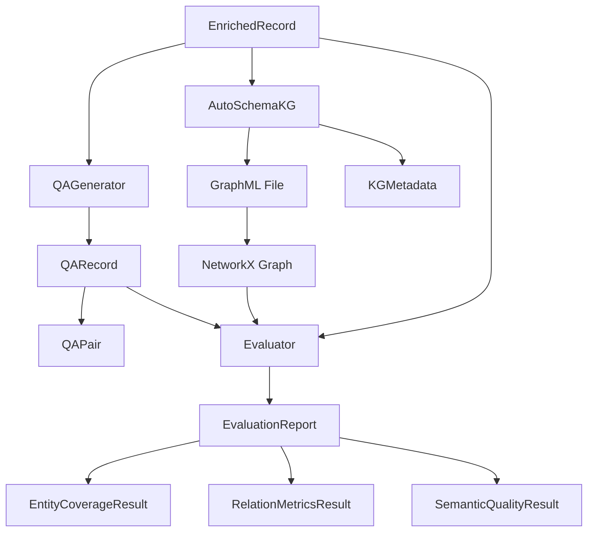

# Data Schemas Documentation

This document provides complete specifications for all data schemas used in the Knowledge Graph Construction Pipeline.

## Table of Contents

1. [QA Generation Schemas](#qa-generation-schemas)
2. [Knowledge Graph Schemas](#knowledge-graph-schemas)
3. [Evaluation Schemas](#evaluation-schemas)
4. [Schema Relationships](#schema-relationships)

---

## QA Generation Schemas

### QAPair

Represents a single question-answer pair generated from a transcription.

**Fields**:

| Field | Type | Required | Description |
|-------|------|----------|-------------|
| `question` | `str` | Yes | The generated question |
| `answer` | `str` | Yes | The ground truth answer (extractive from context) |
| `context` | `str` | Yes | Source text segment from which QA was generated |
| `question_type` | `Literal["factual", "conceptual", "temporal", "entity"]` | Yes | Strategy used for question generation |
| `confidence` | `float` | Yes | Generation confidence score (0.0-1.0) |
| `start_time` | `float \| None` | No | Segment start time in seconds (if available) |
| `end_time` | `float \| None` | No | Segment end time in seconds (if available) |

**Example**:
```json
{
  "question": "What caused the flooding in the region?",
  "answer": "Heavy rainfall combined with poor drainage infrastructure",
  "context": "The flooding was caused by heavy rainfall combined with poor drainage infrastructure. Many residents were evacuated.",
  "question_type": "factual",
  "confidence": 0.92,
  "start_time": 45.3,
  "end_time": 52.1
}
```

**Validation Rules**:
- `confidence` must be between 0.0 and 1.0
- `answer` must be a substring of or semantically contained in `context`
- `question_type` must be one of: "factual", "conceptual", "temporal", "entity"
- If `start_time` is provided, `end_time` must also be provided
- `start_time` < `end_time` when both are provided

**Python Implementation**:
```python
from typing import Literal
from pydantic import BaseModel, Field, field_validator, model_validator

class QAPair(BaseModel):
    """Represents a single question-answer pair generated from a transcription."""
    question: str
    answer: str
    context: str
    question_type: Literal["factual", "conceptual", "temporal", "entity"]
    confidence: float = Field(ge=0.0, le=1.0)
    start_time: float | None = None
    end_time: float | None = None

    @field_validator("answer")
    @classmethod
    def answer_must_be_extractive(cls, v: str, info) -> str:
        """Validate that answer is extractive from context."""
        context = info.data.get("context", "")
        if context and v.lower() not in context.lower():
            raise ValueError("Answer must be extractive from context")
        return v

    @model_validator(mode="after")
    def validate_time_range(self) -> "QAPair":
        """Validate temporal constraints."""
        if self.start_time is not None and self.end_time is None:
            raise ValueError("end_time required when start_time is provided")
        if self.end_time is not None and self.start_time is None:
            raise ValueError("start_time required when end_time is provided")
        if self.start_time is not None and self.end_time is not None:
            if self.start_time >= self.end_time:
                raise ValueError("start_time must be less than end_time")
        return self
```

### QARecord

Represents the complete QA dataset for a single transcription document.

**Fields**:

| Field | Type | Required | Description |
|-------|------|----------|-------------|
| `source_gdrive_id` | `str` | Yes | Google Drive ID of original media file |
| `source_filename` | `str` | Yes | Original filename |
| `transcription_text` | `str` | Yes | Full transcription text |
| `qa_pairs` | `list[QAPair]` | Yes | List of generated QA pairs |
| `model_id` | `str` | Yes | LLM model used for generation (e.g., "llama3.1:8b") |
| `provider` | `Literal["openai", "ollama", "custom"]` | Yes | LLM provider used |
| `generation_timestamp` | `datetime` | Yes | When QA pairs were generated |
| `total_pairs` | `int` | Yes | Total number of QA pairs generated |

**Example**:
```json
{
  "source_gdrive_id": "1abc123xyz",
  "source_filename": "interview_2023_flood.mp3",
  "transcription_text": "The flooding was caused by heavy rainfall...",
  "qa_pairs": [
    {
      "question": "What caused the flooding?",
      "answer": "Heavy rainfall combined with poor drainage",
      "context": "The flooding was caused by heavy rainfall...",
      "question_type": "factual",
      "confidence": 0.92,
      "start_time": 45.3,
      "end_time": 52.1
    }
  ],
  "model_id": "llama3.1:8b",
  "provider": "ollama",
  "generation_timestamp": "2026-01-14T10:30:00Z",
  "total_pairs": 12
}
```

**Validation Rules**:
- `total_pairs` must equal `len(qa_pairs)`
- `provider` must be one of: "openai", "ollama", "custom"
- All `qa_pairs` must pass QAPair validation

**Python Implementation**:
```python
from datetime import datetime
from pathlib import Path
from typing import Literal
from pydantic import BaseModel, Field, model_validator

class QARecord(BaseModel):
    """Represents the complete QA dataset for a single transcription document."""
    source_gdrive_id: str
    source_filename: str
    transcription_text: str
    qa_pairs: list[QAPair]
    model_id: str
    provider: Literal["openai", "ollama", "custom"]
    generation_timestamp: datetime = Field(default_factory=datetime.now)
    total_pairs: int

    @model_validator(mode="after")
    def validate_total_pairs(self) -> "QARecord":
        """Validate that total_pairs matches actual count."""
        if self.total_pairs != len(self.qa_pairs):
            raise ValueError(
                f"total_pairs ({self.total_pairs}) must equal len(qa_pairs) ({len(self.qa_pairs)})"
            )
        return self

    def save(self, path: str | Path) -> None:
        """Save QA record to JSON file."""
        Path(path).write_text(self.model_dump_json(indent=2))

    @classmethod
    def load(cls, path: str | Path) -> "QARecord":
        """Load QA record from JSON file."""
        return cls.model_validate_json(Path(path).read_text())
```

---

## Knowledge Graph Schemas

### Design Decision: GraphML-First Approach

Instead of defining custom schema classes (KGNode, KGEdge, etc.), we use **AutoSchemaKG's native GraphML output** directly with NetworkX. This provides:

- **Simplicity**: No custom conversion code to maintain
- **Standard format**: GraphML is widely supported
- **Direct NetworkX compatibility**: Load with `nx.read_graphml()`
- **AutoSchemaKG validation**: Triples are validated during extraction

### AutoSchemaKG Pipeline

The KG construction uses AutoSchemaKG's extraction pipeline:

```python
from atlas_rag.kg_construction import KGExtractor

# Initialize extractor
kg_extractor = KGExtractor(config)

# 1. Extract triples from text
kg_extractor.run_extraction()

# 2. Convert to CSV format
kg_extractor.convert_json_to_csv()

# 3. Run schema induction (conceptualization)
kg_extractor.generate_concept_csv_temp()

# 4. Create concept CSV
kg_extractor.create_concept_csv()

# 5. Export to GraphML (NetworkX-compatible)
kg_extractor.convert_to_graphml()
```

### Loading into NetworkX

```python
import networkx as nx

# Load GraphML directly into NetworkX
graph = nx.read_graphml("knowledge_graphs/corpus_graph.graphml")

# Access nodes and edges with all attributes preserved
for node, attrs in graph.nodes(data=True):
    print(f"Node: {node}, Type: {attrs.get('type')}, Label: {attrs.get('label')}")

for u, v, attrs in graph.edges(data=True):
    print(f"Edge: {u} -> {v}, Relation: {attrs.get('relation')}")

# Compute statistics using NetworkX
print(f"Nodes: {graph.number_of_nodes()}")
print(f"Edges: {graph.number_of_edges()}")
print(f"Density: {nx.density(graph)}")
print(f"Connected components: {nx.number_connected_components(graph)}")
```

### KGMetadata (Optional)

For provenance tracking, a lightweight metadata sidecar file can be stored alongside the GraphML:

**Fields**:

| Field | Type | Required | Description |
|-------|------|----------|-------------|
| `graph_id` | `str` | Yes | Unique graph identifier |
| `source_documents` | `list[str]` | Yes | List of source document IDs |
| `created_at` | `datetime` | Yes | When graph was created |
| `model_id` | `str` | Yes | LLM model used for extraction |
| `provider` | `str` | Yes | LLM provider |

**Example** (`corpus_graph_metadata.json`):
```json
{
  "graph_id": "corpus_merged_2026_01_14",
  "source_documents": ["1abc123xyz", "2def456uvw", "3ghi789rst"],
  "created_at": "2026-01-14T15:45:00Z",
  "model_id": "llama3.1:8b",
  "provider": "ollama"
}
```

**Python Implementation**:
```python
from datetime import datetime
from pathlib import Path
from pydantic import BaseModel, Field

class KGMetadata(BaseModel):
    """Lightweight metadata for provenance tracking."""
    graph_id: str
    source_documents: list[str]
    model_id: str
    provider: str
    created_at: datetime = Field(default_factory=datetime.now)

    def save(self, path: str | Path) -> None:
        Path(path).write_text(self.model_dump_json(indent=2))

    @classmethod
    def load(cls, path: str | Path) -> "KGMetadata":
        return cls.model_validate_json(Path(path).read_text())
```

### Node Types (from AutoSchemaKG)

AutoSchemaKG extracts nodes with these semantic types (stored as node attributes in GraphML):

- `PERSON` - People, groups of people
- `LOCATION` - Geographic locations
- `ORGANIZATION` - Companies, institutions
- `EVENT` - Occurrences, incidents
- `DATE` - Temporal references
- `CONCEPT` - Abstract ideas
- `OBJECT` - Physical objects
- Custom types from dynamic schema induction

### Common Relations

Relations are stored as edge attributes in GraphML:

- `LOCATED_IN` - Spatial containment
- `CAUSED_BY` - Causal relationship
- `AFFECTED_BY` - Impact relationship
- `OCCURRED_IN` - Temporal/spatial occurrence
- `BELONGS_TO` - Membership
- Custom relations from dynamic schema induction

---

## Evaluation Schemas

### EntityCoverageResult

Represents entity coverage metrics.

**Fields**:

| Field | Type | Required | Description |
|-------|------|----------|-------------|
| `total_entities` | `int` | Yes | Total entities extracted |
| `unique_entities` | `int` | Yes | Number of unique entities |
| `entity_density` | `float` | Yes | Entities per 100 tokens |
| `entity_type_distribution` | `dict[str, int]` | Yes | Count by entity type |
| `entity_diversity` | `float` | Computed | unique_entities / total_entities (auto-calculated) |

**Example**:
```json
{
  "total_entities": 4823,
  "unique_entities": 1523,
  "entity_density": 12.4,
  "entity_diversity": 0.316,
  "entity_type_distribution": {
    "PERSON": 342,
    "LOCATION": 189,
    "EVENT": 423,
    "ORGANIZATION": 156
  }
}
```

**Interpretation**:
- **Entity Density**: Higher values indicate more entity mentions per text unit
- **Entity Diversity**: Values closer to 1.0 indicate less repetition
- Ideal diversity: 0.3-0.6 (some repetition for coherence, but not excessive)

**Python Implementation**:
```python
from pydantic import BaseModel, Field, computed_field

class EntityCoverageResult(BaseModel):
    """Entity coverage metrics."""
    total_entities: int = Field(ge=0)
    unique_entities: int = Field(ge=0)
    entity_density: float = Field(ge=0.0, description="Entities per 100 tokens")
    entity_type_distribution: dict[str, int]

    @computed_field
    @property
    def entity_diversity(self) -> float:
        """Compute entity diversity as unique/total ratio."""
        if self.total_entities == 0:
            return 0.0
        return self.unique_entities / self.total_entities
```

### RelationMetricsResult

Represents relation metrics.

**Fields**:

| Field | Type | Required | Description |
|-------|------|----------|-------------|
| `total_relations` | `int` | Yes | Total relations extracted |
| `unique_relations` | `int` | Yes | Number of unique relations |
| `relation_density` | `float` | Yes | Relations per entity |
| `graph_connectivity` | `GraphConnectivity` | Yes | Nested connectivity metrics model |
| `relation_diversity` | `float` | Computed | unique_relations / total_relations (auto-calculated) |

**Example**:
```json
{
  "total_relations": 3847,
  "unique_relations": 1204,
  "relation_density": 2.53,
  "relation_diversity": 0.313,
  "graph_connectivity": {
    "average_degree": 5.05,
    "connected_components": 3,
    "largest_component_size": 1421,
    "density": 0.0033
  }
}
```

**Interpretation**:
- **Relation Density**: Typical range 1.5-3.0 (depends on domain)
- **Connectivity**: Fewer components = more cohesive knowledge
- **Density**: Values close to 0 are normal for large graphs

**Python Implementation**:
```python
from pydantic import BaseModel, Field, computed_field

class GraphConnectivity(BaseModel):
    """Graph connectivity metrics."""
    average_degree: float = Field(ge=0.0)
    connected_components: int = Field(ge=1)
    largest_component_size: int = Field(ge=0)
    density: float = Field(ge=0.0, le=1.0)

class RelationMetricsResult(BaseModel):
    """Relation density and connectivity metrics."""
    total_relations: int = Field(ge=0)
    unique_relations: int = Field(ge=0)
    relation_density: float = Field(ge=0.0, description="Relations per entity")
    graph_connectivity: GraphConnectivity

    @computed_field
    @property
    def relation_diversity(self) -> float:
        """Compute relation diversity as unique/total ratio."""
        if self.total_relations == 0:
            return 0.0
        return self.unique_relations / self.total_relations
```

### SemanticQualityResult

Represents semantic quality metrics.

**Fields**:

| Field | Type | Required | Description |
|-------|------|----------|-------------|
| `coherence_score` | `float` | Yes | Semantic coherence (0.0-1.0) |
| `information_density` | `float` | Yes | (Entities + Relations) / text_length |
| `knowledge_coverage` | `float` | Yes | Entities covered by QA pairs (0.0-1.0) |

**Example**:
```json
{
  "coherence_score": 0.78,
  "information_density": 0.042,
  "knowledge_coverage": 0.64
}
```

**Interpretation**:
- **Coherence**: >0.7 is good, >0.8 is excellent
- **Information Density**: Higher values indicate more structured knowledge
- **Knowledge Coverage**: >0.5 means QA pairs cover majority of entities

**Python Implementation**:
```python
from pydantic import BaseModel, Field

class SemanticQualityResult(BaseModel):
    """Semantic quality metrics."""
    coherence_score: float = Field(ge=0.0, le=1.0)
    information_density: float = Field(ge=0.0)
    knowledge_coverage: float = Field(ge=0.0, le=1.0)
```

### EvaluationReport

Represents a comprehensive evaluation report.

**Fields**:

| Field | Type | Required | Description |
|-------|------|----------|-------------|
| `dataset_name` | `str` | Yes | Name/identifier of evaluated dataset |
| `evaluation_timestamp` | `datetime` | Yes | When evaluation was run |
| `total_documents` | `int` | Yes | Number of documents evaluated |
| `total_qa_pairs` | `int` | Yes | Total QA pairs in dataset |
| `qa_exact_match` | `float \| None` | No | Exact match score (0.0-1.0) |
| `qa_f1_score` | `float \| None` | No | F1 score (0.0-1.0) |
| `qa_bleu_score` | `float \| None` | No | BLEU score (0.0-100.0) |
| `entity_coverage` | `EntityCoverageResult \| None` | No | Entity coverage metrics |
| `relation_metrics` | `RelationMetricsResult \| None` | No | Relation metrics |
| `semantic_quality` | `SemanticQualityResult \| None` | No | Semantic quality metrics |
| `recommendations` | `list[str]` | Yes | Improvement suggestions |
| `overall_score` | `float` | Computed | Weighted average score (auto-calculated, 0.0-1.0) |

**Example**:
```json
{
  "dataset_name": "etno_kgc_evaluation_2026_01_14",
  "evaluation_timestamp": "2026-01-14T18:30:00Z",
  "total_documents": 187,
  "total_qa_pairs": 2244,
  "qa_exact_match": 0.68,
  "qa_f1_score": 0.79,
  "qa_bleu_score": 72.3,
  "entity_coverage": { ... },
  "relation_metrics": { ... },
  "semantic_quality": { ... },
  "overall_score": 0.73,
  "recommendations": [
    "Increase entity diversity by reducing repetitive mentions",
    "Improve relation extraction for temporal relations",
    "Consider using more specific question strategies for conceptual QA"
  ]
}
```

**Overall Score Calculation**:
```python
overall_score = (
    0.3 * qa_f1_score +
    0.2 * entity_coverage.entity_diversity +
    0.2 * relation_metrics.relation_density / 3.0 +  # normalized
    0.3 * semantic_quality.coherence_score
)
```

**Python Implementation**:
```python
from datetime import datetime
from pathlib import Path
from pydantic import BaseModel, Field, computed_field

class EvaluationReport(BaseModel):
    """Comprehensive evaluation report."""
    dataset_name: str
    evaluation_timestamp: datetime = Field(default_factory=datetime.now)
    total_documents: int = Field(ge=0)
    total_qa_pairs: int = Field(ge=0)

    # QA metrics
    qa_exact_match: float | None = Field(default=None, ge=0.0, le=1.0)
    qa_f1_score: float | None = Field(default=None, ge=0.0, le=1.0)
    qa_bleu_score: float | None = Field(default=None, ge=0.0, le=100.0)

    # Component metrics
    entity_coverage: EntityCoverageResult | None = None
    relation_metrics: RelationMetricsResult | None = None
    semantic_quality: SemanticQualityResult | None = None

    # Summary
    recommendations: list[str] = Field(default_factory=list)

    @computed_field
    @property
    def overall_score(self) -> float:
        """Compute weighted overall score."""
        components = []
        weights = []

        if self.qa_f1_score is not None:
            components.append(self.qa_f1_score)
            weights.append(0.3)

        if self.entity_coverage is not None:
            components.append(self.entity_coverage.entity_diversity)
            weights.append(0.2)

        if self.relation_metrics is not None:
            # Normalize relation_density (assuming max ~3.0)
            components.append(min(self.relation_metrics.relation_density / 3.0, 1.0))
            weights.append(0.2)

        if self.semantic_quality is not None:
            components.append(self.semantic_quality.coherence_score)
            weights.append(0.3)

        if not components:
            return 0.0

        # Normalize weights and compute weighted average
        total_weight = sum(weights)
        return sum(c * w for c, w in zip(components, weights)) / total_weight

    def save(self, path: str | Path) -> None:
        """Save evaluation report to JSON file."""
        Path(path).write_text(self.model_dump_json(indent=2))

    @classmethod
    def load(cls, path: str | Path) -> "EvaluationReport":
        """Load evaluation report from JSON file."""
        return cls.model_validate_json(Path(path).read_text())
```

---

## Schema Relationships



## File Format Examples

### QARecord JSON File

**Filename**: `qa_<gdrive_id>.json`

```json
{
  "source_gdrive_id": "1abc123xyz",
  "source_filename": "interview_2023_flood.mp3",
  "transcription_text": "Full transcription here...",
  "qa_pairs": [
    {
      "question": "What caused the flooding?",
      "answer": "Heavy rainfall",
      "context": "The flooding was caused by heavy rainfall...",
      "question_type": "factual",
      "confidence": 0.92,
      "start_time": 45.3,
      "end_time": 52.1
    }
  ],
  "model_id": "llama3.1:8b",
  "provider": "ollama",
  "generation_timestamp": "2026-01-14T10:30:00Z",
  "total_pairs": 12
}
```

### Knowledge Graph Files

Knowledge graphs are stored as **GraphML files** (AutoSchemaKG native output) with optional metadata sidecars.

**Graph file**: `<graph_id>.graphml`
**Metadata file**: `<graph_id>_metadata.json`

**Example Directory Structure**:
```
knowledge_graphs/
├── corpus_graph.graphml           # Main graph (NetworkX-compatible)
├── corpus_graph_metadata.json     # Provenance metadata
├── individual/                    # Per-document graphs (optional)
│   ├── 1abc123xyz.graphml
│   └── 2def456uvw.graphml
└── checkpoints/
    └── kg_checkpoint.json
```

**Metadata Example** (`corpus_graph_metadata.json`):
```json
{
  "graph_id": "corpus_merged",
  "source_documents": ["1abc123xyz", "2def456uvw"],
  "created_at": "2026-01-14T15:45:00Z",
  "model_id": "llama3.1:8b",
  "provider": "ollama"
}
```

**Loading and Computing Statistics**:
```python
import networkx as nx

# Load graph
graph = nx.read_graphml("knowledge_graphs/corpus_graph.graphml")

# Compute statistics on demand
stats = {
    "total_nodes": graph.number_of_nodes(),
    "total_edges": graph.number_of_edges(),
    "density": nx.density(graph),
    "connected_components": nx.number_connected_components(graph),
    "average_degree": sum(dict(graph.degree()).values()) / graph.number_of_nodes()
}
```

### EvaluationReport JSON File

**Filename**: `evaluation_report_<timestamp>.json`

```json
{
  "dataset_name": "etno_kgc_evaluation",
  "evaluation_timestamp": "2026-01-14T18:30:00Z",
  "total_documents": 187,
  "total_qa_pairs": 2244,
  "qa_exact_match": 0.68,
  "qa_f1_score": 0.79,
  "qa_bleu_score": 72.3,
  "entity_coverage": {
    "total_entities": 4823,
    "unique_entities": 1523,
    "entity_density": 12.4,
    "entity_diversity": 0.316,
    "entity_type_distribution": {"PERSON": 342}
  },
  "relation_metrics": {
    "total_relations": 3847,
    "unique_relations": 1204,
    "relation_density": 2.53,
    "relation_diversity": 0.313,
    "graph_connectivity": {
      "average_degree": 5.05,
      "connected_components": 3
    }
  },
  "semantic_quality": {
    "coherence_score": 0.78,
    "information_density": 0.042,
    "knowledge_coverage": 0.64
  },
  "overall_score": 0.73,
  "recommendations": [
    "Increase entity diversity",
    "Improve temporal relation extraction"
  ]
}
```

---

**Document Version**: 1.0
**Last Updated**: 2026-01-14
