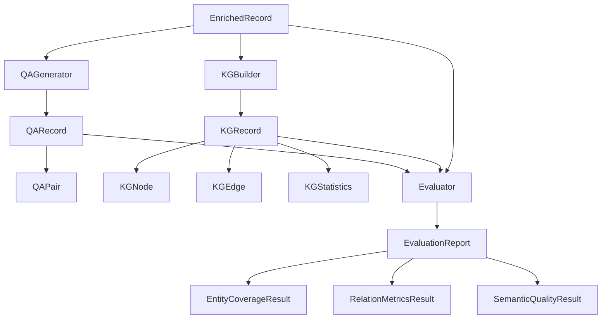

# Data Schemas Documentation

This document provides complete specifications for all data schemas used in the Knowledge Graph Construction Pipeline.

## Table of Contents

1. [QA Generation Schemas](#qa-generation-schemas)
2. [Knowledge Graph Schemas](#knowledge-graph-schemas)
3. [Evaluation Schemas](#evaluation-schemas)
4. [Schema Relationships](#schema-relationships)

---

## QA Generation Schemas

### QAPair

Represents a single question-answer pair generated from a transcription.

**Fields**:

| Field | Type | Required | Description |
|-------|------|----------|-------------|
| `question` | `str` | Yes | The generated question |
| `answer` | `str` | Yes | The ground truth answer (extractive from context) |
| `context` | `str` | Yes | Source text segment from which QA was generated |
| `question_type` | `str` | Yes | Strategy used: "factual", "conceptual", "temporal", "entity" |
| `confidence` | `float` | Yes | Generation confidence score (0.0-1.0) |
| `start_time` | `float \| None` | No | Segment start time in seconds (if available) |
| `end_time` | `float \| None` | No | Segment end time in seconds (if available) |

**Example**:
```json
{
  "question": "What caused the flooding in the region?",
  "answer": "Heavy rainfall combined with poor drainage infrastructure",
  "context": "The flooding was caused by heavy rainfall combined with poor drainage infrastructure. Many residents were evacuated.",
  "question_type": "factual",
  "confidence": 0.92,
  "start_time": 45.3,
  "end_time": 52.1
}
```

**Validation Rules**:
- `confidence` must be between 0.0 and 1.0
- `answer` must be a substring of or semantically contained in `context`
- `question_type` must be one of: "factual", "conceptual", "temporal", "entity"
- If `start_time` is provided, `end_time` must also be provided
- `start_time` < `end_time` when both are provided

### QARecord

Represents the complete QA dataset for a single transcription document.

**Fields**:

| Field | Type | Required | Description |
|-------|------|----------|-------------|
| `source_gdrive_id` | `str` | Yes | Google Drive ID of original media file |
| `source_filename` | `str` | Yes | Original filename |
| `transcription_text` | `str` | Yes | Full transcription text |
| `qa_pairs` | `list[QAPair]` | Yes | List of generated QA pairs |
| `model_id` | `str` | Yes | LLM model used for generation (e.g., "llama3.1:8b") |
| `provider` | `str` | Yes | LLM provider: "openai", "anthropic", "ollama" |
| `generation_timestamp` | `datetime` | Yes | When QA pairs were generated |
| `total_pairs` | `int` | Yes | Total number of QA pairs generated |

**Example**:
```json
{
  "source_gdrive_id": "1abc123xyz",
  "source_filename": "interview_2023_flood.mp3",
  "transcription_text": "The flooding was caused by heavy rainfall...",
  "qa_pairs": [
    {
      "question": "What caused the flooding?",
      "answer": "Heavy rainfall combined with poor drainage",
      "context": "The flooding was caused by heavy rainfall...",
      "question_type": "factual",
      "confidence": 0.92,
      "start_time": 45.3,
      "end_time": 52.1
    }
  ],
  "model_id": "llama3.1:8b",
  "provider": "ollama",
  "generation_timestamp": "2026-01-14T10:30:00Z",
  "total_pairs": 12
}
```

**Validation Rules**:
- `total_pairs` must equal `len(qa_pairs)`
- `provider` must be one of: "openai", "anthropic", "ollama"
- All `qa_pairs` must pass QAPair validation

---

## Knowledge Graph Schemas

### KGNode

Represents a node (entity or event) in the knowledge graph.

**Fields**:

| Field | Type | Required | Description |
|-------|------|----------|-------------|
| `id` | `str` | Yes | Unique node identifier |
| `label` | `str` | Yes | Entity/event text representation |
| `type` | `str` | Yes | Semantic concept type from schema induction |
| `properties` | `dict[str, Any]` | Yes | Additional node properties |
| `source_documents` | `list[str]` | Yes | Document IDs where entity appears |

**Example**:
```json
{
  "id": "node_001",
  "label": "Rio Grande do Sul",
  "type": "LOCATION",
  "properties": {
    "country": "Brazil",
    "state": true,
    "mentioned_count": 15
  },
  "source_documents": ["1abc123xyz", "2def456uvw"]
}
```

**Node Types** (from AutoSchemaKG):
- `PERSON` - People, groups of people
- `LOCATION` - Geographic locations
- `ORGANIZATION` - Companies, institutions
- `EVENT` - Occurrences, incidents
- `DATE` - Temporal references
- `CONCEPT` - Abstract ideas
- `OBJECT` - Physical objects
- Custom types from dynamic schema induction

### KGEdge

Represents an edge (relation) between two nodes in the knowledge graph.

**Fields**:

| Field | Type | Required | Description |
|-------|------|----------|-------------|
| `source` | `str` | Yes | Source node ID |
| `target` | `str` | Yes | Target node ID |
| `relation` | `str` | Yes | Relation type from schema |
| `properties` | `dict[str, Any]` | Yes | Additional edge properties |
| `confidence` | `float` | Yes | Extraction confidence (0.0-1.0) |

**Example**:
```json
{
  "source": "node_001",
  "target": "node_002",
  "relation": "AFFECTED_BY",
  "properties": {
    "intensity": "severe",
    "year": 2023
  },
  "confidence": 0.87
}
```

**Common Relations** (examples):
- `LOCATED_IN` - Spatial containment
- `CAUSED_BY` - Causal relationship
- `AFFECTED_BY` - Impact relationship
- `OCCURRED_IN` - Temporal/spatial occurrence
- `BELONGS_TO` - Membership
- Custom relations from dynamic schema induction

### KGStatistics

Represents statistical information about a knowledge graph.

**Fields**:

| Field | Type | Required | Description |
|-------|------|----------|-------------|
| `total_nodes` | `int` | Yes | Total number of nodes |
| `total_edges` | `int` | Yes | Total number of edges |
| `node_types` | `dict[str, int]` | Yes | Distribution of node types |
| `edge_types` | `dict[str, int]` | Yes | Distribution of edge types |
| `average_degree` | `float` | Yes | Average node degree |
| `connected_components` | `int` | Yes | Number of connected components |
| `density` | `float` | Yes | Graph density (0.0-1.0) |

**Example**:
```json
{
  "total_nodes": 1523,
  "total_edges": 3847,
  "node_types": {
    "PERSON": 342,
    "LOCATION": 189,
    "EVENT": 423,
    "ORGANIZATION": 156,
    "CONCEPT": 413
  },
  "edge_types": {
    "AFFECTED_BY": 892,
    "LOCATED_IN": 567,
    "CAUSED_BY": 423,
    "OCCURRED_IN": 1965
  },
  "average_degree": 5.05,
  "connected_components": 3,
  "density": 0.0033
}
```

### KGRecord

Represents a complete knowledge graph with metadata.

**Fields**:

| Field | Type | Required | Description |
|-------|------|----------|-------------|
| `graph_id` | `str` | Yes | Unique graph identifier |
| `source_documents` | `list[str]` | Yes | List of source document IDs |
| `creation_timestamp` | `datetime` | Yes | When graph was created |
| `model_id` | `str` | Yes | LLM model used for extraction |
| `provider` | `str` | Yes | LLM provider |
| `statistics` | `KGStatistics` | Yes | Graph statistics |
| `nodes` | `list[KGNode]` | Yes | List of nodes |
| `edges` | `list[KGEdge]` | Yes | List of edges |

**Methods**:
- `to_networkx() -> nx.Graph` - Convert to NetworkX graph
- `from_networkx(graph: nx.Graph, metadata: dict) -> KGRecord` - Create from NetworkX

**Example**:
```json
{
  "graph_id": "corpus_merged_2026_01_14",
  "source_documents": ["1abc123xyz", "2def456uvw", "3ghi789rst"],
  "creation_timestamp": "2026-01-14T15:45:00Z",
  "model_id": "llama3.1:8b",
  "provider": "ollama",
  "statistics": {
    "total_nodes": 1523,
    "total_edges": 3847,
    "average_degree": 5.05,
    "connected_components": 3,
    "density": 0.0033
  },
  "nodes": [...],
  "edges": [...]
}
```

**NetworkX Conversion**:
```python
# Convert to NetworkX
import networkx as nx
kg_record = KGRecord.model_validate(json_data)
graph = kg_record.to_networkx()

# Convert from NetworkX
graph = nx.Graph()
# ... build graph ...
kg_record = KGRecord.from_networkx(graph, metadata={
    "graph_id": "my_graph",
    "model_id": "llama3.1:8b",
    # ...
})
```

---

## Evaluation Schemas

### EntityCoverageResult

Represents entity coverage metrics.

**Fields**:

| Field | Type | Required | Description |
|-------|------|----------|-------------|
| `total_entities` | `int` | Yes | Total entities extracted |
| `unique_entities` | `int` | Yes | Number of unique entities |
| `entity_density` | `float` | Yes | Entities per 100 tokens |
| `entity_diversity` | `float` | Yes | unique_entities / total_entities |
| `entity_type_distribution` | `dict[str, int]` | Yes | Count by entity type |

**Example**:
```json
{
  "total_entities": 4823,
  "unique_entities": 1523,
  "entity_density": 12.4,
  "entity_diversity": 0.316,
  "entity_type_distribution": {
    "PERSON": 342,
    "LOCATION": 189,
    "EVENT": 423,
    "ORGANIZATION": 156
  }
}
```

**Interpretation**:
- **Entity Density**: Higher values indicate more entity mentions per text unit
- **Entity Diversity**: Values closer to 1.0 indicate less repetition
- Ideal diversity: 0.3-0.6 (some repetition for coherence, but not excessive)

### RelationMetricsResult

Represents relation metrics.

**Fields**:

| Field | Type | Required | Description |
|-------|------|----------|-------------|
| `total_relations` | `int` | Yes | Total relations extracted |
| `unique_relations` | `int` | Yes | Number of unique relations |
| `relation_density` | `float` | Yes | Relations per entity |
| `relation_diversity` | `float` | Yes | unique_relations / total_relations |
| `graph_connectivity` | `dict` | Yes | Connectivity metrics |

**Example**:
```json
{
  "total_relations": 3847,
  "unique_relations": 1204,
  "relation_density": 2.53,
  "relation_diversity": 0.313,
  "graph_connectivity": {
    "average_degree": 5.05,
    "connected_components": 3,
    "largest_component_size": 1421,
    "density": 0.0033
  }
}
```

**Interpretation**:
- **Relation Density**: Typical range 1.5-3.0 (depends on domain)
- **Connectivity**: Fewer components = more cohesive knowledge
- **Density**: Values close to 0 are normal for large graphs

### SemanticQualityResult

Represents semantic quality metrics.

**Fields**:

| Field | Type | Required | Description |
|-------|------|----------|-------------|
| `coherence_score` | `float` | Yes | Semantic coherence (0.0-1.0) |
| `information_density` | `float` | Yes | (Entities + Relations) / text_length |
| `knowledge_coverage` | `float` | Yes | Entities covered by QA pairs (0.0-1.0) |

**Example**:
```json
{
  "coherence_score": 0.78,
  "information_density": 0.042,
  "knowledge_coverage": 0.64
}
```

**Interpretation**:
- **Coherence**: >0.7 is good, >0.8 is excellent
- **Information Density**: Higher values indicate more structured knowledge
- **Knowledge Coverage**: >0.5 means QA pairs cover majority of entities

### EvaluationReport

Represents a comprehensive evaluation report.

**Fields**:

| Field | Type | Required | Description |
|-------|------|----------|-------------|
| `dataset_name` | `str` | Yes | Name/identifier of evaluated dataset |
| `evaluation_timestamp` | `datetime` | Yes | When evaluation was run |
| `total_documents` | `int` | Yes | Number of documents evaluated |
| `total_qa_pairs` | `int` | Yes | Total QA pairs in dataset |
| `qa_exact_match` | `float \| None` | No | Exact match score (0.0-1.0) |
| `qa_f1_score` | `float \| None` | No | F1 score (0.0-1.0) |
| `qa_bleu_score` | `float \| None` | No | BLEU score (0.0-100.0) |
| `entity_coverage` | `EntityCoverageResult \| None` | No | Entity coverage metrics |
| `relation_metrics` | `RelationMetricsResult \| None` | No | Relation metrics |
| `semantic_quality` | `SemanticQualityResult \| None` | No | Semantic quality metrics |
| `overall_score` | `float` | Yes | Weighted average (0.0-1.0) |
| `recommendations` | `list[str]` | Yes | Improvement suggestions |

**Example**:
```json
{
  "dataset_name": "etno_kgc_evaluation_2026_01_14",
  "evaluation_timestamp": "2026-01-14T18:30:00Z",
  "total_documents": 187,
  "total_qa_pairs": 2244,
  "qa_exact_match": 0.68,
  "qa_f1_score": 0.79,
  "qa_bleu_score": 72.3,
  "entity_coverage": { ... },
  "relation_metrics": { ... },
  "semantic_quality": { ... },
  "overall_score": 0.73,
  "recommendations": [
    "Increase entity diversity by reducing repetitive mentions",
    "Improve relation extraction for temporal relations",
    "Consider using more specific question strategies for conceptual QA"
  ]
}
```

**Overall Score Calculation**:
```python
overall_score = (
    0.3 * qa_f1_score +
    0.2 * entity_coverage.entity_diversity +
    0.2 * relation_metrics.relation_density / 3.0 +  # normalized
    0.3 * semantic_quality.coherence_score
)
```

---

## Schema Relationships



## File Format Examples

### QARecord JSON File

**Filename**: `qa_<gdrive_id>.json`

```json
{
  "source_gdrive_id": "1abc123xyz",
  "source_filename": "interview_2023_flood.mp3",
  "transcription_text": "Full transcription here...",
  "qa_pairs": [
    {
      "question": "What caused the flooding?",
      "answer": "Heavy rainfall",
      "context": "The flooding was caused by heavy rainfall...",
      "question_type": "factual",
      "confidence": 0.92,
      "start_time": 45.3,
      "end_time": 52.1
    }
  ],
  "model_id": "llama3.1:8b",
  "provider": "ollama",
  "generation_timestamp": "2026-01-14T10:30:00Z",
  "total_pairs": 12
}
```

### KGRecord JSON File

**Filename**: `kg_<graph_id>.json`

```json
{
  "graph_id": "corpus_merged",
  "source_documents": ["1abc123xyz", "2def456uvw"],
  "creation_timestamp": "2026-01-14T15:45:00Z",
  "model_id": "llama3.1:8b",
  "provider": "ollama",
  "statistics": {
    "total_nodes": 1523,
    "total_edges": 3847,
    "node_types": {"PERSON": 342, "LOCATION": 189},
    "edge_types": {"AFFECTED_BY": 892},
    "average_degree": 5.05,
    "connected_components": 3,
    "density": 0.0033
  },
  "nodes": [
    {
      "id": "node_001",
      "label": "Rio Grande do Sul",
      "type": "LOCATION",
      "properties": {"country": "Brazil"},
      "source_documents": ["1abc123xyz"]
    }
  ],
  "edges": [
    {
      "source": "node_001",
      "target": "node_002",
      "relation": "AFFECTED_BY",
      "properties": {"intensity": "severe"},
      "confidence": 0.87
    }
  ]
}
```

### EvaluationReport JSON File

**Filename**: `evaluation_report_<timestamp>.json`

```json
{
  "dataset_name": "etno_kgc_evaluation",
  "evaluation_timestamp": "2026-01-14T18:30:00Z",
  "total_documents": 187,
  "total_qa_pairs": 2244,
  "qa_exact_match": 0.68,
  "qa_f1_score": 0.79,
  "qa_bleu_score": 72.3,
  "entity_coverage": {
    "total_entities": 4823,
    "unique_entities": 1523,
    "entity_density": 12.4,
    "entity_diversity": 0.316,
    "entity_type_distribution": {"PERSON": 342}
  },
  "relation_metrics": {
    "total_relations": 3847,
    "unique_relations": 1204,
    "relation_density": 2.53,
    "relation_diversity": 0.313,
    "graph_connectivity": {
      "average_degree": 5.05,
      "connected_components": 3
    }
  },
  "semantic_quality": {
    "coherence_score": 0.78,
    "information_density": 0.042,
    "knowledge_coverage": 0.64
  },
  "overall_score": 0.73,
  "recommendations": [
    "Increase entity diversity",
    "Improve temporal relation extraction"
  ]
}
```

---

**Document Version**: 1.0
**Last Updated**: 2026-01-14
