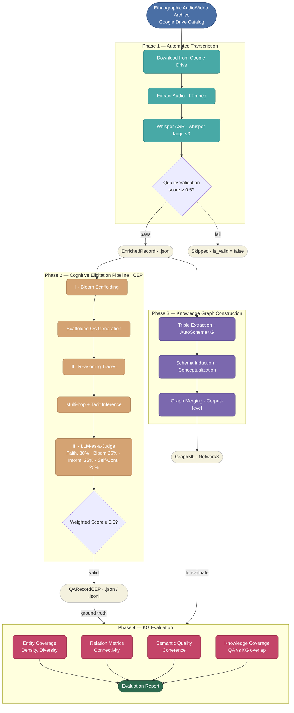
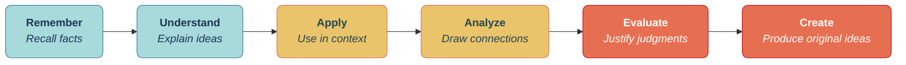
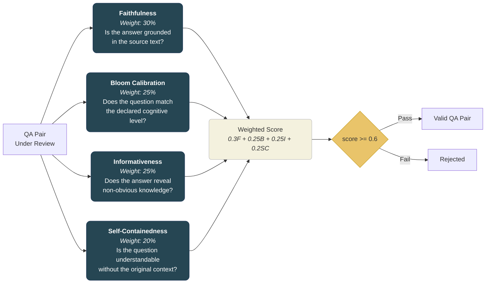
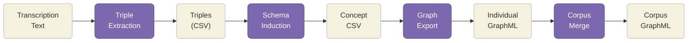
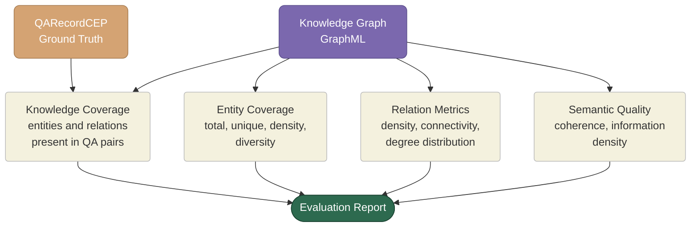
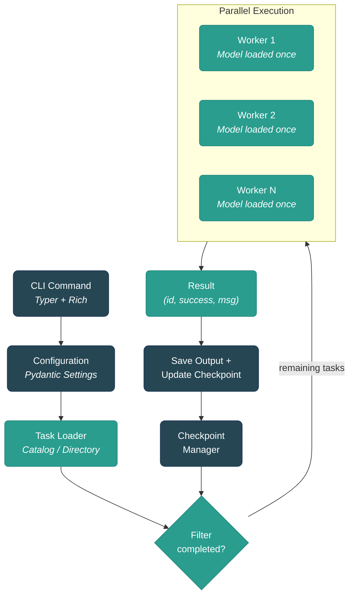

# Methodology: Tacit Knowledge Elicitation from Ethnographic Interviews Using LLM-Powered Pipelines

## 1. Overview

This document describes the methodological framework for **G-Transcriber**, a composable pipeline designed to elicit and structure tacit knowledge from ethnographic audio/video interviews with riverine communities affected by critical climate events in southern Brazil.

The methodology integrates four stages: **(1)** automated speech recognition and transcription, **(2)** cognitively-scaffolded question-answer generation grounded in Bloom's Taxonomy, **(3)** knowledge graph construction via entity and relation extraction, and **(4)** evaluation of the knowledge graph using the QA dataset as ground truth. Stages 2 and 3 operate in parallel from the same transcription input, while Stage 4 bridges them by measuring how well the graph captures the knowledge validated by the QA pairs. Each stage is designed as an independent, resumable module, enabling reproducibility and iterative refinement.

---

## 2. Pipeline Architecture

The following diagram presents the end-to-end methodology, from raw ethnographic media to structured knowledge representations and evaluation metrics.



---

## 3. Phase 1 -- Automated Transcription

### 3.1 Objective

Convert ethnographic audio and video recordings into structured, timestamped text transcriptions with quality guarantees sufficient for downstream LLM processing.

### 3.2 Data Source

Input files are organized in a **Google Drive catalog** (CSV) containing metadata such as `gdrive_id`, filename, MIME type, byte size, and duration. Only audio and video MIME types are selected for processing.

### 3.3 Speech Recognition

Transcription is performed using **OpenAI Whisper** (`whisper-large-v3` or `whisper-large-v3-turbo`) via the Hugging Face Transformers library. The engine supports:

- **Hardware-agnostic execution**: CUDA, Apple MPS, and CPU fallback
- **8-bit quantization**: Reduces VRAM requirements for GPU-constrained environments
- **Parallel batch processing**: `ProcessPoolExecutor` with one model instance per worker process
- **Checkpoint and resume**: Atomic progress tracking allows interrupted jobs to resume without reprocessing

### 3.4 Transcription Quality Validation

Each transcription undergoes a heuristic quality validation composed of four weighted dimensions:

| Dimension | Weight | What It Detects |
|-----------|--------|-----------------|
| **Script/Charset Match** | 35% | Wrong language output (e.g., CJK characters for Portuguese audio) |
| **Repetition Detection** | 30% | Repeated words, phrases, or hallucinated loops |
| **Segment Patterns** | 20% | Suspicious timestamps or degenerate segments |
| **Content Density** | 15% | Words per minute outside plausible range (30--300 wpm) |

Records scoring below **0.5** are flagged as `is_valid: false` and **automatically excluded** from downstream pipelines. This prevents low-quality transcriptions from degrading QA generation and knowledge graph construction.

### 3.5 Output

Each processed file produces an **EnrichedRecord** (JSON) containing: transcription text, timestamped segments, detected language, language probability, quality scores, hardware metadata, and processing duration.

---

## 4. Phase 2 -- Cognitive Elicitation Pipeline (CEP)

### 4.1 Objective

Generate cognitively-calibrated question-answer pairs that systematically elicit tacit knowledge from interview transcriptions, using Bloom's Taxonomy as a scaffolding framework to ensure cognitive diversity and depth.

### 4.2 Theoretical Foundation

The CEP is grounded in **Bloom's Revised Taxonomy** (Anderson & Krathwohl, 2001), which organizes cognitive processes into six progressive levels of complexity:



Higher-order levels (Analyze, Evaluate, Create) are especially relevant for surfacing **tacit knowledge** -- the implicit, experience-based understanding that domain experts possess but rarely articulate explicitly. By forcing the LLM to generate questions at these levels, the pipeline extracts reasoning patterns, causal chains, and practical know-how that would remain invisible through simple factual recall.

### 4.3 Module I -- Bloom Scaffolding

Questions are generated according to a configurable **Bloom level distribution**:

| Cognitive Level | Default Allocation | Purpose |
|-----------------|-------------------|---------|
| **Remember** | 20% | Establish factual baseline from the transcript |
| **Understand** | 30% | Verify conceptual comprehension of described processes |
| **Analyze** | 30% | Identify causal relationships and hidden patterns |
| **Evaluate** | 20% | Surface expert judgment and decision-making rationale |

A key design feature is **scaffolding context**: when generating higher-level questions (Analyze, Evaluate), the prompt includes QA pairs already generated at lower levels. This mirrors how human cognition builds complex understanding on top of foundational knowledge.

### 4.4 Module II -- Reasoning & Grounding

For higher-order cognitive levels, this module enriches QA pairs with:

- **Reasoning traces**: Explicit logical chains connecting facts to conclusions (e.g., `"River rises -> Fisherman stores boat -> Reason: avoid equipment loss"`)
- **Multi-hop detection**: Identifies questions requiring synthesis of information from distant parts of the transcript (1--5 reasoning hops)
- **Tacit inference extraction**: Surfaces implicit domain knowledge that the interviewee assumed but did not verbalize (e.g., `"Rapid river rise indicates imminent flood risk"`)

### 4.5 Module III -- LLM-as-a-Judge Validation

Each generated QA pair undergoes automated quality validation using a separate LLM invocation acting as an evaluator. Four criteria are assessed with detailed rubrics:



The **self-containedness** criterion ensures that QA pairs are understandable and answerable without access to the original transcription. This is critical because the QA dataset serves as ground truth for evaluating a **GraphRAG system** (Phase 4), where questions must stand alone -- a retrieval-augmented system cannot rely on the user having read the source interview. The criterion uses a 6-level rubric ranging from completely autonomous (1.0) to completely dependent on the original context (0.0). Questions at the **Remember** level are automatically scored 1.0, since recalling facts from a provided context is inherent to the cognitive task.

To promote self-containedness at generation time, the pipeline employs a **prompt-first approach** inspired by the RAGAS framework (Es et al., 2024): generation prompts include negative constraints (an explicit list of forbidden context-dependent phrases such as "in the text", "as mentioned", "the interviewee") alongside positive instructions for naming entities, locations, and techniques explicitly. This strategy avoids the need for a separate post-processing decontextualization step, reducing pipeline complexity and LLM cost while achieving high standalone comprehensibility (Choi et al., 2021; Gunjal & Durrett, 2024).

This approach ensures that the final QA dataset is **faithful** to the source material, **cognitively calibrated** to the intended Bloom level, **informative** in terms of tacit knowledge content, and **self-contained** for downstream GraphRAG evaluation.

### 4.6 Output

Each transcription yields a **QARecordCEP** (JSON) containing: the complete set of QA pairs with Bloom annotations, reasoning traces, validation scores (faithfulness, Bloom calibration, informativeness, self-containedness, and overall weighted score), Bloom distribution summary, and validation pass rates. An optional **JSONL** export provides a flat format suitable for downstream KGQA model training.

---

## 5. Phase 3 -- Knowledge Graph Construction

### 5.1 Objective

Extract structured entity-relation triples from transcription text and organize them into a corpus-level knowledge graph that represents the semantic structure of the interviewees' knowledge.

### 5.2 Extraction Pipeline

Knowledge graph construction uses **AutoSchemaKG**, which performs:

1. **Triple extraction**: Identifies `(subject, predicate, object)` triples from natural language text using an LLM
2. **Schema induction**: Automatically conceptualizes entity types and relation types from the extracted triples (dynamic typing rather than a fixed ontology)
3. **Graph merging**: Combines per-document graphs into a unified corpus-level graph with entity resolution



### 5.3 Entity and Relation Types

AutoSchemaKG dynamically induces types from the data, though common types in this ethnographic domain include:

- **Entities**: `PERSON`, `LOCATION`, `EVENT`, `DATE`, `CONCEPT`, `OBJECT`, `ORGANIZATION`
- **Relations**: `LOCATED_IN`, `CAUSED_BY`, `AFFECTED_BY`, `OCCURRED_IN`, `BELONGS_TO`, and dynamically discovered domain-specific relations

### 5.4 Output

- **Per-document graphs**: Individual `.graphml` files for each transcription
- **Corpus-level graph**: A merged `corpus_graph.graphml` with entity resolution across all interviews
- **Provenance metadata**: A JSON sidecar tracking which documents contributed to each entity and relation

---

## 6. Phase 4 -- Knowledge Graph Evaluation

### 6.1 Objective

Assess how well the constructed knowledge graph captures the tacit knowledge present in the ethnographic interviews. The **QA dataset from Phase 2 serves as ground truth**: it represents validated, cognitively-scaffolded knowledge that was successfully elicited from the transcriptions. The evaluation measures whether the knowledge graph preserves this knowledge in its entity-relation structure.

### 6.2 Evaluation Strategy

The QA pairs -- already validated for faithfulness, Bloom calibration, informativeness, and self-containedness -- provide a reference benchmark. The evaluation quantifies how much of the knowledge expressed in the QA dataset is structurally represented in the graph, alongside intrinsic graph quality metrics.



### 6.3 Evaluation Dimensions

| Dimension | Inputs | What It Measures |
|-----------|--------|-----------------|
| **Knowledge Coverage** | QA dataset + KG | Proportion of entities and relations from QA pairs that appear in the graph |
| **Entity Coverage** | KG | Total/unique entities, entity density (per 100 tokens), type diversity |
| **Relation Metrics** | KG | Relation density (per entity), graph connectivity, degree distribution |
| **Semantic Quality** | KG | Coherence of entity neighborhoods, information density |

Knowledge Coverage is the key metric that bridges the QA and KG pipelines: it answers *"does the graph contain the knowledge that the QA pairs confirmed exists in the interviews?"*

### 6.4 Overall Score Computation

The composite evaluation score is computed as a weighted average:

$$\text{Overall} = 0.3 \cdot \text{KnowledgeCoverage} + 0.2 \cdot \text{EntityDiversity} + 0.2 \cdot \min\!\left(\frac{\text{RelationDensity}}{3.0},\ 1.0\right) + 0.3 \cdot \text{Coherence}$$

This weighting prioritizes **knowledge coverage** (how well the graph captures QA-validated knowledge) and **semantic coherence**, while incorporating structural graph metrics to ensure the representation is rich and interconnected.

### 6.5 Output

An **EvaluationReport** (JSON) aggregating all metrics, dimensional scores, and the composite overall score.

---

## 7. Technical Infrastructure

### 7.1 LLM Integration

All LLM interactions use a **unified LLM client** built on the OpenAI SDK, supporting interchangeable backends:

| Provider | Use Case | Default Model |
|----------|----------|---------------|
| **Ollama** (local) | Development, HPC clusters | `qwen3:14b` |
| **OpenAI** | High-quality production runs | `gpt-4o` |
| **Custom** | Any OpenAI-compatible endpoint | Configurable |

The choice of `qwen3:14b` as default balances Portuguese language support, JSON output reliability, and inference speed on 24GB GPUs.

### 7.2 Batch Processing Architecture

All pipeline phases share a consistent batch processing pattern:



Key properties of this architecture:

- **Checkpoint-driven resumability**: Every completed or failed task is atomically recorded, allowing interrupted jobs to resume from the last successful checkpoint
- **Global worker pattern**: Heavy models (Whisper, LLM connections) are initialized once per worker process, avoiding repeated loading overhead
- **Batched future submission**: Tasks are submitted to the executor in controlled batches to prevent memory exhaustion on large corpora
- **Deterministic error handling**: Worker functions never raise exceptions; they return `(id, success, message)` triples that the orchestrator records

### 7.3 Deployment Options

| Environment | Description | Hardware |
|-------------|-------------|----------|
| **Local CLI** | Direct `gtranscriber` invocation | Developer workstation |
| **Docker Compose** | Multi-service profiles (`cep`, `kg`, `evaluate`) | Server with Docker |
| **SLURM** | HPC batch jobs with partition-specific scripts | NVIDIA L40S, RTX 4090, AMD |

### 7.4 Reproducibility

Every pipeline run records:

- **Execution environment**: SLURM detection, node hostname, partition
- **Hardware info**: GPU model, VRAM, CUDA version, CPU count
- **Configuration snapshot**: Complete settings used for the run
- **Timing**: Start/end timestamps, per-document processing duration
- **Model provenance**: Model ID, provider, temperature, and prompt templates

---

## 8. Data Flow Summary

The following diagram provides a compact view of the data artifacts flowing between pipeline phases:

```mermaid
flowchart LR
    classDef src fill:#4a6fa5,stroke:#2d4a7a,color:#fff,rx:10,ry:10
    classDef json fill:#f4f1de,stroke:#bbb,color:#333,rx:6,ry:6
    classDef graph fill:#d8b4fe,stroke:#a78bfa,color:#333,rx:6,ry:6
    classDef final fill:#2d6a4f,stroke:#1b4332,color:#fff,rx:10,ry:10

    A["Audio / Video<br/><i>Google Drive</i>"]:::src
    B["EnrichedRecord<br/><i>.json</i>"]:::json
    C["QARecordCEP<br/><i>.json / .jsonl</i>"]:::json
    D["Knowledge Graph<br/><i>.graphml</i>"]:::graph
    E["EvaluationReport<br/><i>.json</i>"]:::final

    A -- "Whisper ASR +<br/>Quality Filter" --> B
    B -- "CEP<br/>(Bloom + Reasoning +<br/>Validation)" --> C
    B -- "AutoSchemaKG<br/>(Triples + Schema<br/>Induction)" --> D
    C -- "ground truth" --> E
    D -- "evaluated" --> E
```

---

## 9. Summary

This methodology implements a **four-phase composable pipeline** for tacit knowledge elicitation from ethnographic interviews:

1. **Phase 1 (Transcription)** converts raw audio/video into quality-validated text using Whisper ASR with automatic failure detection
2. **Phase 2 (CEP)** generates cognitively-scaffolded QA pairs across Bloom's Taxonomy levels, enriched with reasoning traces and validated by an LLM-as-a-Judge across four criteria (faithfulness, Bloom calibration, informativeness, and self-containedness for GraphRAG compatibility)
3. **Phase 3 (Knowledge Graph)** extracts entity-relation structures using AutoSchemaKG with dynamic schema induction
4. **Phase 4 (Evaluation)** uses the QA dataset as ground truth to assess how well the knowledge graph captures the elicited tacit knowledge, measuring knowledge coverage, entity diversity, graph connectivity, and semantic coherence

Each phase is independently deployable, checkpoint-resumable, and configurable through environment variables. The pipeline is designed for execution on HPC clusters via SLURM, enabling processing of large ethnographic corpora with GPU-accelerated inference. All phases share a consistent batch processing architecture that ensures fault tolerance and reproducibility.

---

### References

- Anderson, L. W., & Krathwohl, D. R. (Eds.). (2001). *A Taxonomy for Learning, Teaching, and Assessing: A Revision of Bloom's Taxonomy of Educational Objectives*. Longman.
- Choi, E., Palomaki, J., Lamm, M., Kwiatkowski, T., Das, D., & Collins, M. (2021). Decontextualization: Making Sentences Stand-Alone. *Transactions of the Association for Computational Linguistics*, 9, 447--461.
- Es, S., James, J., Espinosa-Anke, L., & Schockaert, S. (2024). RAGAS: Automated Evaluation of Retrieval Augmented Generation. *Proceedings of EACL 2024 (System Demonstrations)*.
- Gunjal, A., & Durrett, G. (2024). Molecular Facts: Desiderata for Decontextualization in LLM Fact Verification. *Proceedings of EMNLP 2024*.
- Radford, A., Kim, J. W., Xu, T., Brockman, G., McLeavey, C., & Sutskever, I. (2023). Robust Speech Recognition via Large-Scale Weak Supervision. *Proceedings of ICML*.
- Saad-Falcon, J., Khattab, O., Potts, C., & Zaharia, M. (2023). ARES: An Automated Evaluation Framework for Retrieval-Augmented Generation Systems. *arXiv preprint arXiv:2311.09476*.
- Wanner, L., et al. (2024). DnDScore: Decontextualization and Decomposition for Factuality Verification. *arXiv preprint*.
- Zheng, L., Chiang, W.-L., Sheng, Y., et al. (2023). Judging LLM-as-a-Judge with MT-Bench and Chatbot Arena. *Advances in Neural Information Processing Systems*.
- Zhu, K., et al. (2025). RAGEval: Scenario Specific RAG Evaluation Dataset Generation Framework. *Proceedings of ACL 2025*.
- AutoSchemaKG: LLM-driven knowledge graph construction with schema induction.
