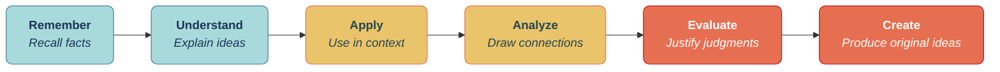
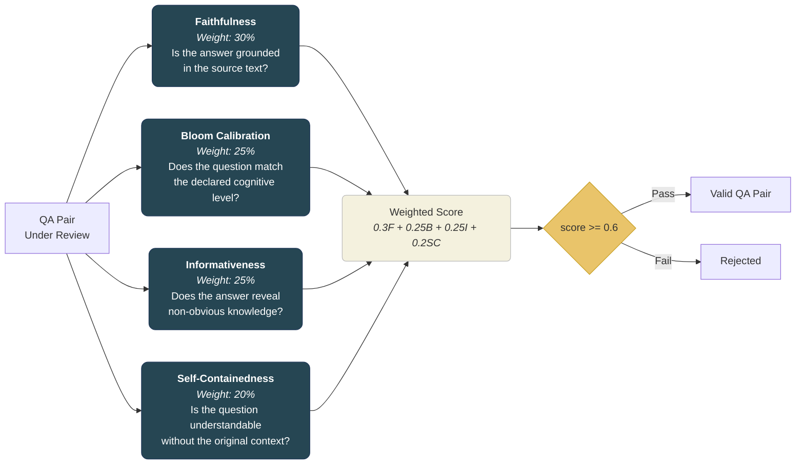
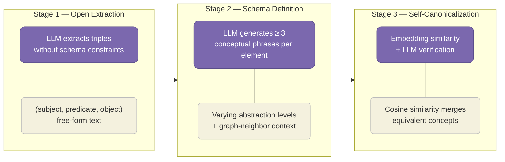
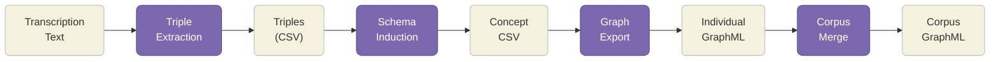
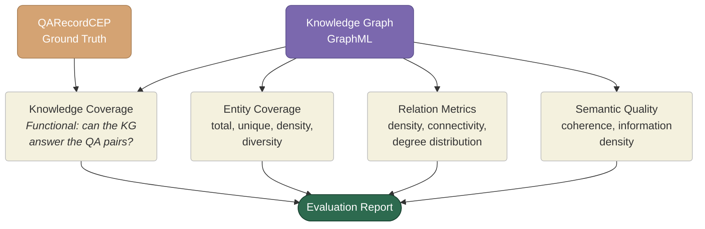
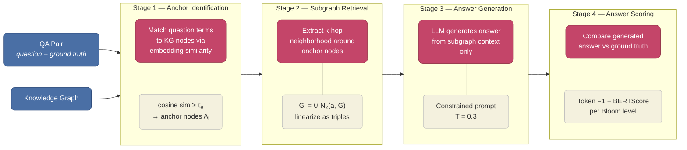
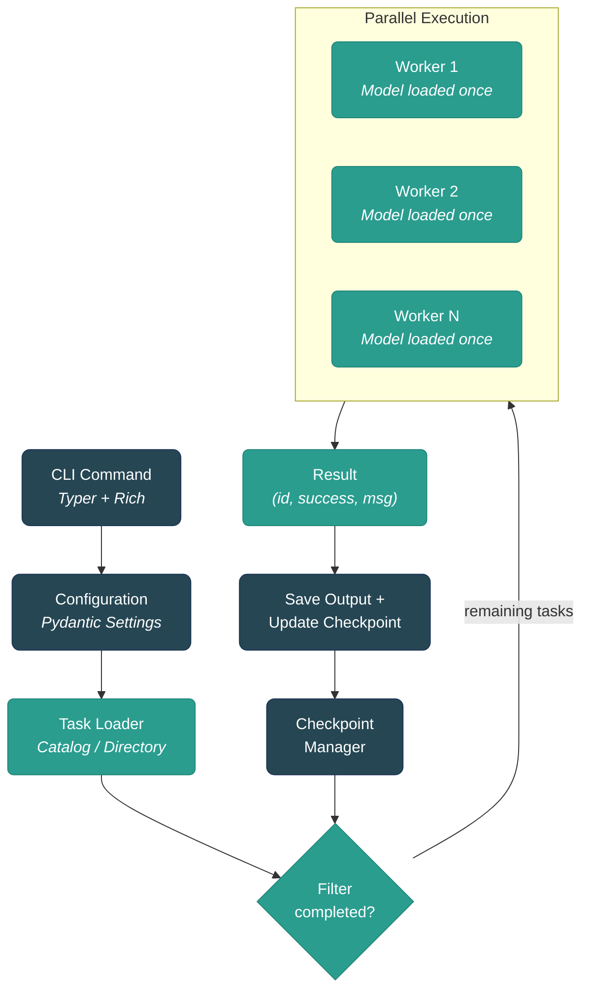
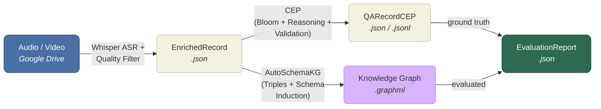

# Methodology: Tacit Knowledge Elicitation from Ethnographic Interviews Using LLM-Powered Pipelines

## 1. Overview

This document describes the methodological framework for **G-Transcriber**, a composable pipeline designed to elicit and structure tacit knowledge from ethnographic audio/video interviews with riverine communities affected by critical climate events in southern Brazil.

The methodology integrates four stages: **(1)** automated speech recognition and transcription, **(2)** cognitively-scaffolded question-answer generation grounded in Bloom's Taxonomy, **(3)** knowledge graph construction via entity and relation extraction, and **(4)** evaluation of the knowledge graph using the QA dataset as ground truth. Stages 2 and 3 operate in parallel from the same transcription input, while Stage 4 bridges them by measuring how well the graph captures the knowledge validated by the QA pairs. Each stage is designed as an independent, resumable module, enabling reproducibility and iterative refinement.

---

## 2. Pipeline Architecture

The following diagram presents the end-to-end methodology, from raw ethnographic media to structured knowledge representations and evaluation metrics.

---

## 3. Phase 1 -- Automated Transcription

### 3.1 Objective

Convert ethnographic audio and video recordings into structured, timestamped text transcriptions with quality guarantees sufficient for downstream LLM processing.

### 3.2 Data Source

Input files are organized in a **Google Drive catalog** (CSV) containing metadata such as `gdrive_id`, filename, MIME type, byte size, and duration. Only audio and video MIME types are selected for processing.

### 3.3 Speech Recognition

Transcription is performed using **OpenAI Whisper** (`whisper-large-v3` or `whisper-large-v3-turbo`) via the Hugging Face Transformers library. The engine supports:

- **Hardware-agnostic execution**: CUDA, Apple MPS, and CPU fallback
- **8-bit quantization**: Reduces VRAM requirements for GPU-constrained environments
- **Parallel batch processing**: `ProcessPoolExecutor` with one model instance per worker process
- **Checkpoint and resume**: Atomic progress tracking allows interrupted jobs to resume without reprocessing

### 3.4 Transcription Quality Validation

Each transcription undergoes a heuristic quality validation composed of four weighted dimensions:

| Dimension | Weight | What It Detects |
|-----------|--------|-----------------|
| **Script/Charset Match** | 35% | Wrong language output (e.g., CJK characters for Portuguese audio) |
| **Repetition Detection** | 30% | Repeated words, phrases, or hallucinated loops |
| **Segment Patterns** | 20% | Suspicious timestamps or degenerate segments |
| **Content Density** | 15% | Words per minute outside plausible range (30--300 wpm) |

Records scoring below **0.5** are flagged as `is_valid: false` and **automatically excluded** from downstream pipelines. This prevents low-quality transcriptions from degrading QA generation and knowledge graph construction.

### 3.5 Output

Each processed file produces an **EnrichedRecord** (JSON) containing: transcription text, timestamped segments, detected language, language probability, quality scores, hardware metadata, and processing duration.

---

## 4. Phase 2 -- Cognitive Elicitation Pipeline (CEP)

### 4.1 Objective

Generate cognitively-calibrated question-answer pairs that systematically elicit tacit knowledge from interview transcriptions, using Bloom's Taxonomy as a scaffolding framework to ensure cognitive diversity and depth.

### 4.2 Theoretical Foundation

The CEP is grounded in **Bloom's Revised Taxonomy** (Anderson & Krathwohl, 2001), which organizes cognitive processes into six progressive levels of complexity:

Higher-order levels (Analyze, Evaluate, Create) are especially relevant for surfacing **tacit knowledge** -- the implicit, experience-based understanding that domain experts possess but rarely articulate explicitly. By forcing the LLM to generate questions at these levels, the pipeline extracts reasoning patterns, causal chains, and practical know-how that would remain invisible through simple factual recall.

#### Level Selection Rationale

The pipeline uses four of the six Bloom levels: **Remember**, **Understand**, **Analyze**, and **Evaluate**. Each level serves a distinct role in the elicitation process:

- **Remember** (20%) establishes the **factual foundation**. It extracts and confirms concrete facts explicitly stated in the transcription -- entities, locations, dates, and events. Although it does not elicit tacit knowledge directly, Remember is indispensable: it provides a verifiable **fidelity anchor** (if the pipeline cannot recover explicit facts, inferences at higher levels are untrustworthy), supplies the first scaffolding context for subsequent levels, and populates the **entity nodes** that the Knowledge Graph requires. In Phase 4 evaluation, the Knowledge Coverage metric relies on Remember-level entities as the baseline for measuring graph completeness.

- **Understand** (30%) bridges factual recall and analytical reasoning. It verifies **semantic comprehension** -- whether processes, mechanisms, and concepts can be paraphrased and explained beyond literal repetition. In ethnographic interviews, much domain expertise is processual: how a technique works, what a natural sign indicates, how a seasonal cycle affects daily routines. This processual knowledge is not captured by factual questions (Remember) nor by evaluative judgment (Evaluate), yet it is central to the Knowledge Graph representation. Understand also plays a critical scaffolding role: without this intermediate conceptual layer, the LLM would have to leap from raw facts directly to causal analysis, losing the comprehension base that Analyze depends on.

- **Analyze** (30%) is where the pipeline begins to extract **tacit knowledge** in earnest. It identifies causal relationships, hidden patterns, and connections between elements that the interviewee did not necessarily articulate explicitly. This is the level where Module II (Reasoning & Grounding) is most active: Analyze-level questions frequently require **multi-hop reasoning**, synthesizing information from distant parts of the transcript into explicit causal chains. It also drives **tacit inference extraction** -- surfacing implicit domain knowledge that interviewees assumed as shared understanding but never verbalized. From a Knowledge Graph perspective, Analyze maps directly to **relation edges** (subject-predicate-object triples): while Remember populates graph nodes, Analyze populates the connections between them, providing the richest ground truth for the Relation Metrics evaluation dimension.

- **Evaluate** (20%) is the highest level employed and targets **expert judgment** -- decisions, priorities, and criteria that domain experts apply based on years of experience but rarely verbalize explicitly. The distinction from Analyze is cognitive in nature: Analyze identifies relationships descriptively (*why* X causes Y), while Evaluate requires prescriptive judgment (*is X worth doing? When should one act? Which alternative is better?*). Evaluate has the strongest dependency on scaffolding, receiving QA pairs from all three prior levels, enabling the LLM to construct judgment questions grounded in established facts (Remember), conceptual understanding (Understand), and causal connections (Analyze). For GraphRAG evaluation, Evaluate-level questions represent the most demanding test: if the Knowledge Graph can answer questions requiring synthesis of multiple relations to support an expert judgment, it demonstrates the capacity to represent not just facts but the implicit decision-making logic of the interviewees.

#### Excluded Levels

The **Apply** and **Create** levels are deliberately excluded:

- **Apply** presupposes procedural knowledge that can be transferred to novel contexts. In ethnographic interviews, domain knowledge is highly situated and context-dependent -- interviewees describe *why* they act in certain ways, not generalizable procedures to replicate elsewhere. The Understand level already covers process comprehension, while Analyze captures the causal reasoning behind actions, making Apply redundant in this domain.

- **Create** requires generating original ideas or artifacts that do not yet exist. This conflicts with the pipeline's **faithfulness constraint**: the LLM-as-a-Judge validation (Module III) assigns 30% weight to faithfulness, requiring answers to be grounded in the source transcription. Questions at the Create level would inevitably produce speculative answers unmoored from the text, either being rejected by the validator or inflating faithfulness scores artificially. Furthermore, since the QA dataset serves as ground truth for **GraphRAG evaluation** (Phase 4), Create-level questions would introduce false negatives -- the knowledge graph cannot represent knowledge that the interviewee never articulated, polluting coverage and coherence metrics with unanswerable queries.

The four selected levels form a coherent spectrum for tacit knowledge elicitation: Remember establishes *what* happened, Understand captures *how* processes work, Analyze reveals *why* things are connected, and Evaluate surfaces *when and whether* expert judgment applies.

### 4.3 Module I -- Bloom Scaffolding

Questions are generated according to a configurable **Bloom level distribution**:

| Cognitive Level | Default Allocation | Purpose |
|-----------------|-------------------|---------|
| **Remember** | 20% | Establish factual baseline from the transcript |
| **Understand** | 30% | Verify conceptual comprehension of described processes |
| **Analyze** | 30% | Identify causal relationships and hidden patterns |
| **Evaluate** | 20% | Surface expert judgment and decision-making rationale |

A key design feature is **scaffolding context**: when generating higher-level questions (Analyze, Evaluate), the prompt includes QA pairs already generated at lower levels. This mirrors how human cognition builds complex understanding on top of foundational knowledge.

### 4.4 Module II -- Reasoning & Grounding

For higher-order cognitive levels, this module enriches QA pairs with:

- **Reasoning traces**: Explicit logical chains connecting facts to conclusions (e.g., `"River rises -> Fisherman stores boat -> Reason: avoid equipment loss"`)
- **Multi-hop detection**: Identifies questions requiring synthesis of information from distant parts of the transcript (1--5 reasoning hops)
- **Tacit inference extraction**: Surfaces implicit domain knowledge that the interviewee assumed but did not verbalize (e.g., `"Rapid river rise indicates imminent flood risk"`)

### 4.5 Module III -- LLM-as-a-Judge Validation

Each generated QA pair undergoes automated quality validation using a separate LLM invocation acting as an evaluator. Four criteria are assessed with detailed rubrics:

The **self-containedness** criterion ensures that QA pairs are understandable and answerable without access to the original transcription. This is critical because the QA dataset serves as ground truth for evaluating a **GraphRAG system** (Phase 4), where questions must stand alone -- a retrieval-augmented system cannot rely on the user having read the source interview. The criterion uses a 6-level rubric ranging from completely autonomous (1.0) to completely dependent on the original context (0.0). Questions at the **Remember** level are automatically scored 1.0, since recalling facts from a provided context is inherent to the cognitive task.

To promote self-containedness at generation time, the pipeline employs a **prompt-first approach** inspired by the RAGAS framework (Es et al., 2024): generation prompts include negative constraints (an explicit list of forbidden context-dependent phrases such as "in the text", "as mentioned", "the interviewee") alongside positive instructions for naming entities, locations, and techniques explicitly. This strategy avoids the need for a separate post-processing decontextualization step, reducing pipeline complexity and LLM cost while achieving high standalone comprehensibility (Choi et al., 2021; Gunjal & Durrett, 2024).

This approach ensures that the final QA dataset is **faithful** to the source material, **cognitively calibrated** to the intended Bloom level, **informative** in terms of tacit knowledge content, and **self-contained** for downstream GraphRAG evaluation.

### 4.6 Output

Each transcription yields a **QARecordCEP** (JSON) containing: the complete set of QA pairs with Bloom annotations, reasoning traces, validation scores (faithfulness, Bloom calibration, informativeness, self-containedness, and overall weighted score), Bloom distribution summary, and validation pass rates. An optional **JSONL** export provides a flat format suitable for downstream KGQA model training.

---

## 5. Phase 3 -- Knowledge Graph Construction

### 5.1 Objective

Extract structured entity-relation triples from transcription text and organize them into a corpus-level knowledge graph that represents the semantic structure of the interviewees' knowledge.

### 5.2 Framework Selection Rationale

Knowledge graph construction in this pipeline adopts **AutoSchemaKG** (Bai et al., 2025), a framework for autonomous schema induction from unstructured text. This choice is motivated by a fundamental mismatch between traditional KG construction approaches and the nature of ethnographic tacit knowledge.

#### Closed World vs. Open World Assumption

Most conventional KG construction systems operate under the **Closed World Assumption (CWA)**: a fixed ontology defines the permissible set of entity types and relation types *a priori*, and any element not matching the schema is discarded. Under CWA, absence of a statement implies its falsehood -- if a triple is not in the graph, the system treats the corresponding fact as false. This works well for domains with stable, well-defined schemas (e.g., biomedical ontologies, product catalogs), but it is fundamentally incompatible with ethnographic knowledge elicitation for three reasons:

1. **No canonical ontology exists for the domain.** Riverine communities' knowledge encompasses ecological observation, subsistence practices, flood response strategies, kinship networks, and cultural rituals -- a heterogeneous mix that no single established ontology covers. Forcing this knowledge into a predefined schema would either require an ad-hoc ontology (introducing researcher bias) or a general-purpose one (losing domain-specific nuance).

2. **Tacit knowledge is emergent and incomplete.** The knowledge surfaced by the CEP (Phase 2) is inherently partial -- interviewees articulate different aspects of their expertise depending on conversational context, and no single interview captures the full extent of a community's collective knowledge. Under CWA, unmentioned facts would be treated as false rather than unknown, conflating **absence of evidence** with **evidence of absence**. The **Open World Assumption (OWA)** adopted by AutoSchemaKG avoids this: unrepresented knowledge is simply unknown, preserving the integrity of what *is* captured without making false claims about what *is not*.

3. **Events must be first-class citizens.** Traditional entity-centric KGs represent the world as static nodes connected by relations, but ethnographic narratives are fundamentally **event-driven** -- floods, migrations, fishing seasons, community responses. Entity-only knowledge graphs preserve approximately 70% of the informational content of source texts, while event-aware representations retain over 90% (Bai et al., 2025). AutoSchemaKG treats events as extractable elements alongside entities, enabling the graph to capture temporal dynamics, causal chains, and situated actions that are central to the interviewees' lived experience.

AutoSchemaKG addresses these challenges through **dynamic schema induction**: rather than constraining extraction to a fixed type system, it allows the LLM to extract triples freely and then induces the schema *from the data itself*, producing a type system that reflects the actual conceptual structure of the source material.

### 5.3 Conceptualization

The core innovation of AutoSchemaKG is the **conceptualization** process, which transforms raw extracted triples into a canonicalized, typed knowledge graph without requiring a predefined ontology.

#### Formal Definition

A conceptualized knowledge graph is defined as:

$$G = (V, E, C, \varphi, \psi)$$

where $V$ is the set of entity nodes, $E$ is the set of relation edges, $C$ is the **concept set** (the induced schema), $\varphi: V \rightarrow C$ maps each entity node to its concept type, and $\psi: E \rightarrow C$ maps each relation edge to its concept type. The key distinction from fixed-ontology approaches is that $C$ is not specified *a priori* -- it emerges from the extraction and canonicalization process described below.

#### Extract-Define-Canonicalize Pipeline

AutoSchemaKG constructs the conceptualized graph through three sequential stages:

**Stage 1 -- Open Extraction.** The LLM receives a passage of transcription text and extracts `(subject, predicate, object)` triples with no schema constraints. This **open extraction** strategy ensures that domain-specific entities (e.g., *"enchente de 2024"*, *"pesca de tarrafa"*) and culturally situated relations (e.g., *"aprendeu com"*, *"se protege usando"*) are captured exactly as the interviewee expressed them, rather than being forced into anglophone or generic categories. The absence of schema constraints is what operationalizes the Open World Assumption at the extraction level.

**Stage 2 -- Schema Definition.** For each extracted entity and relation, the LLM generates a minimum of three **conceptual phrases** at varying levels of abstraction. For example, the entity *"enchente de maio de 2024"* might receive the concepts `["specific flood event", "natural disaster", "climate event"]`. To improve conceptualization quality, AutoSchemaKG employs **context-enhanced entity conceptualization**: when defining concepts for a node, the prompt includes the node's graph neighbors (adjacent entities and their relations), providing structural context that disambiguates polysemous terms and produces more precise type assignments.

**Stage 3 -- Self-Canonicalization.** The conceptual phrases from Stage 2 are embedded into a vector space, and **cosine similarity** is used to identify candidate merges -- concept pairs whose embeddings exceed a similarity threshold. Each candidate merge is then verified by an **LLM judge** that determines whether the two concepts are genuinely synonymous or merely related. This two-step process (embedding retrieval + LLM verification) balances efficiency (embeddings are fast to compute) with precision (the LLM catches false positives that surface-level similarity would miss). The result is a canonicalized concept set $C$ where semantically equivalent types have been unified, producing a coherent schema without manual curation.

### 5.4 Extraction Pipeline

Knowledge graph construction uses **AutoSchemaKG**, which performs:

1. **Triple extraction**: Identifies `(subject, predicate, object)` triples from natural language text using an LLM
2. **Schema induction**: Automatically conceptualizes entity types and relation types from the extracted triples (dynamic typing rather than a fixed ontology)
3. **Graph merging**: Combines per-document graphs into a unified corpus-level graph with entity resolution

### 5.5 Entity and Relation Types

AutoSchemaKG dynamically induces types from the data, though common types in this ethnographic domain include:

- **Entities**: `PERSON`, `LOCATION`, `EVENT`, `DATE`, `CONCEPT`, `OBJECT`, `ORGANIZATION`
- **Relations**: `LOCATED_IN`, `CAUSED_BY`, `AFFECTED_BY`, `OCCURRED_IN`, `BELONGS_TO`, and dynamically discovered domain-specific relations

### 5.6 Output

- **Per-document graphs**: Individual `.graphml` files for each transcription
- **Corpus-level graph**: A merged `corpus_graph.graphml` with entity resolution across all interviews
- **Provenance metadata**: A JSON sidecar tracking which documents contributed to each entity and relation

---

## 6. Phase 4 -- Knowledge Graph Evaluation

### 6.1 Objective

Assess how well the constructed knowledge graph captures the tacit knowledge present in the ethnographic interviews. The **QA dataset from Phase 2 serves as ground truth**: it represents validated, cognitively-scaffolded knowledge that was successfully elicited from the transcriptions. The evaluation combines **intrinsic graph quality metrics** (entity diversity, relation density, semantic coherence) with a **functional assessment** -- Knowledge Coverage -- that measures whether the knowledge graph can support answering the cognitively-scaffolded questions from Phase 2.

### 6.2 Evaluation Strategy

The QA pairs -- already validated for faithfulness, Bloom calibration, informativeness, and self-containedness -- provide a reference benchmark. The evaluation operates on two complementary axes: **intrinsic** metrics assess the graph's structural properties independently (entity diversity, relation density, semantic coherence), while the **extrinsic** Knowledge Coverage metric tests whether the graph functionally supports answering the validated QA pairs.

#### Why Functional Evaluation

No gold-standard knowledge graph exists for ethnographic tacit knowledge -- the domain is too heterogeneous and the knowledge too situated for any reference ontology. Purely structural approaches (counting entity or triple overlaps between QA text and the graph) would require an unvalidated intermediate extraction step whose errors would be conflated with KG quality: measuring entity recall from QA pairs presupposes an entity extraction method that itself lacks a gold standard. Instead, Knowledge Coverage poses the QA pairs as questions, uses the knowledge graph as the sole knowledge source, and measures answer quality directly. This functional paradigm evaluates the KG by its intended purpose -- supporting question answering -- rather than by proxy structural properties.

The Bloom scaffolding of the QA pairs enables **depth profiling**: a graph that answers Remember-level questions but fails Evaluate-level questions has captured explicit facts but not the tacit expert judgment -- precisely the distinction this evaluation aims to quantify. The CEP's multi-pipeline design mitigates circularity concerns: QA generation (Bloom scaffolding + LLM-as-a-Judge) and KG construction (triple extraction + schema induction) employ fundamentally different techniques on the same source text, ensuring that the evaluation is not tautological.

### 6.3 Evaluation Dimensions

| Dimension | Inputs | What It Measures |
|-----------|--------|-----------------|
| **Knowledge Coverage** | QA dataset + KG | Functional answer quality: can the KG support answering the cognitively-scaffolded QA pairs? Measured per Bloom level. |
| **Entity Coverage** | KG | Total/unique entities, entity density (per 100 tokens), type diversity |
| **Relation Metrics** | KG | Relation density (per entity), graph connectivity, degree distribution |
| **Semantic Quality** | KG | Coherence of entity neighborhoods, information density |

Knowledge Coverage is the key extrinsic metric that bridges the QA and KG pipelines: it answers *"can the knowledge that the QA pairs confirmed exists in the interviews be recovered from the graph?"* The Bloom-stratified scores further answer *"at what cognitive depth does the graph support knowledge retrieval?"*

### 6.4 Knowledge Coverage

Knowledge Coverage is the central extrinsic metric of Phase 4. It measures whether the knowledge graph can functionally support answering the cognitively-scaffolded questions from Phase 2 -- the most direct test of whether tacit knowledge has been successfully elicited, structured, and preserved in the graph.

#### Algorithm

The Knowledge Coverage algorithm proceeds in four stages: anchor identification, subgraph retrieval, answer generation, and answer scoring.

**Stage 1 -- Anchor Identification.** For each question $q_i$ in the QA dataset, identify **anchor entities** -- knowledge graph nodes that correspond to entities mentioned in the question text. All KG node labels are pre-embedded using a multilingual sentence-transformer model, producing an entity index $\mathcal{I}_{KG}$. Key terms are extracted from $q_i$ via lightweight tokenization (split on punctuation, filter stopwords, retain sequences of 1--4 content words). For each key term $t$, the best-matching KG node is identified by cosine similarity:

$$\text{anchor}(t) = \arg\max_{v \in V} \cos\!\bigl(\text{emb}(t),\, \text{emb}(v.\text{label})\bigr)$$

A match is accepted if the similarity exceeds a threshold $\tau_e$ (default: 0.75). The resulting set of anchor nodes is $A_i \subseteq V$. Entity matching operates on the question text only (not the answer), preventing information leakage from the ground truth into the retrieval step.

**Stage 2 -- Subgraph Retrieval.** For each set of anchor nodes, extract the $k$-hop neighborhood to form a question-specific subgraph:

$$G_i = \bigcup_{a \in A_i} \mathcal{N}_k(a,\, G)$$

where $\mathcal{N}_k(a, G)$ denotes all nodes and edges reachable within $k$ hops from node $a$ (default: $k = 2$). For questions flagged as multi-hop ($\text{is\_multi\_hop} = \text{true}$), the retrieval radius is extended to $k = \min(\text{hop\_count} + 1,\, 3)$ to accommodate the additional reasoning hops while capping context size. The subgraph is linearized into a textual triple representation with node type annotations (e.g., `[PERSON] Maria da Silva --[VIVE_EM]--> [LOCATION] Barra do Ribeiro`) to provide the LLM with structural context. The retrieval strategy is deliberately minimal -- entity matching plus neighborhood extraction -- to isolate the knowledge graph's content quality from retrieval algorithm sophistication. Full GraphRAG evaluation with advanced retrieval strategies (community detection, hierarchical summarization) constitutes a separate downstream benchmark.

**Stage 3 -- Answer Generation.** The linearized subgraph and the question are provided to an LLM with a constrained prompt:

> *Given ONLY the following knowledge graph triples, answer the question. If the information is insufficient to answer, respond with "INSUFFICIENT".*

The prompt explicitly prevents the LLM from using parametric knowledge, ensuring that answer quality reflects exclusively what the knowledge graph contains. The `INSUFFICIENT` response allows the metric to distinguish between incorrect answers (the KG contains wrong or misleading information) and absent answers (the KG lacks the relevant information entirely). Generation uses low temperature ($T = 0.3$) for reproducibility.

**Stage 4 -- Answer Scoring.** Each generated answer $\hat{a}_i$ is compared against the ground-truth answer $a_i$ using two complementary metrics:

- **Token F1**: Lexical overlap after lowercasing, tokenization, and Portuguese stopword removal. Penalizes hallucinated content (via precision) and missing information (via recall).
- **BERTScore** ($F_1$ variant): Embedding-based semantic similarity using a multilingual model. Captures paraphrase equivalence that lexical matching misses (e.g., *"enchente"* vs. *"inundação"*, *"guardar o barco"* vs. *"recolher a embarcação"*).

The per-pair answer score combines both:

$$\text{Score}(q_i) = \beta \cdot F_1^{\text{token}}(a_i, \hat{a}_i) + (1 - \beta) \cdot F_1^{\text{BERT}}(a_i, \hat{a}_i) \qquad (\beta = 0.5)$$

If no anchor entities are matched ($A_i = \emptyset$) or the LLM responds `INSUFFICIENT`, the score is $\text{Score}(q_i) = 0$ -- the KG lacks the entities or relational structure needed to address the question.

#### Bloom-Stratified Analysis

Knowledge Coverage is computed **per Bloom level** to produce a tacit knowledge depth profile:

$$\text{KC}_\ell = \frac{1}{|Q_\ell|} \sum_{q_i \in Q_\ell} \text{Score}(q_i) \qquad \ell \in \{\text{Remember},\, \text{Understand},\, \text{Analyze},\, \text{Evaluate}\}$$

Each level probes a distinct layer of the graph's knowledge representation:

- $\text{KC}_{\text{Remember}}$ tests **factual completeness** -- whether explicit facts from the interviews (entities, dates, locations) are recoverable from the graph nodes.
- $\text{KC}_{\text{Understand}}$ tests **process representation** -- whether explanations of how techniques, practices, and natural phenomena work can be reconstructed from the graph's relational structure.
- $\text{KC}_{\text{Analyze}}$ tests **causal representation** -- whether multi-hop relational paths in the graph enable identifying cause-effect chains and hidden patterns that the interviewee did not explicitly articulate.
- $\text{KC}_{\text{Evaluate}}$ tests **judgment representation** -- the most demanding level, requiring the graph to contain sufficient relational depth for synthesizing expert decision-making logic from multiple interconnected triples.

The per-level scores form a diagnostic profile:

| Score Pattern | Diagnosis |
|---------------|-----------|
| Gradual decline from Remember to Evaluate | Typical; the **decline rate** measures tacit knowledge depth |
| High Remember + Understand, low Analyze + Evaluate | KG captures entities and processes but misses causal and relational structure |
| Uniform across levels | Balanced knowledge representation (ideal) |
| Low Remember | Critical: entity extraction in Phase 3 failed; all other levels unreliable |

The **aggregate Knowledge Coverage** is the Bloom-weighted average, using the same distribution weights as the CEP generation (Section 4.3):

$$\text{KC} = \sum_{\ell} w_\ell \cdot \text{KC}_\ell$$

where $w_{\text{Remember}} = 0.20$, $w_{\text{Understand}} = 0.30$, $w_{\text{Analyze}} = 0.30$, $w_{\text{Evaluate}} = 0.20$. This weighting ensures that higher-order levels (Analyze + Evaluate) together contribute 50% of the aggregate score, prioritizing tacit knowledge coverage over factual recall.

#### Parameters

| Parameter | Default | Description |
|-----------|---------|-------------|
| $\tau_e$ | 0.75 | Cosine similarity threshold for entity-to-node matching |
| $k$ | 2 | Hop radius for subgraph retrieval (extended for multi-hop questions) |
| $\beta$ | 0.5 | Weight of Token F1 vs. BERTScore in answer scoring |
| $T$ | 0.3 | LLM temperature for answer generation |
| Embedding model | `paraphrase-multilingual-MiniLM-L12-v2` | Multilingual sentence-transformer for entity matching and BERTScore |

### 6.5 Overall Score Computation

The composite evaluation score is computed as a weighted average:

$$\text{Overall} = 0.3 \cdot \text{KnowledgeCoverage} + 0.2 \cdot \text{EntityDiversity} + 0.2 \cdot \min\!\left(\frac{\text{RelationDensity}}{3.0},\ 1.0\right) + 0.3 \cdot \text{Coherence}$$

This weighting prioritizes **knowledge coverage** (how well the graph captures QA-validated knowledge) and **semantic coherence**, while incorporating structural graph metrics to ensure the representation is rich and interconnected.

### 6.6 Output

An **EvaluationReport** (JSON) containing: the aggregate Knowledge Coverage score, per-Bloom-level KC scores ($\text{KC}_{\text{Remember}}$, $\text{KC}_{\text{Understand}}$, $\text{KC}_{\text{Analyze}}$, $\text{KC}_{\text{Evaluate}}$), intrinsic graph metrics (entity coverage, relation metrics, semantic quality), the composite overall score, and the Bloom-stratified diagnostic profile.

---

## 7. Technical Infrastructure

### 7.1 LLM Integration

All LLM interactions use a **unified LLM client** built on the OpenAI SDK, supporting interchangeable backends:

| Provider | Use Case | Default Model |
|----------|----------|---------------|
| **Ollama** (local) | Development, HPC clusters | `qwen3:14b` |
| **OpenAI** | High-quality production runs | `gpt-4o` |
| **Custom** | Any OpenAI-compatible endpoint | Configurable |

The choice of `qwen3:14b` as default balances Portuguese language support, JSON output reliability, and inference speed on 24GB GPUs.

### 7.2 Batch Processing Architecture

All pipeline phases share a consistent batch processing pattern:

Key properties of this architecture:

- **Checkpoint-driven resumability**: Every completed or failed task is atomically recorded, allowing interrupted jobs to resume from the last successful checkpoint
- **Global worker pattern**: Heavy models (Whisper, LLM connections) are initialized once per worker process, avoiding repeated loading overhead
- **Batched future submission**: Tasks are submitted to the executor in controlled batches to prevent memory exhaustion on large corpora
- **Deterministic error handling**: Worker functions never raise exceptions; they return `(id, success, message)` triples that the orchestrator records

### 7.3 Deployment Options

| Environment | Description | Hardware |
|-------------|-------------|----------|
| **Local CLI** | Direct `gtranscriber` invocation | Developer workstation |
| **Docker Compose** | Multi-service profiles (`cep`, `kg`, `evaluate`) | Server with Docker |
| **SLURM** | HPC batch jobs with partition-specific scripts | NVIDIA L40S, RTX 4090, AMD |

### 7.4 Reproducibility

Every pipeline run records:

- **Execution environment**: SLURM detection, node hostname, partition
- **Hardware info**: GPU model, VRAM, CUDA version, CPU count
- **Configuration snapshot**: Complete settings used for the run
- **Timing**: Start/end timestamps, per-document processing duration
- **Model provenance**: Model ID, provider, temperature, and prompt templates

---

## 8. Data Flow Summary

The following diagram provides a compact view of the data artifacts flowing between pipeline phases:

---

## 9. Summary

This methodology implements a **four-phase composable pipeline** for tacit knowledge elicitation from ethnographic interviews:

1. **Phase 1 (Transcription)** converts raw audio/video into quality-validated text using Whisper ASR with automatic failure detection
2. **Phase 2 (CEP)** generates cognitively-scaffolded QA pairs across Bloom's Taxonomy levels, enriched with reasoning traces and validated by an LLM-as-a-Judge across four criteria (faithfulness, Bloom calibration, informativeness, and self-containedness for GraphRAG compatibility)
3. **Phase 3 (Knowledge Graph)** extracts entity-relation structures using AutoSchemaKG with dynamic schema induction
4. **Phase 4 (Evaluation)** uses the QA dataset as ground truth to assess how well the knowledge graph captures the elicited tacit knowledge, combining functional Knowledge Coverage (Bloom-stratified QA answering from the graph) with intrinsic metrics (entity diversity, graph connectivity, and semantic coherence)

Each phase is independently deployable, checkpoint-resumable, and configurable through environment variables. The pipeline is designed for execution on HPC clusters via SLURM, enabling processing of large ethnographic corpora with GPU-accelerated inference. All phases share a consistent batch processing architecture that ensures fault tolerance and reproducibility.

---

### References

- Anderson, L. W., & Krathwohl, D. R. (Eds.). (2001). *A Taxonomy for Learning, Teaching, and Assessing: A Revision of Bloom's Taxonomy of Educational Objectives*. Longman.
- Choi, E., Palomaki, J., Lamm, M., Kwiatkowski, T., Das, D., & Collins, M. (2021). Decontextualization: Making Sentences Stand-Alone. *Transactions of the Association for Computational Linguistics*, 9, 447--461.
- Es, S., James, J., Espinosa-Anke, L., & Schockaert, S. (2024). RAGAS: Automated Evaluation of Retrieval Augmented Generation. *Proceedings of EACL 2024 (System Demonstrations)*.
- Gunjal, A., & Durrett, G. (2024). Molecular Facts: Desiderata for Decontextualization in LLM Fact Verification. *Proceedings of EMNLP 2024*.
- Radford, A., Kim, J. W., Xu, T., Brockman, G., McLeavey, C., & Sutskever, I. (2023). Robust Speech Recognition via Large-Scale Weak Supervision. *Proceedings of ICML*.
- Saad-Falcon, J., Khattab, O., Potts, C., & Zaharia, M. (2023). ARES: An Automated Evaluation Framework for Retrieval-Augmented Generation Systems. *arXiv preprint arXiv:2311.09476*.
- Wanner, L., et al. (2024). DnDScore: Decontextualization and Decomposition for Factuality Verification. *arXiv preprint*.
- Zheng, L., Chiang, W.-L., Sheng, Y., et al. (2023). Judging LLM-as-a-Judge with MT-Bench and Chatbot Arena. *Advances in Neural Information Processing Systems*.
- Zhu, K., et al. (2025). RAGEval: Scenario Specific RAG Evaluation Dataset Generation Framework. *Proceedings of ACL 2025*.
- Bai, J., Fan, W., Hu, Q., et al. (2025). AutoSchemaKG: Autonomous Knowledge Graph Construction through Dynamic Schema Induction from Web-Scale Corpora. *arXiv preprint arXiv:2505.23628*.
