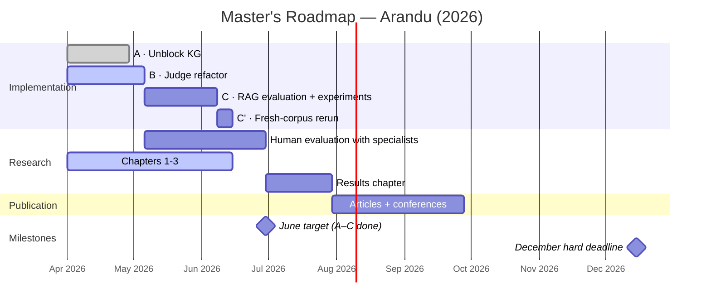
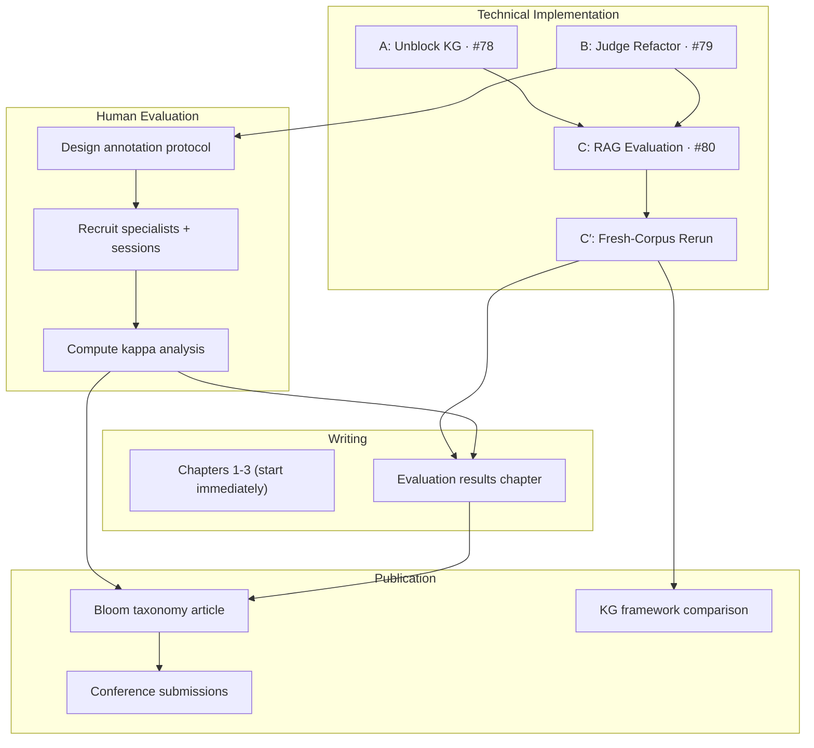

# Master's Roadmap

**Created**: 2026-03-23
**Target**: June 2026 (Phases A-C) | December 2026 (hard deadline)
**Scope**: Technical implementation + dissertation writing

---

## Status snapshot (2026-04-29)

- **Phase A — Unblock KG**: substantially **done**. First Portuguese KG built (`test-kg-04`, 14,617 nodes / 60,318 edges, 95.7% in the largest weakly-connected component). Five distinct atlas-rag bug families surfaced and patched as on-disk shims; upstream issue [HKUST-KnowComp/AutoSchemaKG#45](https://github.com/HKUST-KnowComp/AutoSchemaKG/issues/45) **was answered the same day** with a three-layer fix on `release/v0.0.6` — most of our local shims become removable on the version bump (tracked in the dedicated `atlas-rag-v006-cleanup` session).
- **Phase B — Judge Refactor**: structural work merged via PRs [#84](https://github.com/FredDsR/arandu/pull/84), [#87](https://github.com/FredDsR/arandu/pull/87); LLM criteria open in PR [#88](https://github.com/FredDsR/arandu/pull/88). Remaining: **manual QA-judge calibration audit** (43 rejected + 31 admitted pairs from 2,410 valid; ~6–8 h of work) → returns the remediation decision that closes Phase B.
- **Phase C — RAG Evaluation**: not started; unblocks when Phase B closes.
- **New gate added — C′: Fresh-Corpus Rerun**. New interviews were uploaded to the Drive corpus since `test-kg-04`; the thesis Results chapter must use a clean run on the updated corpus, so a single end-to-end run (transcription → CEP → QA → judge → KG → metrics → RAG eval) sits between Phase C and the Results chapter. Should run on atlas-rag 0.0.6 (post-shim-cleanup).
- **Architectural pivot**: shard-and-merge KG migration was the only durable answer when leak-per-interruption was the failure mode. With upstream's three-layer fix in 0.0.6, monolithic runs become much safer — sharding is now a *nice-to-have* refactor rather than a forcing function.
- **Timeline reality**: ~5 weeks were spent on the atlas-rag bug-hunt that the original Phase A plan didn't anticipate. The upstream fix bought back ~2 weeks of pressure. June 2026 (A–C done) is **tight but reachable** if Phase C scopes to BM25 vs GraphRAG only. December 2026 hard deadline remains comfortable.

---

## Timeline Overview

| Phase | Issue | When | Goal | Status / Blocked By |
|-------|-------|------|------|---------------------|
| **A: Unblock KG** | [#78](https://github.com/FredDsR/etno-kgc-preprocessing/issues/78) | April (actual: ~4 weeks) | Get a complete GraphML from the corpus | **Done** — `test-kg-04` graphml built; 5 atlas-rag bugs shimmed; upstream #45 acknowledged |
| **B: Judge Refactor** | [#79](https://github.com/FredDsR/etno-kgc-preprocessing/issues/79) | April–May (actual: ~5 weeks) | Composable multi-stage judge as shared module | **Closing** — structural work merged; PR #88 (LLM criteria) open; QA calibration audit pending |
| **C: RAG Evaluation** | [#80](https://github.com/FredDsR/etno-kgc-preprocessing/issues/80) | May–June (~4 weeks) | BM25 vs GraphRAG comparison using QA pairs | Blocked on B |
| **C′: Fresh-Corpus Rerun** | — | After C (~1 week wall-time) | Clean end-to-end run on updated Drive corpus; produces canonical thesis dataset | Blocked on B + C |
| **D: Writing & Human Eval** | — | Parallel, intensifies June–Aug | Dissertation chapters, specialist evaluation, articles | B for human eval protocol; C′ for results chapter |
| **E: Polish** | — | July–Dec if needed | Bloom article, KG framework comparison, conferences | D for human eval data |

### Chronogram



### Dependency Graph



---

## Phase A: Unblock KG

**Goal**: Produce a complete Knowledge Graph from the corpus.

**Context (original)**: `test-kg-02` got halfway through concept generation (6,256/13,383 nodes) before SLURM killed it. A language bug meant concepts were generated with English prompts. No GraphML output existed.

**Outcome (2026-04-29)**: `test-kg-04` produced a valid Portuguese GraphML — **14,617 nodes / 60,318 edges**, 95.7% in the largest weakly-connected component. The bug-hunt that paid for this took ~4 weeks (vs. 2 planned) and surfaced five distinct atlas-rag failure modes, all interruption-derived. Upstream answered our report the same day with a three-layer fix on `release/v0.0.6`, which retroactively obsoletes most of the local shims.

### Tasks

1. ~~**Implement #77** — resumable concept generation wrapper + `language='pt'` bug fix~~ Done
2. ~~**Patch atlas-rag `KeyError: 'id'`** — monkey-patch `csvs_to_temp_graphml()` in `atlas_backend.py` so edge endpoints get `id`/`type` attributes.~~ Done in PR [#85](https://github.com/FredDsR/arandu/pull/85). *(Note: this monkey-patch turned out to be dead code due to a Python `from … import` capture issue; the real fix is the disk-rewrite shims in PR #92, and now upstream 0.0.6.)*
3. ~~**File upstream issue** on [HKUST-KnowComp/AutoSchemaKG](https://github.com/HKUST-KnowComp/AutoSchemaKG) so the local patch can eventually be removed.~~ Done — [issue #45](https://github.com/HKUST-KnowComp/AutoSchemaKG/issues/45). **Maintainer responded 2026-04-29 with a three-layer fix on `release/v0.0.6`.**
4. ~~**Run KG pipeline to completion**~~ Done — `test-kg-04` graphml built locally on the partial cluster state after concept generation finished (job 780114, 21h 44m on tupi).
5. **Inspect output quality** — Portuguese entities and relations look sensible at a structural level (95.7% giant component, moderate clustering 0.23, max degree 6,949 — power-law shape). Manual semantic inspection still pending; will land alongside the QA-judge calibration audit.
6. **Analyze predicate explosion** — surfaced empirically: 1,957 unique predicates in `test-kg-04`. atlas-rag's hardcoded English `is participated by` accounted for 37.3% of `Relation`-typed edges; now relabeled to Portuguese `envolve` for `lang=pt` runs. Semantic canonicalization (e.g. `lutar`/`combater`/`brigar`) deferred to RAG-time normalization in Phase C. (Feedback: Joel, midway seminar)
7. ~~**Close #75** — superseded by #77~~ Done
8. **Land PR #92 (KG fixes bundle)** — three on-disk shims + predicate relabel + new analytics scripts. Decision (2026-04-29): merge as-is; cleanup of redundant shims happens in the dedicated `atlas-rag-v006-cleanup` workstream after upstream 0.0.6 releases.

### Success Criteria

- ~~A `*.graphml` file exists with meaningful Portuguese entities and relations~~ ✓ `test-kg-04` graphml in hand (14,617 nodes / 60,318 edges).
- ~~Concept generation can survive SLURM timeouts and resume~~ ✓ Resume helper landed; survived two crashes on `test-kg-04`.
- ~~Predicate space is reasonable (no massive explosion of semantically equivalent predicates)~~ Partially — 1,957 unique predicates is large but the synthesized participation predicate dominates (37.3% of relations); semantic canonicalization deferred to Phase C.
- **(new)** Analytics scripts (`kg_report.py`, `kg_structural_metrics.py`, `kg_relabel_predicate.py`) produce reproducible structural summaries.

### Long-term architectural plan (shard-and-merge)

Originally proposed as the only durable answer to atlas-rag's leak-per-interruption pattern: split the corpus into N partitions, run extraction independently on each, merge the GraphMLs offline. **Status (2026-04-29):** downgraded to *nice-to-have* now that upstream 0.0.6 ships three layers of orphan-node defense. Will be revisited if Phase C reveals partitioning advantages for retrieval, or if scaling to a much larger corpus.

---

## Phase B: Judge Refactor

**Goal**: Composable multi-stage evaluation architecture usable across all pipeline domains.

### Architecture

```
shared/judge/
├── criterion.py      JudgeCriterion protocol (same interface for heuristic and LLM)
├── step.py           JudgeStep: runs N criteria with individual thresholds
├── pipeline.py       JudgePipeline: chains steps with filtering between them
└── registry.py       JudgeRegistry: criterion factory

Domain-specific criteria (all implementing JudgeCriterion):

transcription/criteria/
├── script_match.py        (heuristic)
├── repetition.py          (heuristic)
├── content_density.py     (heuristic)
├── language_drift.py      (LLM-based)
└── hallucination.py       (LLM-based)

qa/criteria/
├── faithfulness.py        (LLM-based)
├── bloom_calibration.py   (LLM-based)
├── informativeness.py     (LLM-based)
├── self_containedness.py  (LLM-based)
└── human_comparable.py    (LLM-based — designed for kappa comparison)
```

### Multi-Stage Pattern

Each domain uses the same pattern:

```
Stage 1: Fast filter (heuristic criteria or cheap LLM checks)
    ↓ items passing individual thresholds
Stage 2: Deep evaluation (LLM-based criteria)
    ↓ items passing individual thresholds
Stage 3: Human-comparable evaluation (single LLM criterion)
    → scores stored for later offline kappa comparison
```

### Tasks

1. ~~**Individual thresholds** — replace weighted avg with per-criterion minimums~~ Done (PR [#84](https://github.com/FredDsR/arandu/pull/84))
2. ~~**Rename**: `JudgePipeline` → `JudgeStep`, create new `JudgePipeline` (multi-stage)~~ Done (PR [#84](https://github.com/FredDsR/arandu/pull/84))
3. ~~**Move judge to `shared/judge/`**~~ Done (PR [#84](https://github.com/FredDsR/arandu/pull/84))
4. ~~**#35: `generate_structured()` on LLMClient**~~ Done — `JudgeResultMixin` extracts the pattern (commit `6b142c2`)
5. ~~**Extract heuristic validators as criteria**~~ Done (PR [#87](https://github.com/FredDsR/arandu/pull/87))
6. **New transcription criteria** — `language_drift` and `hallucination_loop` open in PR [#88](https://github.com/FredDsR/arandu/pull/88)
7. **Human-comparable QA criterion** — **deferred to Phase D** (depends on the annotation protocol design)
8. ~~**Remove `--validate` flag** from `generate-cep-qa`~~ Done (PR [#87](https://github.com/FredDsR/arandu/pull/87))
9. ~~**Standalone CLI**: `arandu judge-transcription` / `arandu judge-qa`~~ Done (PR [#87](https://github.com/FredDsR/arandu/pull/87))

### Calibration evidence (added since the original roadmap)

A judge isn't usable until we know how often its decisions agree with a human reading. Phase B now includes a calibration evidence framework that didn't exist when the roadmap was written:

- **Dual notebooks** (transcription + QA) covering per-criterion distributions, inter-criterion correlation, stage attribution, failure co-occurrence, and threshold proximity.
- **Audit protocol**: dual-class proportional sampling at 30% of rejected + 15% of admitted, sample sizes set so Clopper-Pearson 95% CIs land inside ±10pp of the observed rate.
- **QA-side sample drawn 2026-04-28**: 43 rejected + 31 admitted pairs from 2,410 valid (population pulled from `test-judge-01`, seed=42). Manual audit pending (~6–8 h of work) — its remediation decision is the gate that closes Phase B.
- **Transcription-side audit complete**; silence-filler gap closed in `e1a091c`.

Tracked in the dedicated `judge-calibration-notebooks` work session.

### Key Decisions

- Heuristics are just criteria — `JudgeStep` doesn't care if a criterion is heuristic or LLM-based
- Each CLI command loads only the models it needs — no co-loading Whisper + LLM
- Generator generates, judge judges — separate commands, separate concerns

---

## Phase C: RAG Evaluation

**Goal**: Compare retrieval strategies using CEP QA pairs as the benchmark dataset.

### Design

The evaluation IS the experiment:
- CEP QA pairs are the **benchmark questions**
- Retrievers attempt to answer each question from source material
- The **same judge pipeline** scores the retriever answers
- Comparison: which retriever produces answers that the judge rates highest?

### Components

1. **Retriever protocol** — abstract interface with pluggable implementations
2. **BM25 baseline** — sparse retrieval over raw transcriptions
3. **GraphRAG retriever** — retrieval over the constructed KG
4. **CLI commands**:
   - `arandu retrieve` — runs a retriever against QA questions, produces answers
   - `arandu judge answers` — judges answer quality using the judge pipeline

### No Traditional Metrics

Evaluation does **not** use EM, F1, or BLEU. The judge module scores retriever answers with the same criteria used for QA validation (faithfulness, informativeness, etc.). This is consistent — judge all the way down.

### Non-answerable Questions Experiment

Generate a subset of questions whose answers are **not** present in the KG, to test whether the retriever falls back to parametric knowledge or correctly abstains. This detects hallucination at the retrieval level and validates that the evaluation measures graph coverage, not LLM memorization. (Feedback: Luciana, midway seminar)

### Tasks

1. Define retriever protocol
2. Implement BM25 baseline retriever
3. Implement GraphRAG retriever (using Phase A graph)
4. Design non-answerable question subset (questions the KG cannot answer)
5. Implement `arandu retrieve` CLI command
6. Implement `arandu judge answers` CLI command (reuses Phase B judge)
7. Run experiments, collect results
8. Analyze: separate graph quality limitations from retrieval tool limitations (Feedback: Joel, midway seminar)

---

## Phase C′: Fresh-Corpus Rerun (gate before Results chapter)

**Goal**: Single end-to-end run on the updated Drive corpus, producing the canonical thesis dataset.

**Why this exists (added 2026-04-29)**: New interviews were uploaded to the Drive source corpus since `test-kg-04`. The thesis Results chapter must reflect the *current* dataset, not a mid-2026 snapshot. A fresh run also eliminates artifact contamination (stale CEPs, partial concept-gen state, pre-relabel graphmls, pre-LLM-criteria judge verdicts). The numbers from `test-kg-04` are valid for *describing* the pipeline (bug-hunt narrative, structural metrics, calibration evidence) but **must not** appear in the Results chapter.

### Tasks

1. **Audit new interviews** — survey the Drive: count, languages, durations, communities, recording-setup differences vs. `test-kg-04` corpus. Informs partition strategy and run-time estimate.
2. **Pin the dataset via manifest-in-repo** — commit `data/manifest_<run-id>.json` with file_id + md5 + modifiedTime per input. Drive remains the byte source; the repo is the canonical record of "what was in the dataset". Decision rationale: avoids storing interview audio in the repo (size + GDPR), lets us prove the dataset retroactively without depending on Drive folder organization.
3. **Bump atlas-rag to 0.0.6** — strip the redundant local shims; keep only the predicate relabel and the analytics scripts. Tracked in the `atlas-rag-v006-cleanup` work session.
4. **Run end-to-end on the updated corpus**: transcription → CEP → QA → judge (post-PR-#88) → KG (atlas-rag 0.0.6) → structural metrics → RAG evaluation.
5. **Produce the run's metrics package** — graphml, judge verdicts, RAG eval scores, structural metrics output — ready to drop into the Results chapter.

### Pre-requisites

- Phase B closed (calibration audit verdict applied to judge config).
- Phase C closed (RAG evaluation pipeline operational).
- atlas-rag 0.0.6 released (or pinned via the `release/v0.0.6` branch).
- Drive manifest committed.

### Estimate

~1 week wall-time on atlas-rag 0.0.6 monolithic. Transcription is the largest single block; concept generation is much faster on 0.0.6 than the test-kg-04 baseline because the resume path no longer re-introduces leaks.

---

## Phase D: Writing & Human Evaluation

**Goal**: Dissertation (monography), human evaluation with domain specialists, and article submissions.

### Dissertation Structure

#### Chapter 1 — Introdução

Problem statement, objectives, justification. Frames the evidence gap at the intersection of AI, traditional ecological knowledge, and climate resilience.

| What exists | What's needed |
|-------------|---------------|
| SLR findings (Reckziegel & Costa, 2025b) documenting the evidence gap | Write the problem statement connecting the SLR gap to the Arandu pipeline |
| `docs/related-works.md` §10 (Ethnographic Knowledge, AI, Climate Resilience) | Frame the research questions and objectives |
| `docs/related-works.md` §11 (Positioning: What This Work Adds) | Justification — why this integration is novel |
| CARE Principles / decolonial frameworks (Carroll et al., BlackDeer, Tapu & Fa'agau) | Ethical grounding section |

**Can start**: now

#### Chapter 2 — Referencial Teórico / Trabalhos Relacionados

Literature review organized by thematic axes. `docs/related-works.md` (45+ references, 11 sections) is the primary source — needs consolidation into a cohesive narrative.

| Thematic Axis | Source | Pipeline Phase |
|---------------|--------|----------------|
| Tacit knowledge elicitation with LLMs | `related-works.md` §1 | Overarching |
| LLM-assisted interview/narrative analysis | `related-works.md` §2 | Phase 1-2 |
| Bloom's Taxonomy and QA generation | `related-works.md` §3 | Phase 2 (CEP) |
| LLM-as-a-Judge evaluation | `related-works.md` §4 | Phase 2 (Judge) |
| Self-containedness and decontextualization | `related-works.md` §5 | Phase 2 (CEP) |
| KG construction from text with LLMs | `related-works.md` §6 | Phase 3 |
| Value of KGs as knowledge distillation | Argue independently of RAG performance (Feedback: Joel) | Phase 3 / Discussion |
| Predicate explosion in triple extraction | Known KGC problem — does AutoSchemaKG's conceptualization handle it? (Feedback: Joel) | Phase 3 |
| GraphRAG and graph-based retrieval | `related-works.md` §7 | Phase 4 (Eval) |
| QA-based KG evaluation | `related-works.md` §8 | Phase 4 (Eval) |
| ASR quality and Whisper | `related-works.md` §9 | Phase 1 |
| TEK, AI, and climate resilience | `related-works.md` §10 | Context |
| Network science foundations | `related-works.md` §10.3 | Phase 3 analysis |

**Can start**: now (consolidate `related-works.md` into chapter form)

#### Chapter 3 — Metodologia

Pipeline design, each phase's approach and rationale. `docs/methodology.md` (62K chars, 9 sections) is nearly a complete draft.

| Section | Source | Status |
|---------|--------|--------|
| Pipeline architecture (overview) | `methodology.md` §1-2 | Draft ready |
| Phase 1: Automated transcription | `methodology.md` §3 | Draft ready |
| Phase 2: Cognitive Elicitation Pipeline | `methodology.md` §4 | Draft ready |
| Phase 3: Knowledge Graph Construction | `methodology.md` §5 | Draft ready |
| Phase 4: Evaluation (retrieve + judge) | `methodology.md` §6 | Needs rewrite — current draft uses intrinsic metrics, new design uses judge-based RAG evaluation |
| Human evaluation protocol | — | Not written — depends on Phase B (annotation protocol design) |
| Technical infrastructure | `methodology.md` §7 | Draft ready |

**Can start**: now for sections 1-5, 7. Section 6 blocked on Phase B/C design finalization.

#### Chapter 4 — Resultados e Discussão

Experiment results, analysis, human evaluation findings.

| Section | Blocked on |
|---------|------------|
| Transcription results (353/354 files, quality analysis) | Nothing — data exists |
| CEP QA results (241/309 records, Bloom distribution, judge scores) | Nothing — data exists |
| KG construction results (graph structure, Portuguese entities/relations) | Phase A (no graph yet) |
| RAG evaluation (BM25 vs GraphRAG comparison) | Phase C |
| Non-answerable questions (parametric knowledge detection) | Phase C |
| Human evaluation (kappa analysis, LLM vs specialist agreement) | Phase D human eval sessions |
| Graph value argument (knowledge distillation independent of RAG) | Phase A (graph must exist) |
| Predicate explosion analysis (semantic duplicates in predicates) | Phase A (graph must exist) |
| Technique vs data limitations discussion | All above |
| Discussion (Bloom-stratified depth profiling, tacit knowledge layers) | All above |

**Can start**: transcription and CEP results sections now. Rest blocked.

#### Chapter 5 — Conclusão

Summary, contributions, limitations, future work. Written last.

---

### Human Evaluation with Domain Specialists

The human-comparable judge criterion (Phase B) produces LLM scores that must be compared against human judgments to validate the pipeline. This is a research activity, not a coding task.

1. **Design annotation protocol** — define the evaluation question (same one the LLM judge answers), annotation guidelines, scoring rubric
2. **Select QA sample** — stratified sample across Bloom levels, participants, and validation scores
3. **Recruit specialists** — domain experts familiar with riverine communities / climate events
4. **Run evaluation sessions** — specialists score the same QA pairs the LLM judge scored
5. **Compute agreement** — Cohen's kappa (LLM vs human), inter-annotator agreement
6. **Analyze results** — where does the LLM judge agree/disagree with humans? At which Bloom levels?

**Depends on**: Phase B (human-comparable criterion must exist to define what question specialists answer)
**Blocks**: Phase E (Bloom taxonomy article needs this data)

### Articles

- Consolidate 2025/2 article with new experiments and discoveries
- Bloom taxonomy for cognitive-calibrated QA generation — standalone publication candidate
- Conference submissions

---

## Phase E: Polish & Extensions (if time permits)

- **Bloom taxonomy article** — needs human eval data from Phase D
- **KG framework comparison** — prototype 1-2 alternatives to AutoSchemaKG
- **Justfile** for pipeline orchestration (low effort, nice-to-have)
- **SLURM cheatsheet** — `RUNNING_ON_SLURM.md` with exact commands in order

---

## Command Structure

Each pipeline step is an atomic CLI command. No model co-loading. Pipeline orchestration is command sequencing (Justfile or shell script).

| Command | Input | Output | Models |
|---------|-------|--------|--------|
| `arandu transcribe` | audio/video | EnrichedRecord | Whisper |
| `arandu judge transcription` | EnrichedRecord | scored EnrichedRecord | LLM (heuristics need no model) |
| `arandu generate-cep-qa` | EnrichedRecord | QAPairCEP | LLM |
| `arandu judge qa` | QAPairCEP | scored QAPairCEP | LLM |
| `arandu build-kg` | EnrichedRecord | GraphML | LLM |
| `arandu retrieve` | QA pairs + source | retriever answers | depends on retriever |
| `arandu judge answers` | QA pairs + answers | judge scores | LLM |

---

## Explicitly Skipped

| Item | Reason |
|------|--------|
| Pipeline orchestrator framework (Luigi/Airflow/scikit) | YAGNI — Justfile is sufficient |
| Autonomous SLURM runners | Manual 5-command process is fine for ~20 runs |
| Frontend/report issues (#40, #59–#67) | Not on critical path for dissertation |
| Heuristic/judge module unification | Solved by making heuristics into criteria |
| Backwards compatibility for `--validate` flag | Clean break, minimal codebase |
| EM/F1/BLEU evaluation metrics | Replaced by judge-based evaluation |

---

## Midway Seminar Feedback

Feedback from Luciana and Joel incorporated into the roadmap:

| Feedback | Who | Addressed In |
|----------|-----|-------------|
| Validate QA ground truth with humans, measure concordance | Luciana | Phase D: Human eval with specialists (Cohen's kappa) |
| BM25 baseline — is RAG without graph sufficient? | Luciana | Phase C: BM25 vs GraphRAG comparison |
| Non-answerable questions to detect parametric knowledge use | Luciana | Phase C: Non-answerable questions experiment |
| Argue the value of the graph itself (knowledge distillation) | Joel | Chapter 2 + Chapter 4 discussion |
| Separate graph quality limitations from retrieval tool limitations | Joel | Phase C task 8 + Chapter 4 discussion |
| Predicate explosion — does AutoSchemaKG handle it? | Joel | Phase A task 4 (inspect graph) + Chapter 4 |
| Distinguish technique limitations from data limitations | Joel | Chapter 4 discussion |

---

## Open Issues / PRs

| Ref | Title | Phase | Status |
|---|---|---|---|
| ~~[#77](https://github.com/FredDsR/etno-kgc-preprocessing/issues/77)~~ | ~~Resumable concept generation + language bug~~ | A | Closed (PR #81) |
| ~~[#35](https://github.com/FredDsR/etno-kgc-preprocessing/issues/35)~~ | ~~Extract `generate_structured()` to LLMClient~~ | B | Closed (folded into `JudgeResultMixin`) |
| ~~[#75](https://github.com/FredDsR/etno-kgc-preprocessing/issues/75)~~ | ~~Concept gen resume~~ | — | Closed (superseded by #77) |
| [PR #88](https://github.com/FredDsR/arandu/pull/88) | Judge LLM criteria (`language_drift`, `hallucination_loop`) | B | Open — ready for merge |
| [PR #92](https://github.com/FredDsR/arandu/pull/92) | KG fixes bundle (3 shims + predicate relabel + analytics) | A | Open — to merge as-is, then strip in `atlas-rag-v006-cleanup` |
| [HKUST-KnowComp/AutoSchemaKG#45](https://github.com/HKUST-KnowComp/AutoSchemaKG/issues/45) | Upstream attribute-leak fix | A | **Answered + fixed on `release/v0.0.6`** (2026-04-29) |

---

**Last Updated**: 2026-04-29
